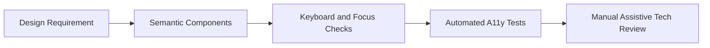

# Day 088 [Advanced]: Accessibility Workflow for Fullstack UI

## Index

- Goal
- Prerequisites
- Explanation
- Topic by Topic
- Key Concepts
- Visual Concept Map
- End-to-End Practical
- Hands-on Coding
- Mini Exercise
- Assessment Quiz
- Task
- Self Check
- Interview Questions and Answers
- Day Outcome

## Goal

Build an end-to-end accessibility workflow for fullstack products that is measurable, testable, and integrated into everyday development.

## Prerequisites

- Day 087 performance budget governance
- HTML semantics and ARIA basics

## Explanation

Accessibility is not a final QA checklist. It is a lifecycle workflow covering design, component implementation, API error semantics, keyboard behavior, and automated/manual audits. Fullstack teams must ensure assistive technology compatibility in both UI and data flows.

## Topic by Topic

### Topic 1: Accessibility Requirements as Product Constraints

Theory:
Accessibility should be treated as a non-functional requirement with acceptance criteria.

Practical:
Define WCAG-linked criteria in story templates.

**Explanation:**
This topic explains Accessibility Requirements as Product Constraints in a practical Node.js backend context so you can build reliable, production-ready APIs and services.

**Key Points:**
- Understand the core idea behind Accessibility Requirements as Product Constraints.
- Apply the practical pattern with safe defaults and validation.
- Keep the implementation observable, maintainable, and secure where relevant.

### Topic 2: Semantic-first Component Design

Theory:
Native elements reduce ARIA complexity and improve interoperability.

Practical:
Use button, label, fieldset, and heading hierarchy correctly.

**Explanation:**
This topic explains Semantic-first Component Design in a practical Node.js backend context so you can build reliable, production-ready APIs and services.

**Key Points:**
- Understand the core idea behind Semantic-first Component Design.
- Apply the practical pattern with safe defaults and validation.
- Keep the implementation observable, maintainable, and secure where relevant.

### Topic 3: Form and Error Accessibility

Theory:
Validation messages must be perceivable, programmatically associated, and actionable.

Practical:
Use aria-describedby and focus management for invalid fields.

**Explanation:**
This topic explains Form and Error Accessibility in a practical Node.js backend context so you can build reliable, production-ready APIs and services.

**Key Points:**
- Understand the core idea behind Form and Error Accessibility.
- Apply the practical pattern with safe defaults and validation.
- Keep the implementation observable, maintainable, and secure where relevant.

### Topic 4: Keyboard and Focus Workflow

Theory:
Keyboard navigation is a primary accessibility path, not an optional feature.

Practical:
Implement predictable tab order, visible focus, and escape routes for dialogs.

**Explanation:**
This topic explains Keyboard and Focus Workflow in a practical Node.js backend context so you can build reliable, production-ready APIs and services.

**Key Points:**
- Understand the core idea behind Keyboard and Focus Workflow.
- Apply the practical pattern with safe defaults and validation.
- Keep the implementation observable, maintainable, and secure where relevant.

### Topic 5: Continuous Testing Strategy

Theory:
Automated tools catch common issues, but manual screen-reader and keyboard checks are still required.

Practical:
Run lint/a11y scans in CI and schedule periodic manual audits.

**Explanation:**
This topic explains Continuous Testing Strategy in a practical Node.js backend context so you can build reliable, production-ready APIs and services.

**Key Points:**
- Understand the core idea behind Continuous Testing Strategy.
- Apply the practical pattern with safe defaults and validation.
- Keep the implementation observable, maintainable, and secure where relevant.

### Topic 6: Inclusive Error APIs and Localization

Theory:
Accessibility includes understandable language and consistent error semantics from backend APIs.

Practical:
Return structured, localizable error codes and map them to assistive-tech-friendly UI messages.

**Explanation:**
This topic explains Inclusive Error APIs and Localization in a practical Node.js backend context so you can build reliable, production-ready APIs and services.

**Key Points:**
- Understand the core idea behind Inclusive Error APIs and Localization.
- Apply the practical pattern with safe defaults and validation.
- Keep the implementation observable, maintainable, and secure where relevant.

## Key Concepts

- Accessibility as engineering requirement
- Semantic-first implementation
- Error and feedback discoverability
- Keyboard/focus reliability
- Automated plus manual audit pipeline
- Accessible API error semantics
- Localization-aware accessibility workflow

## Visual Concept Map



## End-to-End Practical

1. Define accessibility acceptance criteria for one feature.
2. Implement semantic and keyboard-safe UI behavior.
3. Add accessible form validation and error announcements.
4. Enforce automated checks in CI.
5. Record manual audit findings and remediation tasks.

## Hands-on Coding

### Example 1: Case - Accessible Input with Error Binding

Scenario:
User submits empty email field and screen readers must announce error clearly.

```html
<label for="email">Email</label>
<input
  id="email"
  name="email"
  aria-describedby="email-error"
  aria-invalid="true"
/>
<p id="email-error" role="alert">Please enter a valid email address.</p>
```

### Example 2: Case - Keyboard-safe Dialog Close

Scenario:
Modal must allow keyboard users to exit reliably.

```js
document.addEventListener("keydown", (event) => {
  if (event.key === "Escape") closeModal();
});
```

### Example 3: Case - CI A11y Check Concept

Scenario:
Pull request should fail when critical accessibility violations appear.

```js
if (a11yReport.violations.some((v) => v.impact === "critical")) {
  throw new Error("Accessibility gate failed: critical issues found");
}
```

### Example 4: Case - Structured Error Response for UI A11y

Scenario:
Form UI needs consistent message mapping for screen readers and localization.

```json
{
  "code": "EMAIL_INVALID",
  "field": "email",
  "messageKey": "errors.email.invalid"
}
```

### Example 5: Case - Focus and Live Region Update

Scenario:
After failed submit, first invalid field gets focus and summary is announced.

```js
errorSummaryRef.current.textContent = t("errors.form.fixHighlighted");
errorSummaryRef.current.focus();
firstInvalidInputRef.current?.focus();
```

## Mini Exercise

Scenario:
Implement one accessible form flow end to end with semantic markup, keyboard checks, and CI scan.

Expected output:

- Accessibility criteria defined
- Assistive-tech-friendly implementation
- Automation and manual review evidence

## Assessment Quiz

### Quiz Questions

1. Why is accessibility a fullstack concern, not only frontend?
2. What is a common benefit of semantic HTML over custom ARIA-heavy widgets?
3. True or False: Skipping edge-case handling is acceptable in production.
4. Why are automated checks alone insufficient?
5. Why use structured error codes for accessible forms?

### Quiz Answers

1. Error responses, auth flows, and interaction patterns affect assistive technology users.
2. Better default accessibility and reduced implementation complexity.
3. False.
4. They miss many real-world interaction and screen-reader context issues.
5. They enable consistent, localizable, and assistive-tech-friendly error messaging.

## Task

- Build one accessible form workflow with validation feedback
- Add automated accessibility check and manual review notes
- Complete mini exercise and quiz.

## Self Check

- You can deliver accessibility as a repeatable engineering workflow.
- You can catch and prevent common accessibility regressions.
- You can answer at least 4 out of 5 quiz questions.

## Interview Questions and Answers

### Beginner

Question: What is the fastest improvement for many accessibility issues?

Answer: Replacing custom interactive markup with proper native semantic elements.

### Middle

Question: When should accessibility be validated during delivery?

Answer: From design and development through CI and pre-release checks, not only at the end.

### Advanced

Question: What tradeoff exists between strict accessibility checks and release speed?

Answer: Slightly slower merge flow short term, with higher product quality and lower legal/support risk long term.

## Day 088 Outcome

- You can implement an accessibility workflow across UI and backend interactions
- You can enforce accessibility quality through automation and review
- You are ready for design system integration in Day 089
