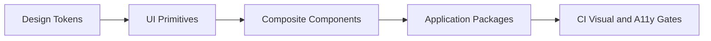

# Day 089 [Advanced]: Design System Integration in Monorepos

## Index

- Goal
- Prerequisites
- Explanation
- Topic by Topic
- Key Concepts
- Visual Concept Map
- End-to-End Practical
- Hands-on Coding
- Mini Exercise
- Assessment Quiz
- Task
- Self Check
- Interview Questions and Answers
- Day Outcome

## Goal

Implement a scalable design system integration strategy in monorepos to ensure UI consistency, developer velocity, and safe upgrade workflows.

## Prerequisites

- Day 088 accessibility workflow
- Monorepo package management fundamentals

## Explanation

In multi-app organizations, design drift and duplicate components slow delivery and degrade UX consistency. A monorepo-integrated design system provides shared tokens, reusable components, testing standards, and versioned rollout controls.

## Topic by Topic

### Topic 1: Design System Layering

Theory:
Separate foundations (tokens), primitives, and feature-ready components.

Practical:
Publish layered packages with clear dependency direction.

**Explanation:**
This topic explains Design System Layering in a practical Node.js backend context so you can build reliable, production-ready APIs and services.

**Key Points:**
- Understand the core idea behind Design System Layering.
- Apply the practical pattern with safe defaults and validation.
- Keep the implementation observable, maintainable, and secure where relevant.

### Topic 2: Versioning and Adoption Workflow

Theory:
Design system changes should be versioned and communicated like APIs.

Practical:
Use SemVer and codemods for breaking migrations.

**Explanation:**
This topic explains Versioning and Adoption Workflow in a practical Node.js backend context so you can build reliable, production-ready APIs and services.

**Key Points:**
- Understand the core idea behind Versioning and Adoption Workflow.
- Apply the practical pattern with safe defaults and validation.
- Keep the implementation observable, maintainable, and secure where relevant.

### Topic 3: Multi-app Compatibility Testing

Theory:
One component update can break many apps with different contexts.

Practical:
Run visual, accessibility, and contract tests against representative apps.

**Explanation:**
This topic explains Multi-app Compatibility Testing in a practical Node.js backend context so you can build reliable, production-ready APIs and services.

**Key Points:**
- Understand the core idea behind Multi-app Compatibility Testing.
- Apply the practical pattern with safe defaults and validation.
- Keep the implementation observable, maintainable, and secure where relevant.

### Topic 4: Ownership and Contribution Model

Theory:
Without governance, shared component quality degrades quickly.

Practical:
Define maintainers, contribution standards, and release checklist.

**Explanation:**
This topic explains Ownership and Contribution Model in a practical Node.js backend context so you can build reliable, production-ready APIs and services.

**Key Points:**
- Understand the core idea behind Ownership and Contribution Model.
- Apply the practical pattern with safe defaults and validation.
- Keep the implementation observable, maintainable, and secure where relevant.

### Topic 5: Theming and Token Strategy

Theory:
Tokens allow controlled customization without component forks.

Practical:
Implement token-based themes for brands/markets in one codebase.

**Explanation:**
This topic explains Theming and Token Strategy in a practical Node.js backend context so you can build reliable, production-ready APIs and services.

**Key Points:**
- Understand the core idea behind Theming and Token Strategy.
- Apply the practical pattern with safe defaults and validation.
- Keep the implementation observable, maintainable, and secure where relevant.

### Topic 6: Release Safety and Visual Contract Governance

Theory:
Shared UI changes can silently break many products. Design system releases need visual contract checks and staged rollout habits.

Practical:
Use story snapshots, visual baselines, and canary adoption in one app before broad rollout.

**Explanation:**
This topic explains Release Safety and Visual Contract Governance in a practical Node.js backend context so you can build reliable, production-ready APIs and services.

**Key Points:**
- Understand the core idea behind Release Safety and Visual Contract Governance.
- Apply the practical pattern with safe defaults and validation.
- Keep the implementation observable, maintainable, and secure where relevant.

## Key Concepts

- Layered system architecture
- Versioned rollout and migration safety
- Multi-app regression controls
- Governance and ownership
- Tokenized theming model
- Visual contract stability
- Safe cross-app release adoption

## Visual Concept Map



## End-to-End Practical

1. Create token and component packages.
2. Integrate package into two separate apps.
3. Add snapshot/visual and accessibility test gates.
4. Publish version and execute one upgrade flow.
5. Document contribution and release workflow.

## Hands-on Coding

### Example 1: Case - Monorepo Package Layout

Scenario:
Platform team wants a shared UI kit used by admin and consumer apps.

```txt
packages/
  tokens/
  ui-primitives/
  ui-components/
apps/
  admin-portal/
  consumer-web/
```

### Example 2: Case - Token Consumption

Scenario:
Button style should inherit shared theme token values.

```css
:root {
  --color-primary: #0f766e;
}

.btn-primary {
  background: var(--color-primary);
}
```

### Example 3: Case - Breaking Change Migration Note

Scenario:
Button size API renamed from size="md" to size="medium".

```md
## Migration v4 to v5

- Replace `size="md"` with `size="medium"`
- Run codemod: pnpm ds-codemod button-size-v5
```

### Example 4: Case - Visual Baseline Gate

Scenario:
Button spacing change must not regress two consuming apps.

```txt
CI checks:
- Story visual diff must pass
- Admin app screenshot diff must pass
- Consumer app screenshot diff must pass
```

### Example 5: Case - Staged Design System Adoption

Scenario:
Roll out new component version to one lower-risk app first.

```txt
step 1: release @acme/ui-components@5.2.0
step 2: adopt in admin-portal
step 3: monitor visual and accessibility regressions
step 4: adopt in consumer-web
```

## Mini Exercise

Scenario:
Integrate a shared component package into two apps and validate that one update does not break either app.

Expected output:

- Shared package usage across apps
- Safe release and upgrade path
- Regression guardrails in CI

## Assessment Quiz

### Quiz Questions

1. Why does design system work fail without ownership?
2. What is the value of layered package architecture?
3. True or False: Skipping edge-case handling is acceptable in production.
4. Why should component changes be tested against real app contexts?
5. Why stage design system rollout across apps?

### Quiz Answers

1. Shared code quality declines and adoption stalls without accountability.
2. It isolates concerns and keeps dependencies predictable.
3. False.
4. Behavior may differ under real routing, state, or layout constraints.
5. It limits blast radius and catches integration regressions before broad adoption.

## Task

- Build a shared token/component package and consume in two apps
- Add one upgrade playbook with migration notes
- Complete mini exercise and quiz.

## Self Check

- You can scale UI consistency across apps in a monorepo model.
- You can deliver safe shared component upgrades.
- You can answer at least 4 out of 5 quiz questions.

## Interview Questions and Answers

### Beginner

Question: Why is a token layer useful in design systems?

Answer: It centralizes visual decisions and enables consistent theme updates across apps.

### Middle

Question: When should teams invest in monorepo design system integration?

Answer: When multiple products share UI patterns and independent duplication becomes expensive.

### Advanced

Question: What tradeoff comes with strict shared component governance?

Answer: Slower ad-hoc customization with stronger consistency and maintainability.

## Day 089 Outcome

- You can integrate and govern design systems across monorepo applications
- You can prevent cross-app UI regressions during shared releases
- You are ready for data migration and backward compatibility in Day 090
