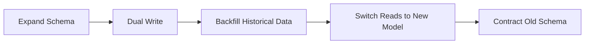

# Day 090 [Advanced]: Data Migration and Backward Compatibility

## Index

- Goal
- Prerequisites
- Explanation
- Topic by Topic
- Key Concepts
- Visual Concept Map
- End-to-End Practical
- Hands-on Coding
- Mini Exercise
- Assessment Quiz
- Task
- Self Check
- Interview Questions and Answers
- Day Outcome

## Goal

Execute safe production data migrations while preserving backward compatibility for services, clients, and operational workflows.

## Prerequisites

- Day 089 design system and release integration thinking
- API versioning and database migration basics

## Explanation

Data migrations can break systems even when application code looks correct. Production-safe migration requires phased rollout, dual-read or dual-write strategies, compatibility windows, and clear rollback plans. The objective is zero or minimal user disruption.

## Topic by Topic

### Topic 1: Migration Risk Modeling

Theory:
Identify schema, data quality, volume, and dependency risks before migration.

Practical:
Classify migration as additive, transformative, or destructive.

**Explanation:**
This topic explains Migration Risk Modeling in a practical Node.js backend context so you can build reliable, production-ready APIs and services.

**Key Points:**
- Understand the core idea behind Migration Risk Modeling.
- Apply the practical pattern with safe defaults and validation.
- Keep the implementation observable, maintainable, and secure where relevant.

### Topic 2: Expand and Contract Strategy

Theory:
Safe migrations generally follow expand first, then contract later.

Practical:
Add new columns/tables first, migrate reads/writes gradually, remove legacy fields last.

**Explanation:**
This topic explains Expand and Contract Strategy in a practical Node.js backend context so you can build reliable, production-ready APIs and services.

**Key Points:**
- Understand the core idea behind Expand and Contract Strategy.
- Apply the practical pattern with safe defaults and validation.
- Keep the implementation observable, maintainable, and secure where relevant.

### Topic 3: Backward-Compatible API Contracts

Theory:
APIs must support old and new clients during transition windows.

Practical:
Version responses and deprecate fields with telemetry-based cutoff.

**Explanation:**
This topic explains Backward-Compatible API Contracts in a practical Node.js backend context so you can build reliable, production-ready APIs and services.

**Key Points:**
- Understand the core idea behind Backward-Compatible API Contracts.
- Apply the practical pattern with safe defaults and validation.
- Keep the implementation observable, maintainable, and secure where relevant.

### Topic 4: Data Backfill and Verification

Theory:
Backfill jobs need idempotency, checkpoints, and validation sampling.

Practical:
Run chunked migration jobs and compare old/new data parity.

**Explanation:**
This topic explains Data Backfill and Verification in a practical Node.js backend context so you can build reliable, production-ready APIs and services.

**Key Points:**
- Understand the core idea behind Data Backfill and Verification.
- Apply the practical pattern with safe defaults and validation.
- Keep the implementation observable, maintainable, and secure where relevant.

### Topic 5: Rollback and Incident Readiness

Theory:
Rollback plan must be prepared before first production change.

Practical:
Define stop criteria, fallback toggles, and recovery runbook.

**Explanation:**
This topic explains Rollback and Incident Readiness in a practical Node.js backend context so you can build reliable, production-ready APIs and services.

**Key Points:**
- Understand the core idea behind Rollback and Incident Readiness.
- Apply the practical pattern with safe defaults and validation.
- Keep the implementation observable, maintainable, and secure where relevant.

### Topic 6: Shadow Reads and Progressive Cutover

Theory:
Before switching fully to a new model, compare old and new read paths safely. Shadow reads reduce migration risk.

Practical:
Serve response from old path but log parity differences against new path during rollout.

**Explanation:**
This topic explains Shadow Reads and Progressive Cutover in a practical Node.js backend context so you can build reliable, production-ready APIs and services.

**Key Points:**
- Understand the core idea behind Shadow Reads and Progressive Cutover.
- Apply the practical pattern with safe defaults and validation.
- Keep the implementation observable, maintainable, and secure where relevant.

## Key Concepts

- Migration risk categorization
- Expand-contract execution
- Compatibility window design
- Backfill integrity and verification
- Rollback-first thinking
- Shadow-read verification
- Progressive read cutover control

## Visual Concept Map



## End-to-End Practical

1. Propose migration plan with risk classification.
2. Implement expand phase and dual-write support.
3. Run incremental backfill with progress checkpoints.
4. Shift read path with canary release and monitoring.
5. Decommission legacy fields after cutoff confidence.

## Hands-on Coding

### Example 1: Case - Additive Expand Migration

Scenario:
Split full_name into first_name and last_name while keeping old field for compatibility.

```sql
ALTER TABLE users ADD COLUMN first_name TEXT;
ALTER TABLE users ADD COLUMN last_name TEXT;
```

### Example 2: Case - Dual-write Service Logic

Scenario:
Write to both old and new columns during migration window.

```js
await db.query(
  "UPDATE users SET full_name = $1, first_name = $2, last_name = $3 WHERE id = $4",
  [fullName, firstName, lastName, userId],
);
```

### Example 3: Case - Backfill Worker with Checkpoint

Scenario:
Process users table in batches and resume safely after failure.

```js
for await (const batch of readUsersInBatches({
  size: 1000,
  fromId: checkpoint,
})) {
  await migrateBatch(batch);
  checkpoint = batch[batch.length - 1].id;
  await saveCheckpoint(checkpoint);
}
```

### Example 4: Case - Shadow Read Comparison

Scenario:
New profile read model should match legacy response before cutover.

```js
const oldProfile = await profileRepoLegacy.findById(userId);
const newProfile = await profileRepoV2.findById(userId);

if (JSON.stringify(oldProfile) !== JSON.stringify(newProfile)) {
  logger.warn({ userId }, "migration_parity_mismatch");
}

return oldProfile;
```

### Example 5: Case - Progressive Read Flag

Scenario:
Move only 10% of traffic to new read path first.

```js
const useNewRead = rolloutService.inRollout(`profile-read:${userId}`, 10);
return useNewRead
  ? profileRepoV2.findById(userId)
  : profileRepoLegacy.findById(userId);
```

## Mini Exercise

Scenario:
Migrate one production-like data model with dual-write and verifiable rollback strategy.

Expected output:

- Expand-contract migration plan
- Backward-compatible service behavior
- Data integrity verification report

## Assessment Quiz

### Quiz Questions

1. Why is expand-contract safer than immediate destructive migration?
2. What purpose does dual-write serve?
3. True or False: Skipping edge-case handling is acceptable in production.
4. Why should deprecation rely on usage telemetry?
5. Why use shadow reads before full cutover?

### Quiz Answers

1. It allows staged rollout with lower blast radius and easier rollback.
2. It keeps old and new data paths consistent during transition.
3. False.
4. Unknown client usage can cause hidden production breakage.
5. They reveal mismatches safely before users depend on the new path.

## Task

- Execute one expand-contract migration simulation
- Produce rollback and verification checklist
- Complete mini exercise and quiz.

## Self Check

- You can design and execute safe production migration workflows.
- You can preserve compatibility while evolving schema and APIs.
- You can answer at least 4 out of 5 quiz questions.

## Interview Questions and Answers

### Beginner

Question: What is the biggest mistake in production migrations?

Answer: Making destructive schema changes before compatibility and rollback paths are ready.

### Middle

Question: When is dual-write unnecessary?

Answer: In small, offline, or fully coordinated migrations where zero overlap is guaranteed.

### Advanced

Question: What tradeoff comes with long compatibility windows?

Answer: Lower migration risk with increased temporary system complexity and maintenance cost.

## Day 090 Outcome

- You can run end-to-end migration plans with confidence and safeguards
- You can balance speed of change with compatibility and reliability
- You are ready for advanced capstone architecture implementation next
