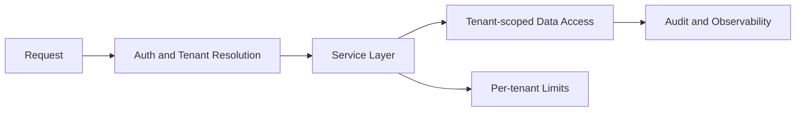

# Day 091 [Expert]: Multi-tenant Architecture

## Index

- Goal
- Prerequisites
- Explanation
- Topic by Topic
- Key Concepts
- Visual Concept Map
- End-to-End Practical
- Hands-on Coding
- Mini Exercise
- Assessment Quiz
- Task
- Self Check
- Interview Questions and Answers
- Day Outcome

## Goal

Design robust multi-tenant Node architectures that guarantee tenant isolation, predictable performance, and cost-efficient scale.

## Prerequisites

- Day 090 data migration and compatibility strategies
- Authorization and database partitioning fundamentals

## Explanation

Multi-tenancy lets one platform serve many customers while balancing isolation, cost, and operational simplicity. The key challenge is preventing one tenant's behavior from impacting others while still sharing infrastructure where practical.

## Topic by Topic

### Topic 1: Tenant Isolation Models

Theory:
Common models are shared database/shared schema, shared database/separate schema, and dedicated database per tenant.

Practical:
Choose isolation model by compliance, noisy-neighbor risk, and customer contract tier.

**Explanation:**
This topic explains Tenant Isolation Models in a practical Node.js backend context so you can build reliable, production-ready APIs and services.

**Key Points:**
- Understand the core idea behind Tenant Isolation Models.
- Apply the practical pattern with safe defaults and validation.
- Keep the implementation observable, maintainable, and secure where relevant.

### Topic 2: Tenant Context Propagation

Theory:
Tenant identity must travel end to end across APIs, queues, caches, and logs.

Practical:
Inject tenant context at gateway and enforce in service middleware.

**Explanation:**
This topic explains Tenant Context Propagation in a practical Node.js backend context so you can build reliable, production-ready APIs and services.

**Key Points:**
- Understand the core idea behind Tenant Context Propagation.
- Apply the practical pattern with safe defaults and validation.
- Keep the implementation observable, maintainable, and secure where relevant.

### Topic 3: Data Access and Security Boundaries

Theory:
Authorization logic must enforce tenant scoping at query level, not only route level.

Practical:
Use row-level tenant filters and deny cross-tenant access by default.

**Explanation:**
This topic explains Data Access and Security Boundaries in a practical Node.js backend context so you can build reliable, production-ready APIs and services.

**Key Points:**
- Understand the core idea behind Data Access and Security Boundaries.
- Apply the practical pattern with safe defaults and validation.
- Keep the implementation observable, maintainable, and secure where relevant.

### Topic 4: Performance and Noisy Neighbor Control

Theory:
Shared resources require rate limits and workload shaping to preserve fairness.

Practical:
Apply per-tenant quotas, burst controls, and queue partitioning.

**Explanation:**
This topic explains Performance and Noisy Neighbor Control in a practical Node.js backend context so you can build reliable, production-ready APIs and services.

**Key Points:**
- Understand the core idea behind Performance and Noisy Neighbor Control.
- Apply the practical pattern with safe defaults and validation.
- Keep the implementation observable, maintainable, and secure where relevant.

### Topic 5: Tenant Lifecycle Operations

Theory:
Onboarding, offboarding, plan upgrades, and migration operations need automation.

Practical:
Create tenant provisioning workflow with idempotent steps and audit logs.

**Explanation:**
This topic explains Tenant Lifecycle Operations in a practical Node.js backend context so you can build reliable, production-ready APIs and services.

**Key Points:**
- Understand the core idea behind Tenant Lifecycle Operations.
- Apply the practical pattern with safe defaults and validation.
- Keep the implementation observable, maintainable, and secure where relevant.

### Topic 6: Tenant-aware Background Jobs and Encryption Boundaries

Theory:
Isolation must continue outside request handlers. Queues, caches, and encrypted data paths also need tenant separation.

Practical:
Carry tenantId in job payloads and use tenant-scoped encryption/access rules for sensitive data.

**Explanation:**
This topic explains Tenant-aware Background Jobs and Encryption Boundaries in a practical Node.js backend context so you can build reliable, production-ready APIs and services.

**Key Points:**
- Understand the core idea behind Tenant-aware Background Jobs and Encryption Boundaries.
- Apply the practical pattern with safe defaults and validation.
- Keep the implementation observable, maintainable, and secure where relevant.

## Key Concepts

- Isolation strategy tradeoffs
- Tenant-aware request pipeline
- Query-level data boundaries
- Fair resource governance
- Automated tenant lifecycle management
- Tenant-safe async processing
- Sensitive-data isolation per tenant boundary

## Visual Concept Map



## End-to-End Practical

1. Define tenant tiers and isolation model per tier.
2. Implement tenant context middleware.
3. Enforce tenant-scoped queries in repositories.
4. Add per-tenant rate and concurrency limits.
5. Validate with cross-tenant security and load tests.

## Hands-on Coding

### Example 1: Case - Tenant Middleware

Scenario:
Incoming requests must resolve tenant safely from verified token claims.

```js
export function tenantContext(req, res, next) {
  const tenantId = req.user?.tenantId;
  if (!tenantId)
    return res.status(401).json({ error: "Missing tenant context" });
  req.tenantId = tenantId;
  return next();
}
```

### Example 2: Case - Tenant-scoped Repository Query

Scenario:
Orders API should never read another tenant's data.

```js
export async function listOrders(db, tenantId) {
  return db.query(
    "SELECT id, total, status FROM orders WHERE tenant_id = $1 ORDER BY created_at DESC LIMIT 100",
    [tenantId],
  );
}
```

### Example 3: Case - Per-tenant Throttle Guard

Scenario:
One tenant starts bulk sync and risks saturating shared resources.

```js
const key = `rl:${req.tenantId}:minute`;
const allowed = await limiter.consume(key, 1200);
if (!allowed)
  return res.status(429).json({ error: "Tenant rate limit exceeded" });
```

### Example 4: Case - Tenant-aware Queue Job

Scenario:
Invoice generation worker must never lose tenant context.

```js
await billingQueue.add("generate-invoice", {
  tenantId: req.tenantId,
  invoiceId,
});
```

### Example 5: Case - Tenant-scoped Encryption Key Lookup

Scenario:
Enterprise tenant requires stronger separation for exported reports.

```js
const keyRef = await keyService.getTenantKey(req.tenantId);
const encrypted = await encryptWithKey(reportPayload, keyRef);
```

## Mini Exercise

Scenario:
Build tenant-safe order retrieval with middleware, repository scoping, and per-tenant throttling.

Expected output:

- Verified tenant context in request pipeline
- Data access restricted by tenant ID
- One protection against noisy-neighbor behavior

## Assessment Quiz

### Quiz Questions

1. Which isolation model is usually easiest to operate at small scale?
2. Why is route-level authorization alone insufficient in multi-tenant systems?
3. True or False: Per-tenant rate limiting is optional in shared infrastructure.
4. What does noisy-neighbor risk mean?
5. Why must background jobs include tenant context explicitly?

### Quiz Answers

1. Shared database with strict tenant scoping controls.
2. Because query paths or background jobs can still leak data if not scoped.
3. False.
4. One tenant consuming resources in a way that degrades others.
5. Async workers can otherwise process data without isolation guarantees and leak tenant boundaries.

## Task

- Implement tenant context propagation in one API path
- Add tenant-scoped data access checks in repository layer
- Complete mini exercise and quiz

## Self Check

- You can explain and choose multi-tenant isolation models
- You can enforce tenant boundaries in code and operations
- You can answer at least 4 out of 5 quiz questions

## Interview Questions and Answers

### Beginner

Question: What is multi-tenancy in backend architecture?

Answer: It is a model where one platform serves multiple customer tenants with controlled isolation.

### Middle

Question: How would you prevent accidental cross-tenant data leaks?

Answer: Enforce tenant context at middleware and query layers, backed by automated tests and audits.

### Advanced

Question: How do you mix shared and dedicated isolation for enterprise tiers?

Answer: Use tiered tenancy where standard tenants share infrastructure and regulated tiers use dedicated data partitions or databases.

## Day 091 Outcome

- You can design and operate secure multi-tenant Node systems
- You can balance isolation, performance, and cost tradeoffs
- You are ready for compliance and privacy engineering in Day 092
