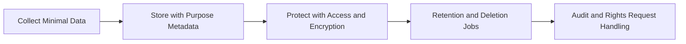

# Day 092 [Expert]: Compliance and Data Privacy

## Index

- Goal
- Prerequisites
- Explanation
- Topic by Topic
- Key Concepts
- Visual Concept Map
- End-to-End Practical
- Hands-on Coding
- Mini Exercise
- Assessment Quiz
- Task
- Self Check
- Interview Questions and Answers
- Day Outcome

## Goal

Implement compliance-aware data privacy architecture in Node systems with practical controls for consent, minimization, retention, and auditability.

## Prerequisites

- Day 091 multi-tenant architecture
- Encryption and identity management basics

## Explanation

Compliance is a system design requirement, not a legal afterthought. Privacy-focused architecture should explicitly define what data is collected, why it is needed, how long it is retained, and how user rights requests are fulfilled.

## Topic by Topic

### Topic 1: Data Classification and Inventory

Theory:
Classify data by sensitivity and regulatory scope.

Practical:
Build a data map linking fields to purpose, owner, and retention.

**Explanation:**
This topic explains Data Classification and Inventory in a practical Node.js backend context so you can build reliable, production-ready APIs and services.

**Key Points:**
- Understand the core idea behind Data Classification and Inventory.
- Apply the practical pattern with safe defaults and validation.
- Keep the implementation observable, maintainable, and secure where relevant.

### Topic 2: Consent and Purpose Limitation

Theory:
Data processing must align with declared purpose and user consent.

Practical:
Record consent version and processing basis with timestamp.

**Explanation:**
This topic explains Consent and Purpose Limitation in a practical Node.js backend context so you can build reliable, production-ready APIs and services.

**Key Points:**
- Understand the core idea behind Consent and Purpose Limitation.
- Apply the practical pattern with safe defaults and validation.
- Keep the implementation observable, maintainable, and secure where relevant.

### Topic 3: Retention and Deletion Workflow

Theory:
Unbounded retention increases legal and breach risk.

Practical:
Automate retention windows and verified deletion jobs.

**Explanation:**
This topic explains Retention and Deletion Workflow in a practical Node.js backend context so you can build reliable, production-ready APIs and services.

**Key Points:**
- Understand the core idea behind Retention and Deletion Workflow.
- Apply the practical pattern with safe defaults and validation.
- Keep the implementation observable, maintainable, and secure where relevant.

### Topic 4: Encryption, Access Control, and Auditing

Theory:
Sensitive data should be protected in transit, at rest, and in access pathways.

Practical:
Apply field-level encryption where needed and log privileged access.

**Explanation:**
This topic explains Encryption, Access Control, and Auditing in a practical Node.js backend context so you can build reliable, production-ready APIs and services.

**Key Points:**
- Understand the core idea behind Encryption, Access Control, and Auditing.
- Apply the practical pattern with safe defaults and validation.
- Keep the implementation observable, maintainable, and secure where relevant.

### Topic 5: Data Subject Rights Operations

Theory:
Systems must support access, correction, portability, and erasure requests.

Practical:
Create a rights-request workflow with SLA tracking.

**Explanation:**
This topic explains Data Subject Rights Operations in a practical Node.js backend context so you can build reliable, production-ready APIs and services.

**Key Points:**
- Understand the core idea behind Data Subject Rights Operations.
- Apply the practical pattern with safe defaults and validation.
- Keep the implementation observable, maintainable, and secure where relevant.

### Topic 6: Residency, Legal Holds, and Policy Enforcement

Theory:
Privacy controls must sometimes respect region limits and legal retention exceptions. Deletion cannot ignore lawful holds.

Practical:
Tag records by region, enforce residency-aware processing, and suspend deletion when legal hold is active.

**Explanation:**
This topic explains Residency, Legal Holds, and Policy Enforcement in a practical Node.js backend context so you can build reliable, production-ready APIs and services.

**Key Points:**
- Understand the core idea behind Residency, Legal Holds, and Policy Enforcement.
- Apply the practical pattern with safe defaults and validation.
- Keep the implementation observable, maintainable, and secure where relevant.

## Key Concepts

- Privacy-by-design architecture
- Consent and purpose traceability
- Retention and deletion automation
- Layered data protection controls
- Rights-request operational readiness
- Data residency-aware system design
- Legal-hold exception handling

## Visual Concept Map



## End-to-End Practical

1. Create data inventory for one user-facing flow.
2. Add consent capture and purpose metadata.
3. Implement retention policy job with dry-run mode.
4. Build data-export endpoint for user access request.
5. Add audit logging and compliance dashboard checks.

## Hands-on Coding

### Example 1: Case - Consent Record Model

Scenario:
User opts into marketing emails and consent must be auditable.

```js
const consentRecord = {
  userId,
  purpose: "marketing_email",
  consentGiven: true,
  policyVersion: "2026-07",
  capturedAt: new Date().toISOString(),
};
```

### Example 2: Case - Retention Cleanup Job

Scenario:
Delete expired session logs after retention period.

```js
await db.query(
  "DELETE FROM session_logs WHERE created_at < NOW() - INTERVAL '90 days'",
);
```

### Example 3: Case - Sensitive Field Redaction in Logs

Scenario:
Prevent PII leakage in structured logs.

```js
function redact(input) {
  return { ...input, email: "[REDACTED]", phone: "[REDACTED]" };
}
logger.info({ event: "profile_update", payload: redact(req.body) });
```

### Example 4: Case - Residency Tag Check

Scenario:
EU customer data must stay in approved processing region.

```js
if (user.region === "EU" && runtimeRegion !== "eu-west") {
  throw new Error("Residency policy violation");
}
```

### Example 5: Case - Legal Hold-aware Deletion

Scenario:
User requested deletion but account is under legal investigation hold.

```js
if (await legalHoldRepo.exists(userId)) {
  await rightsRequestRepo.markBlocked(userId, "legal_hold_active");
  return;
}

await privacyService.deleteUserData(userId);
```

## Mini Exercise

Scenario:
Implement privacy controls for account signup and profile update flows.

Expected output:

- Data map with purpose and retention tags
- Consent logging and redacted telemetry
- One automated cleanup or rights-request routine

## Assessment Quiz

### Quiz Questions

1. Why is data minimization important for compliance and security?
2. What role does policy versioning play in consent records?
3. True or False: Encryption alone guarantees compliance.
4. Why should deletion jobs have audit trails?
5. Why must deletion workflows consider legal holds and residency rules?

### Quiz Answers

1. Less sensitive data means lower legal and breach exposure.
2. It proves what terms the user agreed to at capture time.
3. False.
4. To demonstrate execution and support regulatory evidence.
5. Compliance can require retaining or region-restricting data even when deletion is requested.

## Task

- Add compliance metadata to one critical data flow
- Implement one retention/deletion automation path
- Complete mini exercise and quiz

## Self Check

- You can map compliance requirements to technical controls
- You can build auditable privacy workflows in Node services
- You can answer at least 4 out of 5 quiz questions

## Interview Questions and Answers

### Beginner

Question: What is personal data minimization?

Answer: Collecting and storing only the data needed for a defined purpose.

### Middle

Question: How would you implement the right to erasure technically?

Answer: Use request workflows, data-location inventory, verified deletion jobs, and immutable audit records.

### Advanced

Question: How do you design privacy controls for multi-region data residency requirements?

Answer: Partition data by region, enforce residency-aware routing, and prevent cross-region replication for regulated fields.

## Day 092 Outcome

- You can engineer compliance and privacy requirements into system design
- You can operationalize retention and rights-request workflows
- You are ready for platform engineering systems in Day 093
