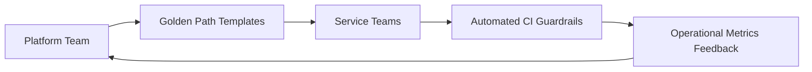

# Day 093 [Expert]: Platform Engineering for Node Teams

## Index

- Goal
- Prerequisites
- Explanation
- Topic by Topic
- Key Concepts
- Visual Concept Map
- End-to-End Practical
- Hands-on Coding
- Mini Exercise
- Assessment Quiz
- Task
- Self Check
- Interview Questions and Answers
- Day Outcome

## Goal

Build a platform engineering model for Node teams that improves developer experience, reliability, security, and delivery throughput at scale.

## Prerequisites

- Day 092 compliance and privacy workflows
- CI/CD and infrastructure-as-code foundations

## Explanation

Platform engineering creates internal products that enable application teams to deliver faster with safer defaults. Instead of every team reinventing deployment, observability, and security setup, platform capabilities provide paved paths with governance and flexibility.

## Topic by Topic

### Topic 1: Platform Product Mindset

Theory:
Treat platform capabilities as products with users, feedback loops, and measurable outcomes.

Practical:
Define developer personas and top friction points.

**Explanation:**
This topic explains Platform Product Mindset in a practical Node.js backend context so you can build reliable, production-ready APIs and services.

**Key Points:**
- Understand the core idea behind Platform Product Mindset.
- Apply the practical pattern with safe defaults and validation.
- Keep the implementation observable, maintainable, and secure where relevant.

### Topic 2: Golden Paths and Templates

Theory:
Golden paths reduce variability and operational mistakes.

Practical:
Publish standardized service templates for APIs, workers, and cron jobs.

**Explanation:**
This topic explains Golden Paths and Templates in a practical Node.js backend context so you can build reliable, production-ready APIs and services.

**Key Points:**
- Understand the core idea behind Golden Paths and Templates.
- Apply the practical pattern with safe defaults and validation.
- Keep the implementation observable, maintainable, and secure where relevant.

### Topic 3: Self-service Infrastructure

Theory:
Teams should provision common resources safely without long ticket queues.

Practical:
Expose approved infrastructure modules through self-service workflows.

**Explanation:**
This topic explains Self-service Infrastructure in a practical Node.js backend context so you can build reliable, production-ready APIs and services.

**Key Points:**
- Understand the core idea behind Self-service Infrastructure.
- Apply the practical pattern with safe defaults and validation.
- Keep the implementation observable, maintainable, and secure where relevant.

### Topic 4: Embedded Guardrails

Theory:
Guardrails are more scalable than manual approvals.

Practical:
Embed security, performance, and compliance checks into pipelines.

**Explanation:**
This topic explains Embedded Guardrails in a practical Node.js backend context so you can build reliable, production-ready APIs and services.

**Key Points:**
- Understand the core idea behind Embedded Guardrails.
- Apply the practical pattern with safe defaults and validation.
- Keep the implementation observable, maintainable, and secure where relevant.

### Topic 5: Adoption and Value Measurement

Theory:
Platform success depends on adoption and measurable impact, not only feature count.

Practical:
Track lead time, failure rate, and onboarding time before/after adoption.

**Explanation:**
This topic explains Adoption and Value Measurement in a practical Node.js backend context so you can build reliable, production-ready APIs and services.

**Key Points:**
- Understand the core idea behind Adoption and Value Measurement.
- Apply the practical pattern with safe defaults and validation.
- Keep the implementation observable, maintainable, and secure where relevant.

### Topic 6: Escape Hatches and Platform Reliability

Theory:
Golden paths must be easy, but exceptional cases still exist. Platform teams also need uptime and support standards for the platform itself.

Practical:
Allow documented escape hatches with review, and define platform SLOs for critical internal services.

**Explanation:**
This topic explains Escape Hatches and Platform Reliability in a practical Node.js backend context so you can build reliable, production-ready APIs and services.

**Key Points:**
- Understand the core idea behind Escape Hatches and Platform Reliability.
- Apply the practical pattern with safe defaults and validation.
- Keep the implementation observable, maintainable, and secure where relevant.

## Key Concepts

- Internal developer platform strategy
- Golden path architecture
- Self-service with policy boundaries
- Automated quality guardrails
- Metrics-driven platform evolution
- Safe escape-hatch governance
- Platform-as-product reliability thinking

## Visual Concept Map



## End-to-End Practical

1. Define one golden path for Node API services.
2. Add template with logging, health checks, and security middleware.
3. Integrate CI policies for lint, test, SAST, and dependency checks.
4. Publish documentation and quick-start workflow.
5. Measure adoption and delivery KPI change after rollout.

## Hands-on Coding

### Example 1: Case - Service Template Starter

Scenario:
New team should bootstrap production-ready API in minutes.

```js
app.get("/health", (_req, res) => {
  res.status(200).json({ status: "ok", service: "orders-api" });
});
```

### Example 2: Case - Pipeline Guardrail Concept

Scenario:
Build must fail when critical security vulnerabilities are detected.

```yaml
steps:
  - run: npm ci
  - run: npm test
  - run: npm audit --audit-level=high
```

### Example 3: Case - Platform Telemetry Event

Scenario:
Track which template versions are used by teams.

```js
logger.info({
  event: "platform_template_used",
  template: "node-api-v3",
  team: process.env.TEAM_NAME,
});
```

### Example 4: Case - Escape Hatch Request Template

Scenario:
Team needs a non-standard queue topology not covered by the default template.

```txt
request: custom-worker-topology
reason: high-volume fanout use case
owner: media-platform
reviewer: platform-architecture
expiry: revisit in 60 days
```

### Example 5: Case - Platform SLO Example

Scenario:
Internal deployment portal is critical for engineering throughput.

```txt
service: developer-portal
availability_slo: 99.9%
incident_response: page platform-oncall if unavailable > 10m
```

## Mini Exercise

Scenario:
Design one reusable platform template and adoption plan for internal Node teams.

Expected output:

- Template with production-safe defaults
- Guardrails and policy checks integrated
- Adoption and success metrics defined

## Assessment Quiz

### Quiz Questions

1. Why is platform engineering not just a DevOps rebrand?
2. What is a golden path in this context?
3. True or False: Guardrails should rely primarily on manual review.
4. Which metric best reflects developer experience improvement?
5. Why are escape hatches important in platform engineering?

### Quiz Answers

1. It focuses on productizing internal developer capabilities with measurable outcomes.
2. A standardized, supported way to build and run services safely.
3. False.
4. Lead time to production and onboarding time reduction.
5. Some legitimate edge cases need flexibility without breaking overall governance.

## Task

- Build one Node service golden path template
- Add at least one automated policy guardrail
- Complete mini exercise and quiz

## Self Check

- You can define and ship platform capabilities for Node teams
- You can balance developer autonomy with operational governance
- You can answer at least 4 out of 5 quiz questions

## Interview Questions and Answers

### Beginner

Question: What is platform engineering in simple terms?

Answer: Building internal tools and defaults that help teams deliver software faster and safer.

### Middle

Question: How do you increase adoption of platform standards?

Answer: Make the paved path the easiest path with clear docs, templates, and responsive support.

### Advanced

Question: How would you prevent platform team bottlenecks while keeping governance strong?

Answer: Use self-service interfaces with automated policy enforcement and clear ownership boundaries.

## Day 093 Outcome

- You can design high-impact platform engineering systems for Node teams
- You can operationalize templates, guardrails, and adoption loops
- You are ready for tech lead decision frameworks in Day 094
