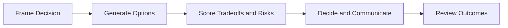

# Day 094 [Expert]: Tech Lead Decision Framework

## Index

- Goal
- Prerequisites
- Explanation
- Topic by Topic
- Key Concepts
- Visual Concept Map
- End-to-End Practical
- Hands-on Coding
- Mini Exercise
- Assessment Quiz
- Task
- Self Check
- Interview Questions and Answers
- Day Outcome

## Goal

Build a repeatable decision framework for tech leads to make high-quality architecture and delivery decisions under uncertainty.

## Prerequisites

- Day 093 platform engineering strategy
- System design tradeoff analysis basics

## Explanation

Tech lead decisions often involve incomplete information, conflicting priorities, and irreversible costs. A formal decision framework improves consistency, communication, and accountability across product, engineering, and operations.

## Topic by Topic

### Topic 1: Decision Framing

Theory:
Clear framing defines what is being decided, why now, and what constraints exist.

Practical:
Write a one-page decision statement before evaluating options.

**Explanation:**
This topic explains Decision Framing in a practical Node.js backend context so you can build reliable, production-ready APIs and services.

**Key Points:**
- Understand the core idea behind Decision Framing.
- Apply the practical pattern with safe defaults and validation.
- Keep the implementation observable, maintainable, and secure where relevant.

### Topic 2: Option Analysis and Tradeoff Scoring

Theory:
Compare options across dimensions like reliability, cost, speed, and complexity.

Practical:
Use weighted scoring or pros/cons matrix.

**Explanation:**
This topic explains Option Analysis and Tradeoff Scoring in a practical Node.js backend context so you can build reliable, production-ready APIs and services.

**Key Points:**
- Understand the core idea behind Option Analysis and Tradeoff Scoring.
- Apply the practical pattern with safe defaults and validation.
- Keep the implementation observable, maintainable, and secure where relevant.

### Topic 3: Risk and Reversibility

Theory:
Not all decisions are equal; irreversible decisions require higher rigor.

Practical:
Classify decisions as reversible (Type 2) or hard-to-reverse (Type 1).

**Explanation:**
This topic explains Risk and Reversibility in a practical Node.js backend context so you can build reliable, production-ready APIs and services.

**Key Points:**
- Understand the core idea behind Risk and Reversibility.
- Apply the practical pattern with safe defaults and validation.
- Keep the implementation observable, maintainable, and secure where relevant.

### Topic 4: Alignment and Communication

Theory:
Good decisions fail when context is not shared with stakeholders.

Practical:
Publish Architecture Decision Records (ADR) with rationale and consequences.

**Explanation:**
This topic explains Alignment and Communication in a practical Node.js backend context so you can build reliable, production-ready APIs and services.

**Key Points:**
- Understand the core idea behind Alignment and Communication.
- Apply the practical pattern with safe defaults and validation.
- Keep the implementation observable, maintainable, and secure where relevant.

### Topic 5: Follow-through and Review

Theory:
Decision quality includes execution outcomes and feedback loops.

Practical:
Schedule decision review checkpoints at 30/60/90 days.

**Explanation:**
This topic explains Follow-through and Review in a practical Node.js backend context so you can build reliable, production-ready APIs and services.

**Key Points:**
- Understand the core idea behind Follow-through and Review.
- Apply the practical pattern with safe defaults and validation.
- Keep the implementation observable, maintainable, and secure where relevant.

### Topic 6: Assumption Tracking and Trigger Points

Theory:
Many decisions fail because hidden assumptions change quietly. Explicit trigger points tell teams when to revisit a decision.

Practical:
Record top assumptions and define thresholds that force reconsideration.

**Explanation:**
This topic explains Assumption Tracking and Trigger Points in a practical Node.js backend context so you can build reliable, production-ready APIs and services.

**Key Points:**
- Understand the core idea behind Assumption Tracking and Trigger Points.
- Apply the practical pattern with safe defaults and validation.
- Keep the implementation observable, maintainable, and secure where relevant.

## Key Concepts

- Decision framing clarity
- Multi-factor option evaluation
- Reversibility-aware rigor
- Transparent stakeholder communication
- Outcome-based review discipline
- Assumption-aware decision records
- Trigger-based re-evaluation

## Visual Concept Map



## End-to-End Practical

1. Draft a decision brief for one architecture choice.
2. Compare at least three options with weighted criteria.
3. Evaluate risks, reversibility, and mitigation plans.
4. Publish ADR and rollout decision.
5. Review outcomes and capture lessons.

## Hands-on Coding

### Example 1: Case - Weighted Decision Criteria

Scenario:
Choose between monolith optimization, modular monolith, and microservices split.

```json
{
  "criteria": {
    "delivery_speed": 0.25,
    "reliability": 0.3,
    "cost": 0.2,
    "team_autonomy": 0.25
  }
}
```

### Example 2: Case - ADR Skeleton

Scenario:
Document architecture decision for future maintainers.

```md
# ADR-017: Move Checkout to Dedicated Service

## Context

## Decision

## Consequences

## Rollback Plan
```

### Example 3: Case - Decision Review Check

Scenario:
Evaluate if expected impact happened after rollout.

```js
if (metrics.leadTimePctChange <= -15 && metrics.errorRateStable) {
  console.log("Decision outcome meets target");
}
```

### Example 4: Case - Assumption Log

Scenario:
Service split decision depends on traffic growth and team staffing.

```txt
assumption_1: checkout traffic will double in 2 quarters
assumption_2: team will grow from 4 to 8 engineers
assumption_3: current monolith deploy risk remains above threshold
```

### Example 5: Case - Revisit Trigger

Scenario:
Original architecture decision should be re-opened if reality shifts.

```txt
revisit_if:
- p95 latency stays above 800ms for 30 days
- team size remains under 5 engineers
- migration cost estimate rises above agreed budget
```

## Mini Exercise

Scenario:
Use the framework to decide how to scale one critical Node subsystem in the next quarter.

Expected output:

- Decision framing and constraints
- Option matrix with scoring and risks
- ADR and post-decision review plan

## Assessment Quiz

### Quiz Questions

1. Why should decisions be classified by reversibility?
2. What is the value of an ADR in team-scale systems?
3. True or False: Fast decisions should skip explicit tradeoff documentation.
4. Which factors are commonly underweighted in architecture decisions?
5. Why document assumptions with revisit triggers?

### Quiz Answers

1. It determines how much analysis and safeguards are required.
2. It preserves rationale, assumptions, and consequences for future teams.
3. False.
4. Operational load, migration cost, and long-term ownership burden.
5. It makes hidden risks visible and tells the team when the decision may no longer fit reality.

## Task

- Run one architecture decision using a weighted framework
- Publish one ADR with rollback and review checkpoints
- Complete mini exercise and quiz

## Self Check

- You can make structured tech lead decisions under uncertainty
- You can communicate and review decisions effectively
- You can answer at least 4 out of 5 quiz questions

## Interview Questions and Answers

### Beginner

Question: Why do teams need a formal decision framework?

Answer: It improves consistency and reduces ad-hoc decisions with hidden risks.

### Middle

Question: What makes an architecture decision high quality?

Answer: Clear context, explicit tradeoffs, risk mitigation, and measurable outcomes.

### Advanced

Question: How do you make good decisions when data is incomplete?

Answer: Use bounded experiments, reversible rollouts, and time-boxed assumptions with clear re-evaluation triggers.

## Day 094 Outcome

- You can drive architecture and delivery decisions with repeatable rigor
- You can align technical direction across stakeholders
- You are ready for client-server state strategy in Day 095
