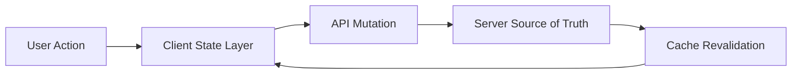

# Day 095 [Expert]: State Strategy Across Client and Server

## Index

- Goal
- Prerequisites
- Explanation
- Topic by Topic
- Key Concepts
- Visual Concept Map
- End-to-End Practical
- Hands-on Coding
- Mini Exercise
- Assessment Quiz
- Task
- Self Check
- Interview Questions and Answers
- Day Outcome

## Goal

Design a coherent state strategy across client and server that improves consistency, performance, and operational correctness.

## Prerequisites

- Day 094 decision framework
- React state and Node API caching fundamentals

## Explanation

State strategy breaks when ownership is unclear: what belongs on the client, what is authoritative on the server, and what can be cached temporarily. A good strategy minimizes stale behavior while preserving fast UX and efficient backend resource usage.

## Topic by Topic

### Topic 1: State Ownership Model

Theory:
Classify state as server-authoritative, client-ephemeral, derived, or synchronized.

Practical:
Define ownership and invalidation rules per state type.

**Explanation:**
This topic explains State Ownership Model in a practical Node.js backend context so you can build reliable, production-ready APIs and services.

**Key Points:**
- Understand the core idea behind State Ownership Model.
- Apply the practical pattern with safe defaults and validation.
- Keep the implementation observable, maintainable, and secure where relevant.

### Topic 2: Fetching, Caching, and Revalidation

Theory:
Caching reduces latency but increases staleness risk.

Practical:
Use TTL, revalidation, and mutation invalidation patterns.

**Explanation:**
This topic explains Fetching, Caching, and Revalidation in a practical Node.js backend context so you can build reliable, production-ready APIs and services.

**Key Points:**
- Understand the core idea behind Fetching, Caching, and Revalidation.
- Apply the practical pattern with safe defaults and validation.
- Keep the implementation observable, maintainable, and secure where relevant.

### Topic 3: Optimistic Updates and Consistency

Theory:
Optimistic UI improves responsiveness but needs conflict handling.

Practical:
Apply optimistic updates with rollback on server rejection.

**Explanation:**
This topic explains Optimistic Updates and Consistency in a practical Node.js backend context so you can build reliable, production-ready APIs and services.

**Key Points:**
- Understand the core idea behind Optimistic Updates and Consistency.
- Apply the practical pattern with safe defaults and validation.
- Keep the implementation observable, maintainable, and secure where relevant.

### Topic 4: Real-time Synchronization

Theory:
Collaborative or high-change domains need push-based state updates.

Practical:
Merge websocket events into local cache with version checks.

**Explanation:**
This topic explains Real-time Synchronization in a practical Node.js backend context so you can build reliable, production-ready APIs and services.

**Key Points:**
- Understand the core idea behind Real-time Synchronization.
- Apply the practical pattern with safe defaults and validation.
- Keep the implementation observable, maintainable, and secure where relevant.

### Topic 5: Observability and Debuggability

Theory:
State bugs are hard to diagnose without traceable events.

Practical:
Log mutation lifecycle and correlation IDs across client-server boundary.

**Explanation:**
This topic explains Observability and Debuggability in a practical Node.js backend context so you can build reliable, production-ready APIs and services.

**Key Points:**
- Understand the core idea behind Observability and Debuggability.
- Apply the practical pattern with safe defaults and validation.
- Keep the implementation observable, maintainable, and secure where relevant.

### Topic 6: Offline Tolerance and Sync Recovery

Theory:
Some apps must continue working during short disconnects. Offline tolerance needs queued mutations and conflict-aware resync.

Practical:
Store pending local actions and replay them after reconnect with version checks.

**Explanation:**
This topic explains Offline Tolerance and Sync Recovery in a practical Node.js backend context so you can build reliable, production-ready APIs and services.

**Key Points:**
- Understand the core idea behind Offline Tolerance and Sync Recovery.
- Apply the practical pattern with safe defaults and validation.
- Keep the implementation observable, maintainable, and secure where relevant.

## Key Concepts

- State ownership contracts
- Cache coherence and invalidation
- Optimistic mutation safety
- Real-time sync conflict management
- End-to-end state observability
- Offline-first mutation queueing
- Resync and replay discipline

## Visual Concept Map



## End-to-End Practical

1. Define state ownership for one product flow.
2. Implement query cache with staleness policy.
3. Add optimistic update and rollback handling.
4. Integrate websocket event reconciliation.
5. Validate consistency with failure injection tests.

## Hands-on Coding

### Example 1: Case - Ownership Contract

Scenario:
Profile preferences edited on client but saved on server as source of truth.

```ts
type PreferencesState = {
  localDraft: { theme: string; language: string };
  serverVersion: number;
};
```

### Example 2: Case - Optimistic Mutation Rollback

Scenario:
Task status update appears instantly and reverts on API failure.

```js
const prev = cache.get(taskId);
cache.set(taskId, { ...prev, status: "done" });
try {
  await api.updateTask(taskId, { status: "done" });
} catch {
  cache.set(taskId, prev);
}
```

### Example 3: Case - Event Version Guard

Scenario:
Ignore stale websocket events that arrive out of order.

```js
if (event.version <= local.version) return;
applyEvent(event);
```

### Example 4: Case - Pending Mutation Queue

Scenario:
User edits tasks while temporarily offline.

```js
pendingQueue.push({
  action: "updateTask",
  taskId,
  payload: { status: "done" },
  createdAt: Date.now(),
});
```

### Example 5: Case - Replay on Reconnect

Scenario:
Queued local changes should be retried after connectivity returns.

```js
for (const item of pendingQueue) {
  await api[item.action](item.taskId, item.payload);
}
pendingQueue.length = 0;
```

## Mini Exercise

Scenario:
Implement a real-time task board with cached queries, optimistic updates, and server reconciliation.

Expected output:

- State ownership matrix
- Conflict-safe optimistic update logic
- Revalidation and event-order handling

## Assessment Quiz

### Quiz Questions

1. Why should server state and UI state be separated conceptually?
2. What is the main risk of optimistic updates?
3. True or False: Cache invalidation can be skipped if TTL is short.
4. Why are version numbers useful in real-time systems?
5. Why queue mutations for offline-tolerant flows?

### Quiz Answers

1. It clarifies authority boundaries and prevents accidental divergence.
2. UI and server can diverge if failures/conflicts are not handled.
3. False.
4. They prevent stale updates from overwriting newer state.
5. It preserves user actions and enables safe replay after connectivity returns.

## Task

- Define state ownership and invalidation for one feature
- Implement optimistic update with rollback path
- Complete mini exercise and quiz

## Self Check

- You can design reliable state flow across client and server
- You can manage performance and consistency tradeoffs explicitly
- You can answer at least 4 out of 5 quiz questions

## Interview Questions and Answers

### Beginner

Question: What is the difference between client state and server state?

Answer: Client state is local UI/session data; server state is authoritative shared data managed by backend systems.

### Middle

Question: How do you avoid stale UI when multiple clients update the same resource?

Answer: Use versioned updates, invalidation rules, and real-time reconciliation events.

### Advanced

Question: How would you design state strategy for offline-first plus real-time collaboration?

Answer: Combine local operation logs, conflict-resolution strategy, server sequencing, and reconciliation with deterministic merge rules.

## Day 095 Outcome

- You can architect state across client and server with production-grade reliability
- You can handle consistency, performance, and user experience tradeoffs
- You are ready for expert capstone implementation tracks next
