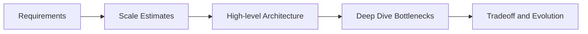

# Day 097 [Expert]: System Design Interview Simulation

## Index

- Goal
- Prerequisites
- Explanation
- Topic by Topic
- Key Concepts
- Visual Concept Map
- End-to-End Practical
- Hands-on Coding
- Mini Exercise
- Assessment Quiz
- Task
- Self Check
- Interview Questions and Answers
- Day Outcome

## Goal

Master end-to-end system design interview execution for Node-centric architectures with strong reasoning, tradeoff depth, and scale thinking.

## Prerequisites

- Day 096 machine coding simulation
- Distributed systems and API architecture basics

## Explanation

System design interviews evaluate your ability to decompose large problems, estimate scale, choose architecture patterns, and defend tradeoffs. Success depends on structured communication and progressive deepening from high-level design to bottleneck mitigation.

## Topic by Topic

### Topic 1: Problem Framing and Clarification

Theory:
Design quality starts with accurate scope and constraints.

Practical:
Clarify user scale, latency targets, consistency needs, and failure tolerance.

**Explanation:**
This topic explains Problem Framing and Clarification in a practical Node.js backend context so you can build reliable, production-ready APIs and services.

**Key Points:**
- Understand the core idea behind Problem Framing and Clarification.
- Apply the practical pattern with safe defaults and validation.
- Keep the implementation observable, maintainable, and secure where relevant.

### Topic 2: Capacity Estimation and Sizing

Theory:
Rough calculations anchor architecture decisions.

Practical:
Estimate QPS, storage growth, and bandwidth for the target workload.

**Explanation:**
This topic explains Capacity Estimation and Sizing in a practical Node.js backend context so you can build reliable, production-ready APIs and services.

**Key Points:**
- Understand the core idea behind Capacity Estimation and Sizing.
- Apply the practical pattern with safe defaults and validation.
- Keep the implementation observable, maintainable, and secure where relevant.

### Topic 3: Baseline Architecture Draft

Theory:
Start simple and evolve complexity only where needed.

Practical:
Sketch client, API layer, core services, cache, DB, and queue.

**Explanation:**
This topic explains Baseline Architecture Draft in a practical Node.js backend context so you can build reliable, production-ready APIs and services.

**Key Points:**
- Understand the core idea behind Baseline Architecture Draft.
- Apply the practical pattern with safe defaults and validation.
- Keep the implementation observable, maintainable, and secure where relevant.

### Topic 4: Bottleneck and Failure Analysis

Theory:
Interview depth comes from identifying hotspots and mitigation plans.

Practical:
Discuss cache stampede, DB contention, and partial outage handling.

**Explanation:**
This topic explains Bottleneck and Failure Analysis in a practical Node.js backend context so you can build reliable, production-ready APIs and services.

**Key Points:**
- Understand the core idea behind Bottleneck and Failure Analysis.
- Apply the practical pattern with safe defaults and validation.
- Keep the implementation observable, maintainable, and secure where relevant.

### Topic 5: Tradeoff Defense and Evolution Path

Theory:
No design is perfect; defend choices with context.

Practical:
Compare alternatives and propose next-stage architecture evolution.

**Explanation:**
This topic explains Tradeoff Defense and Evolution Path in a practical Node.js backend context so you can build reliable, production-ready APIs and services.

**Key Points:**
- Understand the core idea behind Tradeoff Defense and Evolution Path.
- Apply the practical pattern with safe defaults and validation.
- Keep the implementation observable, maintainable, and secure where relevant.

### Topic 6: Interview Time Management and Depth Control

Theory:
Strong candidates know where to go deep and where to stay high level. Poor pacing can hide otherwise good thinking.

Practical:
Spend time in layers: requirements first, baseline design second, deep dives only on highest-risk areas.

**Explanation:**
This topic explains Interview Time Management and Depth Control in a practical Node.js backend context so you can build reliable, production-ready APIs and services.

**Key Points:**
- Understand the core idea behind Interview Time Management and Depth Control.
- Apply the practical pattern with safe defaults and validation.
- Keep the implementation observable, maintainable, and secure where relevant.

## Key Concepts

- Structured design narrative
- Estimation-informed decisions
- Progressive architecture refinement
- Reliability and bottleneck analysis
- Tradeoff communication confidence
- Time-boxed depth management
- Risk-prioritized deep dives

## Visual Concept Map



## End-to-End Practical

1. Choose one interview prompt (for example, real-time notifications).
2. Capture requirements and non-goals.
3. Estimate capacity and storage assumptions.
4. Propose base design and failure mitigations.
5. Defend alternatives and future scaling path.

## Hands-on Coding

### Example 1: Case - Rough Throughput Estimate

Scenario:
Design service for 5 million daily active users.

```txt
DAU = 5,000,000
Average requests/user/day = 24
Total requests/day = 120,000,000
Average QPS ≈ 1,389
Peak QPS (x4) ≈ 5,556
```

### Example 2: Case - Queue-based Decoupling

Scenario:
Notification writes should not block user actions.

```js
await queue.publish("notification-events", {
  userId,
  type: "comment_reply",
  createdAt: Date.now(),
});
```

### Example 3: Case - Cache Stampede Lock

Scenario:
Protect hot key reads when cache expires.

```js
const lockAcquired = await redis.set(`lock:${key}`, "1", "NX", "EX", 5);
if (lockAcquired) {
  const data = await db.read(key);
  await redis.set(key, JSON.stringify(data), "EX", 60);
}
```

### Example 4: Case - 45-minute Design Cadence

Scenario:
Candidate needs a simple pace plan for a short interview round.

```txt
0-8 min: clarify requirements and constraints
8-15 min: estimate scale
15-25 min: draw baseline architecture
25-35 min: discuss bottlenecks and failure handling
35-45 min: tradeoffs, alternatives, and evolution path
```

### Example 5: Case - Deep-dive Selection Rule

Scenario:
Do not spend equal time on every component.

```txt
Go deep on components with highest risk:
- storage hot path
- caching strategy
- consistency model
- failure recovery
```

## Mini Exercise

Scenario:
Run a timed 45-minute system design simulation for a social feed service.

Expected output:

- Requirement and scale sheet
- Architecture diagram with component responsibilities
- Bottleneck mitigation and tradeoff notes

## Assessment Quiz

### Quiz Questions

1. Why should interviews start with clarifying questions?
2. What is the value of rough sizing before architecture details?
3. True or False: It is better to jump directly to microservices in interviews.
4. Name one common failure mode for high-traffic read systems.
5. Why is pacing important in system design interviews?

### Quiz Answers

1. It prevents wrong assumptions and aligns design decisions.
2. It validates feasibility and guides component choices.
3. False.
4. Cache stampede or database hot partition pressure.
5. Good pacing ensures requirements, architecture, and tradeoffs all get visible discussion time.

## Task

- Complete one timed system design simulation
- Include estimates, architecture, and failure handling
- Complete mini exercise and quiz

## Self Check

- You can lead system design discussions with structure and confidence
- You can defend architecture choices with data and constraints
- You can answer at least 4 out of 5 quiz questions

## Interview Questions and Answers

### Beginner

Question: What is the first step in a system design interview?

Answer: Clarify requirements, scale expectations, and key constraints.

### Middle

Question: How do you decide when to introduce caching?

Answer: Add caching when read frequency is high and data staleness tolerance is acceptable.

### Advanced

Question: How do you defend a design that is not "perfect"?

Answer: Explain why it is optimal for current constraints and present a clear evolution strategy.

## Day 097 Outcome

- You can run complete system design interview simulations effectively
- You can communicate architecture tradeoffs at expert depth
- You are ready for architecture review defense in Day 098
