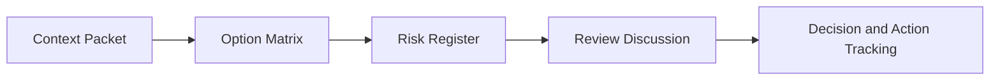

# Day 098 [Expert]: Architecture Review and Tradeoff Defense

## Index

- Goal
- Prerequisites
- Explanation
- Topic by Topic
- Key Concepts
- Visual Concept Map
- End-to-End Practical
- Hands-on Coding
- Mini Exercise
- Assessment Quiz
- Task
- Self Check
- Interview Questions and Answers
- Day Outcome

## Goal

Lead architecture reviews with evidence-based tradeoff defense, risk visibility, and decision traceability.

## Prerequisites

- Day 097 system design simulation
- ADR and reliability metrics familiarity

## Explanation

Architecture review is where design quality is stress-tested against production reality. The goal is not to "win" debates, but to expose assumptions, compare options, and reach accountable decisions with explicit risks and mitigations.

## Topic by Topic

### Topic 1: Review Preparation Artifacts

Theory:
Reviews fail when context is missing.

Practical:
Prepare problem statement, alternatives, constraints, and non-goals in advance.

**Explanation:**
This topic explains Review Preparation Artifacts in a practical Node.js backend context so you can build reliable, production-ready APIs and services.

**Key Points:**
- Understand the core idea behind Review Preparation Artifacts.
- Apply the practical pattern with safe defaults and validation.
- Keep the implementation observable, maintainable, and secure where relevant.

### Topic 2: Tradeoff Matrix Construction

Theory:
Comparing options on common criteria reduces subjective bias.

Practical:
Score options on reliability, cost, latency, complexity, and team fit.

**Explanation:**
This topic explains Tradeoff Matrix Construction in a practical Node.js backend context so you can build reliable, production-ready APIs and services.

**Key Points:**
- Understand the core idea behind Tradeoff Matrix Construction.
- Apply the practical pattern with safe defaults and validation.
- Keep the implementation observable, maintainable, and secure where relevant.

### Topic 3: Risk Register and Mitigation Plan

Theory:
Every option carries risk; strong reviews make this explicit.

Practical:
Attach owner, probability, impact, and mitigation for top risks.

**Explanation:**
This topic explains Risk Register and Mitigation Plan in a practical Node.js backend context so you can build reliable, production-ready APIs and services.

**Key Points:**
- Understand the core idea behind Risk Register and Mitigation Plan.
- Apply the practical pattern with safe defaults and validation.
- Keep the implementation observable, maintainable, and secure where relevant.

### Topic 4: Objection Handling and Debate Quality

Theory:
Good technical debate improves design if grounded in constraints.

Practical:
Address concerns with data and run limited experiments where uncertainty remains.

**Explanation:**
This topic explains Objection Handling and Debate Quality in a practical Node.js backend context so you can build reliable, production-ready APIs and services.

**Key Points:**
- Understand the core idea behind Objection Handling and Debate Quality.
- Apply the practical pattern with safe defaults and validation.
- Keep the implementation observable, maintainable, and secure where relevant.

### Topic 5: Decision Closure and Follow-up

Theory:
A review without a closed decision creates drift and rework.

Practical:
Publish decision outcome, action items, and review checkpoints.

**Explanation:**
This topic explains Decision Closure and Follow-up in a practical Node.js backend context so you can build reliable, production-ready APIs and services.

**Key Points:**
- Understand the core idea behind Decision Closure and Follow-up.
- Apply the practical pattern with safe defaults and validation.
- Keep the implementation observable, maintainable, and secure where relevant.

### Topic 6: Review Culture and Red-team Thinking

Theory:
Healthy reviews welcome challenge without becoming personal. Red-team thinking surfaces hidden failure modes before production does.

Practical:
Ask one reviewer to argue against the preferred design using operational and security risk scenarios.

**Explanation:**
This topic explains Review Culture and Red-team Thinking in a practical Node.js backend context so you can build reliable, production-ready APIs and services.

**Key Points:**
- Understand the core idea behind Review Culture and Red-team Thinking.
- Apply the practical pattern with safe defaults and validation.
- Keep the implementation observable, maintainable, and secure where relevant.

## Key Concepts

- Review readiness artifacts
- Structured tradeoff comparison
- Risk-first decision hygiene
- Constraint-driven technical debate
- Decision closure discipline
- Constructive dissent in reviews
- Pre-production adversarial thinking

## Visual Concept Map



## End-to-End Practical

1. Build architecture review packet for one upcoming feature.
2. Prepare at least three viable options with matrix scoring.
3. Document top five risks and mitigations.
4. Conduct a mock review with objections.
5. Publish ADR plus follow-up validation plan.

## Hands-on Coding

### Example 1: Case - Tradeoff Matrix Snippet

Scenario:
Compare event-driven integration vs direct synchronous orchestration.

```json
{
  "event_driven": {
    "reliability": 8,
    "latency": 6,
    "cost": 7,
    "complexity": 5
  },
  "sync_orchestration": {
    "reliability": 6,
    "latency": 8,
    "cost": 6,
    "complexity": 7
  }
}
```

### Example 2: Case - Risk Register Entry

Scenario:
New architecture introduces message ordering risk.

```yaml
risk: "Out-of-order event processing"
probability: "medium"
impact: "high"
mitigation: "idempotency keys + version checks"
owner: "payments-team"
```

### Example 3: Case - Decision Evidence Check

Scenario:
Validate post-launch whether decision assumptions were correct.

```js
if (metrics.errorRate > baseline.errorRate * 1.1) {
  console.warn("Decision assumption mismatch: error rate regression detected");
}
```

### Example 4: Case - Red-team Review Prompt

Scenario:
Team is confident in a proposed multi-region design and needs stronger challenge.

```txt
red-team questions:
- what fails during partial region outage?
- what hidden cost grows fastest?
- where can data consistency break?
- what is hardest to operate at 10x scale?
```

### Example 5: Case - Review Outcome Template

Scenario:
Close review with explicit next steps and unresolved risks.

```txt
decision: approve with conditions
top_risks: event ordering, migration complexity
required_actions: add replay plan, run load test
recheck_date: 30 days after rollout
```

## Mini Exercise

Scenario:
Run a complete architecture review for a multi-region API scaling proposal.

Expected output:

- Review packet and options matrix
- Risk register with owners
- Decision note and validation milestones

## Assessment Quiz

### Quiz Questions

1. Why must non-goals be explicit in architecture reviews?
2. What does a risk register add beyond a design diagram?
3. True or False: Reviews should avoid unresolved uncertainty discussions.
4. What is a healthy sign of review quality?
5. Why include red-team thinking in architecture reviews?

### Quiz Answers

1. It protects scope and prevents evaluation noise.
2. It turns uncertainty into managed action items.
3. False.
4. Objections are surfaced and resolved with evidence.
5. It exposes weak assumptions and failure paths before they become production incidents.

## Task

- Prepare one architecture review packet and matrix
- Facilitate one mock tradeoff defense session
- Complete mini exercise and quiz

## Self Check

- You can run high-quality architecture reviews with clear outcomes
- You can defend tradeoffs with context and evidence
- You can answer at least 4 out of 5 quiz questions

## Interview Questions and Answers

### Beginner

Question: What should be included in a basic architecture review document?

Answer: Problem statement, constraints, options, recommendation, and risks.

### Middle

Question: How do you handle stakeholder disagreement in a review?

Answer: Re-anchor to goals/constraints, compare options objectively, and propose measurable experiments.

### Advanced

Question: How do you defend a higher-cost architecture choice?

Answer: Show long-term reliability, scale, and operational benefits that outweigh near-term cost.

## Day 098 Outcome

- You can conduct architecture reviews with strong decision clarity
- You can make tradeoff defense explicit and auditable
- You are ready for capstone delivery and portfolio readiness in Day 099
