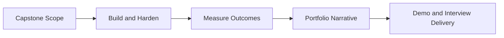

# Day 099 [Expert]: Capstone Delivery and Portfolio Readiness

## Index

- Goal
- Prerequisites
- Explanation
- Topic by Topic
- Key Concepts
- Visual Concept Map
- End-to-End Practical
- Hands-on Coding
- Mini Exercise
- Assessment Quiz
- Task
- Self Check
- Interview Questions and Answers
- Day Outcome

## Goal

Deliver a production-grade capstone and package it into a portfolio narrative that demonstrates senior Node engineering capability.

## Prerequisites

- Day 098 architecture review and tradeoff defense
- CI/CD, testing, and observability implementation familiarity

## Explanation

Strong projects fail to impress when delivery quality and storytelling are weak. Portfolio readiness means presenting architecture decisions, production practices, measurable impact, and lessons learned in a concise professional format.

## Topic by Topic

### Topic 1: Capstone Scope and Success Criteria

Theory:
Ambitious but unfinished projects are weaker than focused complete solutions.

Practical:
Define must-have features, quality gates, and explicit non-goals.

**Explanation:**
This topic explains Capstone Scope and Success Criteria in a practical Node.js backend context so you can build reliable, production-ready APIs and services.

**Key Points:**
- Understand the core idea behind Capstone Scope and Success Criteria.
- Apply the practical pattern with safe defaults and validation.
- Keep the implementation observable, maintainable, and secure where relevant.

### Topic 2: Production-readiness Checklist

Theory:
A capstone should demonstrate real engineering rigor.

Practical:
Include auth, validation, error handling, tests, observability, and deployment docs.

**Explanation:**
This topic explains Production-readiness Checklist in a practical Node.js backend context so you can build reliable, production-ready APIs and services.

**Key Points:**
- Understand the core idea behind Production-readiness Checklist.
- Apply the practical pattern with safe defaults and validation.
- Keep the implementation observable, maintainable, and secure where relevant.

### Topic 3: Evidence and Metrics

Theory:
Claims are stronger with measurable proof.

Practical:
Track latency, reliability, test coverage, and incident-free runtime metrics.

**Explanation:**
This topic explains Evidence and Metrics in a practical Node.js backend context so you can build reliable, production-ready APIs and services.

**Key Points:**
- Understand the core idea behind Evidence and Metrics.
- Apply the practical pattern with safe defaults and validation.
- Keep the implementation observable, maintainable, and secure where relevant.

### Topic 4: Portfolio Narrative Design

Theory:
Hiring reviewers need fast signal on problem, approach, and impact.

Practical:
Use a concise structure: problem, architecture, tradeoffs, outcomes, future roadmap.

**Explanation:**
This topic explains Portfolio Narrative Design in a practical Node.js backend context so you can build reliable, production-ready APIs and services.

**Key Points:**
- Understand the core idea behind Portfolio Narrative Design.
- Apply the practical pattern with safe defaults and validation.
- Keep the implementation observable, maintainable, and secure where relevant.

### Topic 5: Demo and Interview Packaging

Theory:
Delivery quality includes how clearly you explain and demonstrate your work.

Practical:
Prepare a 5-minute and 15-minute version of your project walkthrough.

**Explanation:**
This topic explains Demo and Interview Packaging in a practical Node.js backend context so you can build reliable, production-ready APIs and services.

**Key Points:**
- Understand the core idea behind Demo and Interview Packaging.
- Apply the practical pattern with safe defaults and validation.
- Keep the implementation observable, maintainable, and secure where relevant.

### Topic 6: Evidence Packaging and Credibility Signals

Theory:
Reviewers trust demonstrated evidence more than claims. Artifacts should make your engineering quality easy to verify quickly.

Practical:
Include architecture diagram, metrics screenshots, test evidence, and a short production-readiness checklist.

**Explanation:**
This topic explains Evidence Packaging and Credibility Signals in a practical Node.js backend context so you can build reliable, production-ready APIs and services.

**Key Points:**
- Understand the core idea behind Evidence Packaging and Credibility Signals.
- Apply the practical pattern with safe defaults and validation.
- Keep the implementation observable, maintainable, and secure where relevant.

## Key Concepts

- Scope discipline for completion
- Production-quality implementation evidence
- Metrics-backed impact presentation
- Storytelling for technical credibility
- Interview-ready demo strategy
- Evidence-first portfolio packaging
- Fast reviewer trust signals

## Visual Concept Map



## End-to-End Practical

1. Finalize capstone scope and non-goals.
2. Complete implementation with quality gates.
3. Collect architecture and performance evidence.
4. Write portfolio README with tradeoffs and outcomes.
5. Rehearse interview-style demo with Q&A responses.

## Hands-on Coding

### Example 1: Case - Readiness Checklist Snippet

Scenario:
Before release, verify minimum production standards.

```md
- [ ] Authentication and authorization controls
- [ ] Input validation and error contracts
- [ ] Monitoring dashboards and alerts
- [ ] CI tests and deployment pipeline
```

### Example 2: Case - Portfolio Impact Metrics

Scenario:
Document measurable results after optimization changes.

```txt
p95 latency: 780ms -> 420ms
Error rate: 1.9% -> 0.4%
Deploy frequency: weekly -> daily
```

### Example 3: Case - Demo Structure

Scenario:
Present architecture clearly within limited interview time.

```txt
1) Problem and constraints
2) Architecture and tradeoffs
3) Key implementation highlights
4) Reliability and observability proof
5) Lessons and next steps
```

### Example 4: Case - Portfolio Evidence Pack

Scenario:
Hiring reviewer should verify project quality in under five minutes.

```txt
- architecture diagram
- README with setup and tradeoffs
- test results screenshot
- performance or reliability metrics
- deployment/demo link
```

### Example 5: Case - Capstone Review Questions

Scenario:
Prepare answers for likely interviewer follow-ups.

```txt
1) why this architecture?
2) what failed during development?
3) how would you scale it further?
4) what security and reliability controls exist?
```

## Mini Exercise

Scenario:
Create a portfolio-ready one-page summary for your Node capstone.

Expected output:

- Problem and solution statement
- Architecture/tradeoff explanation
- Metrics and reliability evidence

## Assessment Quiz

### Quiz Questions

1. Why is a narrower finished capstone often stronger than a broad unfinished one?
2. Which evidence is most persuasive in portfolio reviews?
3. True or False: Demo quality is less important than code quality.
4. What makes a capstone "production-ready"?
5. Why package explicit evidence with a portfolio project?

### Quiz Answers

1. It demonstrates execution ability and disciplined delivery.
2. Measurable before/after metrics tied to user/system outcomes.
3. False.
4. Security, reliability, observability, tests, and operational documentation.
5. Evidence makes claims credible and helps reviewers assess impact quickly.

## Task

- Finalize one capstone delivery packet
- Add metrics and architecture defense notes
- Complete mini exercise and quiz

## Self Check

- You can deliver and present a senior-quality Node capstone
- You can communicate impact with evidence and clarity
- You can answer at least 4 out of 5 quiz questions

## Interview Questions and Answers

### Beginner

Question: What should a capstone README include first?

Answer: A clear problem statement and the value your solution provides.

### Middle

Question: How do you make your project stand out in interviews?

Answer: Show production decisions, measurable impact, and thoughtful tradeoff reasoning.

### Advanced

Question: How do you present failures or mistakes from your capstone work?

Answer: As learning evidence with root cause, corrective action, and architectural improvement.

## Day 099 Outcome

- You can ship and present a portfolio-ready capstone with confidence
- You can articulate engineering impact beyond implementation details
- You are ready for final 100-day closure and growth plan in Day 100
