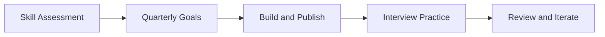

# Day 100 [Expert]: Career Roadmap and Continuous Improvement

## Index

- Goal
- Prerequisites
- Explanation
- Topic by Topic
- Key Concepts
- Visual Concept Map
- End-to-End Practical
- Hands-on Coding
- Mini Exercise
- Assessment Quiz
- Task
- Self Check
- Interview Questions and Answers
- Day Outcome

## Goal

Convert your 100-day Node journey into a long-term growth roadmap with repeatable learning, delivery, and career acceleration systems.

## Prerequisites

- Day 099 capstone delivery and portfolio readiness
- Personal reflection on strengths and skill gaps

## Explanation

Learning does not end after a curriculum. Senior growth requires an operating system for improvement: targeted goals, structured practice, measurable outcomes, and regular reflection. This day turns short-term learning momentum into sustained career progress.

## Topic by Topic

### Topic 1: Skill Mapping and Gap Analysis

Theory:
Career progress is faster when you identify explicit capability gaps.

Practical:
Map yourself across backend, architecture, operations, and communication skills.

**Explanation:**
This topic explains Skill Mapping and Gap Analysis in a practical Node.js backend context so you can build reliable, production-ready APIs and services.

**Key Points:**
- Understand the core idea behind Skill Mapping and Gap Analysis.
- Apply the practical pattern with safe defaults and validation.
- Keep the implementation observable, maintainable, and secure where relevant.

### Topic 2: Quarterly Growth Planning

Theory:
Annual goals are often too broad; quarterly cycles are actionable.

Practical:
Set 90-day goals with measurable outputs.

**Explanation:**
This topic explains Quarterly Growth Planning in a practical Node.js backend context so you can build reliable, production-ready APIs and services.

**Key Points:**
- Understand the core idea behind Quarterly Growth Planning.
- Apply the practical pattern with safe defaults and validation.
- Keep the implementation observable, maintainable, and secure where relevant.

### Topic 3: Portfolio and Public Proof Strategy

Theory:
Opportunities increase when skills are visible and verifiable.

Practical:
Publish case studies, architecture notes, and selected open-source contributions.

**Explanation:**
This topic explains Portfolio and Public Proof Strategy in a practical Node.js backend context so you can build reliable, production-ready APIs and services.

**Key Points:**
- Understand the core idea behind Portfolio and Public Proof Strategy.
- Apply the practical pattern with safe defaults and validation.
- Keep the implementation observable, maintainable, and secure where relevant.

### Topic 4: Interview Readiness Loop

Theory:
Interview skill improves with deliberate rehearsal and feedback.

Practical:
Run weekly machine coding and design mocks with structured review logs.

**Explanation:**
This topic explains Interview Readiness Loop in a practical Node.js backend context so you can build reliable, production-ready APIs and services.

**Key Points:**
- Understand the core idea behind Interview Readiness Loop.
- Apply the practical pattern with safe defaults and validation.
- Keep the implementation observable, maintainable, and secure where relevant.

### Topic 5: Sustainable Improvement Habits

Theory:
Consistency beats intensity for long-term growth.

Practical:
Create a weekly cadence for learning, building, reviewing, and reflection.

**Explanation:**
This topic explains Sustainable Improvement Habits in a practical Node.js backend context so you can build reliable, production-ready APIs and services.

**Key Points:**
- Understand the core idea behind Sustainable Improvement Habits.
- Apply the practical pattern with safe defaults and validation.
- Keep the implementation observable, maintainable, and secure where relevant.

### Topic 6: Mentorship, Leverage, and Staff-level Growth

Theory:
Senior growth eventually depends on multiplying team impact, not only individual output. Mentorship and cross-team influence are major career accelerators.

Practical:
Add mentoring, design reviews, and knowledge-sharing goals to your quarterly plan.

**Explanation:**
This topic explains Mentorship, Leverage, and Staff-level Growth in a practical Node.js backend context so you can build reliable, production-ready APIs and services.

**Key Points:**
- Understand the core idea behind Mentorship, Leverage, and Staff-level Growth.
- Apply the practical pattern with safe defaults and validation.
- Keep the implementation observable, maintainable, and secure where relevant.

## Key Concepts

- Capability-based growth planning
- Time-boxed improvement cycles
- Evidence-driven career storytelling
- Interview performance practice system
- Habit-oriented long-term progression
- Influence and leverage growth path
- Mentorship-driven career acceleration

## Visual Concept Map



## End-to-End Practical

1. Perform self-assessment across key Node engineering competencies.
2. Set next-quarter goals with output metrics.
3. Choose one project for deeper specialization.
4. Build interview preparation routine and tracker.
5. Create monthly reflection template for recalibration.

## Hands-on Coding

### Example 1: Case - Skill Matrix Template

Scenario:
Rate current capability and define target levels.

```json
{
  "system_design": { "current": 6, "target": 8 },
  "node_performance": { "current": 5, "target": 8 },
  "cloud_operations": { "current": 4, "target": 7 }
}
```

### Example 2: Case - Weekly Practice Tracker

Scenario:
Track completion of machine coding and design sessions.

```txt
Week 1: machine-coding=2, system-design=1, review-notes=done
Week 2: machine-coding=2, system-design=1, review-notes=done
```

### Example 3: Case - Learning Backlog Prioritization

Scenario:
Pick high-impact topics first.

```js
const backlog = topics.sort((a, b) => b.impactScore - a.impactScore);
```

### Example 4: Case - Quarterly Leverage Goals

Scenario:
Engineer wants to move from senior delivery to broader technical influence.

```txt
quarter goals:
- lead 2 architecture reviews
- mentor 1 junior engineer weekly
- publish 1 internal engineering guide
```

### Example 5: Case - Monthly Reflection Questions

Scenario:
Use reflection to keep growth system honest.

```txt
1) what produced the most learning value?
2) where did I create leverage beyond my own tasks?
3) which habit slipped and why?
4) what should change next month?
```

## Mini Exercise

Scenario:
Create your next 90-day Node career improvement plan with weekly milestones.

Expected output:

- 3 measurable goals
- Weekly practice cadence
- Portfolio and interview readiness milestones

## Assessment Quiz

### Quiz Questions

1. Why should growth goals be measurable?
2. What is the benefit of quarterly planning cycles?
3. True or False: Portfolio quality matters less than number of projects.
4. How can you maintain consistent interview readiness?
5. Why add mentorship and leverage goals to a growth roadmap?

### Quiz Answers

1. Measurable goals allow objective progress tracking and adjustment.
2. They are short enough to act on and long enough to create meaningful progress.
3. False.
4. Follow a recurring practice and feedback routine.
5. Higher-level career growth depends on multiplying impact across people and systems, not only individual execution.

## Task

- Build a 90-day technical growth roadmap
- Define weekly execution and review rituals
- Complete mini exercise and quiz

## Self Check

- You can plan and execute continuous career growth strategically
- You can maintain momentum with measurable routines
- You can answer at least 4 out of 5 quiz questions

## Interview Questions and Answers

### Beginner

Question: What is the most important thing after finishing a learning roadmap?

Answer: Converting it into a consistent execution habit with measurable milestones.

### Middle

Question: How do you prioritize what to learn next?

Answer: Focus on highest-impact gaps for your target role and current projects.

### Advanced

Question: How would you design a growth system for a senior engineer transitioning to staff-level impact?

Answer: Combine deep technical specialization with architecture leadership, mentorship, cross-team influence, and business-aware decision making.

## Day 100 Outcome

- You completed the 100-day Node curriculum with an expert roadmap mindset
- You can continue growth through a measurable improvement system
- You are ready to apply these skills in interviews and real production teams
