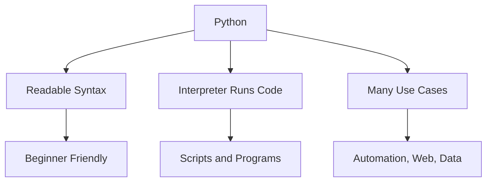

# Day 001 [Beginner]: Introduction to Python

## Index

- [Goal](#goal)
- [Prerequisites](#prerequisites)
- [Explanation](#explanation)
- [Topic by Topic](#topic-by-topic)
- [Key Concepts](#key-concepts)
- [Visual Concept Map](#visual-concept-map)
- [End-to-End Practical](#end-to-end-practical)
- [Hands-on Coding](#hands-on-coding)
- [Mini Exercise](#mini-exercise)
- [Assessment Quiz](#assessment-quiz)
- [Task](#task)
- [Self Check](#self-check)
- [Interview Questions and Answers](#interview-questions-and-answers)
- [Day 001 Outcome](#day-001-outcome)

## Goal

Understand what Python is, why it is popular, and how to run your first small Python programs confidently.

## Prerequisites

- No previous Python knowledge is required
- Basic computer usage is enough

## Explanation

Python is a programming language known for simple syntax and fast learning. It is used in automation, web development, data work, testing, scripting, machine learning, and backend systems.

## Topic by Topic

### Topic 1: What Python Is

Theory:
Python is a high-level programming language that focuses on readability. This means code usually looks closer to human thinking than many older languages.

Practical:
You can use Python to automate repeated tasks like renaming files, reading reports, or processing data.

Code Example:

```python
print("Hello, Python")
```

**Explanation:**
This topic explains What Python Is in a practical Python context so you can write clear, reliable, and maintainable programs for real-world tasks.

**Key Points:**
- Understand the core idea behind What Python Is.
- Apply the practical pattern with good readability and validation habits.
- Keep the solution maintainable, testable, and safe for production use where relevant.

### Topic 2: Why Python Is Popular

Theory:
Python is popular because it is beginner-friendly, has a huge library ecosystem, and works in many domains.

Practical:
A beginner can start with simple scripts, then later build APIs, test automation, or data pipelines using the same language.

Code Example:

```python
message = "Python is easy to read"
print(message)
```

**Explanation:**
This topic explains Why Python Is Popular in a practical Python context so you can write clear, reliable, and maintainable programs for real-world tasks.

**Key Points:**
- Understand the core idea behind Why Python Is Popular.
- Apply the practical pattern with good readability and validation habits.
- Keep the solution maintainable, testable, and safe for production use where relevant.

### Topic 3: How Python Code Runs

Theory:
Python code is usually written in `.py` files and executed by the Python interpreter.

Practical:
You can run a file from the terminal using `python file_name.py` or `python3 file_name.py` depending on your setup.

Code Example:

```python
# save this as app.py
print("Running from a file")
```

**Explanation:**
This topic explains How Python Code Runs in a practical Python context so you can write clear, reliable, and maintainable programs for real-world tasks.

**Key Points:**
- Understand the core idea behind How Python Code Runs.
- Apply the practical pattern with good readability and validation habits.
- Keep the solution maintainable, testable, and safe for production use where relevant.

### Topic 4: Indentation Matters

Theory:
Python uses indentation to define code blocks. Unlike some languages, spacing is not only for beauty, it affects program behavior.

Practical:
If indentation is wrong, Python raises an error immediately.

Code Example:

```python
if True:
    print("Indented correctly")
```

**Explanation:**
This topic explains Indentation Matters in a practical Python context so you can write clear, reliable, and maintainable programs for real-world tasks.

**Key Points:**
- Understand the core idea behind Indentation Matters.
- Apply the practical pattern with good readability and validation habits.
- Keep the solution maintainable, testable, and safe for production use where relevant.

### Topic 5: First Programming Mindset

Theory:
Programming is giving clear step-by-step instructions to the computer.

Practical:
Start by solving small problems: show text, store a value, compare values, repeat tasks.

Code Example:

```python
name = "Asha"
print("Welcome", name)
```

**Explanation:**
This topic explains First Programming Mindset in a practical Python context so you can write clear, reliable, and maintainable programs for real-world tasks.

**Key Points:**
- Understand the core idea behind First Programming Mindset.
- Apply the practical pattern with good readability and validation habits.
- Keep the solution maintainable, testable, and safe for production use where relevant.

### Topic 6: Python Use Cases Around You

Theory:
Learning grows faster when you know where a language is used in real work.

Practical:
Think of Python as one tool that can write scripts, web services, automation tasks, and data-processing jobs.

Code Example:

```python
tasks = ["automation", "web", "testing", "data"]
print(tasks)
```

**Explanation:**
This topic explains Python Use Cases Around You in a practical Python context so you can write clear, reliable, and maintainable programs for real-world tasks.

**Key Points:**
- Understand the core idea behind Python Use Cases Around You.
- Apply the practical pattern with good readability and validation habits.
- Keep the solution maintainable, testable, and safe for production use where relevant.

## Key Concepts

- Python is readable and beginner-friendly
- Python code runs through an interpreter
- Indentation defines blocks of code
- One language can solve many kinds of problems
- Small scripts are the best starting point
- Real-world use case awareness

## Visual Concept Map



## End-to-End Practical

1. Create a new file named `hello.py`.
2. Write one `print()` statement.
3. Add one variable and print it.
4. Run the file from the terminal.
5. Change the output and rerun it.

## Hands-on Coding

### Example 1: Case - Your First Output

Scenario:
You want to display a welcome message when the program starts.

```python
print("Welcome to Python learning")
```

### Example 2: Case - Store and Show Data

Scenario:
You want to store a learner name and print it in a friendly message.

```python
learner_name = "Ravi"
print("Hello", learner_name)
```

### Example 3: Case - Small Informational Script

Scenario:
You want to create a short program that shows language info.

```python
language = "Python"
version = 3
print(language)
print("Version family:", version)
```

## Mini Exercise

Scenario:
Create a script that prints your name, your goal for learning Python, and one domain where Python is used.

Expected output:

- A working Python file
- At least 3 printed lines
- Clear use of one variable

## Assessment Quiz

### Quiz Questions

1. What type of language is Python known as?
2. What runs Python code?
3. True or False: Indentation does not matter in Python.
4. Name two areas where Python is used.
5. What is usually the extension of a Python file?

### Quiz Answers

1. A high-level, readable programming language
2. The Python interpreter
3. False
4. Any two: automation, web development, testing, data, machine learning
5. `.py`

## Task

- Create and run your first Python file
- Use at least two variables
- Complete the mini exercise

## Self Check

- You can explain what Python is
- You can run a simple Python program
- You understand why indentation matters

## Interview Questions and Answers

### Beginner

**Question:** Why is Python a good first language?

**Answer:** Its syntax is simple to read, so beginners can focus on logic instead of complex symbols.

**Question:** What does `print()` do?

**Answer:** It displays output on the screen.

### Middle

**Question:** Why is Python used in many domains?

**Answer:** It has a large ecosystem of libraries and works well for scripting, backend systems, testing, and data tasks.

**Question:** What happens if indentation is wrong in Python?

**Answer:** Python raises an error because indentation defines code blocks.

### Advanced

**Question:** Why does readability matter in a language used by teams?

**Answer:** Readable code is easier to review, debug, and maintain over time.

**Question:** What tradeoff does Python make compared to lower-level languages?

**Answer:** It often gives faster development speed and readability, but may not match lower-level languages for raw performance in some workloads.

## Day 001 Outcome

- You can explain what Python is and where it is used
- You can write and run simple Python files
- You are ready for environment setup on Day 002
