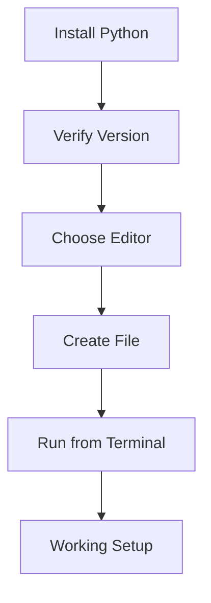

# Day 002 [Beginner]: Environment and Tooling Setup

## Index

- [Goal](#goal)
- [Prerequisites](#prerequisites)
- [Explanation](#explanation)
- [Topic by Topic](#topic-by-topic)
- [Key Concepts](#key-concepts)
- [Visual Concept Map](#visual-concept-map)
- [End-to-End Practical](#end-to-end-practical)
- [Hands-on Coding](#hands-on-coding)
- [Mini Exercise](#mini-exercise)
- [Assessment Quiz](#assessment-quiz)
- [Task](#task)
- [Self Check](#self-check)
- [Interview Questions and Answers](#interview-questions-and-answers)
- [Day 002 Outcome](#day-002-outcome)

## Goal

Set up Python, a code editor, and a basic terminal workflow so you can write, run, and debug programs comfortably.

## Prerequisites

- Day 001 completed
- Access to a computer where Python can be installed

## Explanation

A clean setup removes early confusion. You should know where Python is installed, how to run files, which editor you use, and how to verify that everything works.

## Topic by Topic

### Topic 1: Installing Python

Theory:
Python must be installed before you can run `.py` files locally.

Practical:
After installation, verify it from the terminal using the version command.

Code Example:

```python
# terminal command
# python --version
```

**Explanation:**
This topic explains Installing Python in a practical Python context so you can write clear, reliable, and maintainable programs for real-world tasks.

**Key Points:**
- Understand the core idea behind Installing Python.
- Apply the practical pattern with good readability and validation habits.
- Keep the solution maintainable, testable, and safe for production use where relevant.

### Topic 2: Choosing an Editor

Theory:
A good editor helps with syntax highlighting, error hints, and file navigation.

Practical:
Use VS Code or another editor that supports Python extensions and integrated terminal use.

Code Example:

```python
print("Editor setup helps you code faster")
```

**Explanation:**
This topic explains Choosing an Editor in a practical Python context so you can write clear, reliable, and maintainable programs for real-world tasks.

**Key Points:**
- Understand the core idea behind Choosing an Editor.
- Apply the practical pattern with good readability and validation habits.
- Keep the solution maintainable, testable, and safe for production use where relevant.

### Topic 3: Terminal Basics

Theory:
The terminal is where you run Python files, check versions, and manage tools.

Practical:
Open the project folder in the terminal, then run a file directly from there.

Code Example:

```python
# python hello.py
```

**Explanation:**
This topic explains Terminal Basics in a practical Python context so you can write clear, reliable, and maintainable programs for real-world tasks.

**Key Points:**
- Understand the core idea behind Terminal Basics.
- Apply the practical pattern with good readability and validation habits.
- Keep the solution maintainable, testable, and safe for production use where relevant.

### Topic 4: Folder and File Workflow

Theory:
Organized folders make learning cleaner and reduce lost files.

Practical:
Keep one main learning folder and create one file per lesson or experiment.

Code Example:

```python
# day-002/
#   hello.py
```

**Explanation:**
This topic explains Folder and File Workflow in a practical Python context so you can write clear, reliable, and maintainable programs for real-world tasks.

**Key Points:**
- Understand the core idea behind Folder and File Workflow.
- Apply the practical pattern with good readability and validation habits.
- Keep the solution maintainable, testable, and safe for production use where relevant.

### Topic 5: Verifying the Setup

Theory:
A setup is only complete when you confirm that code actually runs.

Practical:
Create a small script and execute it from the terminal.

Code Example:

```python
print("Python setup is working")
```

**Explanation:**
This topic explains Verifying the Setup in a practical Python context so you can write clear, reliable, and maintainable programs for real-world tasks.

**Key Points:**
- Understand the core idea behind Verifying the Setup.
- Apply the practical pattern with good readability and validation habits.
- Keep the solution maintainable, testable, and safe for production use where relevant.

### Topic 6: Tooling Habits from the Start

Theory:
Good developer habits early on save time later.

Practical:
Use consistent file names, keep the terminal open, and read error messages instead of guessing.

Code Example:

```python
print("Read the error carefully before changing code")
```

**Explanation:**
This topic explains Tooling Habits from the Start in a practical Python context so you can write clear, reliable, and maintainable programs for real-world tasks.

**Key Points:**
- Understand the core idea behind Tooling Habits from the Start.
- Apply the practical pattern with good readability and validation habits.
- Keep the solution maintainable, testable, and safe for production use where relevant.

## Key Concepts

- Python must be installed and verified
- A code editor improves productivity
- The terminal is part of daily Python work
- Organized folders reduce confusion
- Setup must be tested with a real file
- Early tooling discipline

## Visual Concept Map



## End-to-End Practical

1. Install Python.
2. Verify with the version command.
3. Open your editor.
4. Create `hello.py`.
5. Run it from the terminal successfully.

## Hands-on Coding

### Example 1: Case - Version Check

Scenario:
You want to confirm Python is installed correctly.

```python
# terminal command
# python --version
```

### Example 2: Case - First Setup Test File

Scenario:
You want proof that the interpreter and editor are both working.

```python
print("My Python environment is ready")
```

### Example 3: Case - Multiple Prints in One File

Scenario:
You want to test both saving and rerunning the file after changes.

```python
print("Run 1")
print("Run 2")
print("Run 3")
```

## Mini Exercise

Scenario:
Create a folder for Python practice, add one file named `setup_test.py`, and make it print three lines that confirm your environment is ready.

Expected output:

- A working folder structure
- One runnable Python file
- Three visible output lines

## Assessment Quiz

### Quiz Questions

1. Why do we verify Python after installation?
2. What is one benefit of using a code editor like VS Code?
3. True or False: The terminal is not needed once the editor is installed.
4. What command is commonly used to check Python version?
5. Why should learning files be organized clearly?

### Quiz Answers

1. To confirm the interpreter is available and working
2. Syntax highlighting, extensions, and integrated terminal support
3. False
4. `python --version`
5. To make files easy to find, run, and maintain

## Task

- Install and verify Python
- Create and run one setup test file
- Complete the mini exercise

## Self Check

- You can verify Python installation
- You can run files from the terminal
- You can explain your basic folder setup

## Interview Questions and Answers

### Beginner

**Question:** How do you verify Python is installed?

**Answer:** Run `python --version` in the terminal and check that a valid version appears.

**Question:** Why use a code editor instead of plain Notepad?

**Answer:** Editors provide syntax help, navigation, and easier project workflow.

### Middle

**Question:** Why is terminal knowledge important for Python developers?

**Answer:** Running scripts, checking environments, installing packages, and debugging often happen through the terminal.

**Question:** What is a good early habit for managing learning files?

**Answer:** Use clear file names and keep related files in organized folders.

### Advanced

**Question:** Why is environment setup part of engineering quality, not just installation?

**Answer:** A reliable setup reduces false errors, speeds debugging, and makes work reproducible across machines.

**Question:** What problem appears when developers do not verify setup early?

**Answer:** They waste time debugging code when the actual issue is the environment or command path.

## Day 002 Outcome

- You can install and verify Python correctly
- You can run Python files from an editor and terminal
- You are ready to learn variables and data types on Day 003
  Refactor for performance, maintainability, and team-scale readability.

## Mini Exercise

Scenario:
Build a small feature using "Environment and Tooling Setup" and include one resilience improvement.

Expected output:

- Working core flow
- One edge case handled
- One quality improvement documented

## Assessment Quiz

### Quiz Questions

1. What problem does "Environment and Tooling Setup" solve?
2. Which implementation pattern fits this lesson best?
3. True or False: Skipping edge-case handling is acceptable in production.
4. What is one common pitfall in this topic?
5. How do you validate readiness after implementation?

### Quiz Answers

1. It solves a specific architecture or implementation challenge in this domain.
2. The pattern demonstrated in Topic 2.
3. False.
4. The pitfall covered in Topic 3.
5. By scenario checks, tests, and review of tradeoffs.

## Task

- Implement one practical exercise for "Environment and Tooling Setup".
- Document one tradeoff and one improvement.
- Complete mini exercise and quiz.

## Self Check

- You can explain "Environment and Tooling Setup" clearly.
- You can implement it in a realistic scenario.
- You can answer at least 4 out of 5 quiz questions.

## Interview Questions and Answers

### Beginner

Question: What is "Environment and Tooling Setup" in simple terms?

Answer: It is a practical concept used to build reliable software behavior in this phase of learning.

### Middle

Question: When should you use this approach instead of a simpler one?

Answer: Use it when scale, complexity, or maintainability needs justify the added structure.

### Advanced

Question: What tradeoffs would you highlight in a design review?

Answer: Complexity vs flexibility, performance vs maintainability, and short-term speed vs long-term reliability.

## Day 002 Outcome

- You can apply "Environment and Tooling Setup" in practical development work.
- You can articulate design and implementation tradeoffs.
- You are ready for the next day progression.
