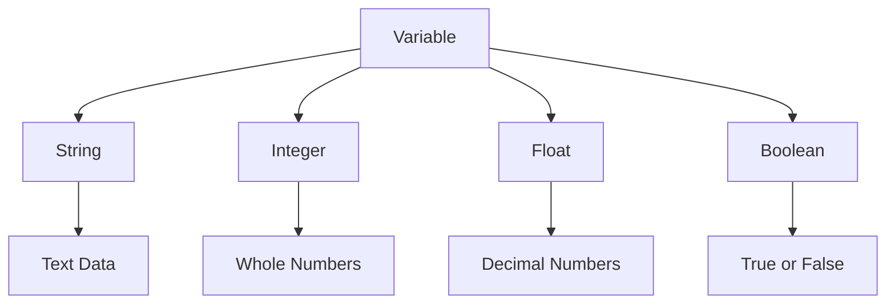

# Day 003 [Beginner]: Variables and Data Types

## Index

- [Goal](#goal)
- [Prerequisites](#prerequisites)
- [Explanation](#explanation)
- [Topic by Topic](#topic-by-topic)
- [Key Concepts](#key-concepts)
- [Visual Concept Map](#visual-concept-map)
- [End-to-End Practical](#end-to-end-practical)
- [Hands-on Coding](#hands-on-coding)
- [Mini Exercise](#mini-exercise)
- [Assessment Quiz](#assessment-quiz)
- [Task](#task)
- [Self Check](#self-check)
- [Interview Questions and Answers](#interview-questions-and-answers)
- [Day 003 Outcome](#day-003-outcome)

## Goal

Learn how Python stores values in variables and how core data types behave in real programs.

## Prerequisites

- Day 002 completed
- Python setup working correctly

## Explanation

Variables help you store information for later use. Data types describe what kind of value is stored, such as text, numbers, or true/false values.

## Topic by Topic

### Topic 1: What a Variable Is

Theory:
A variable is a name that points to a value.

Practical:
Store a learner name, score, or city in a variable and reuse it in different places.

Code Example:

```python
name = "Riya"
print(name)
```

**Explanation:**
This topic explains What a Variable Is in a practical Python context so you can write clear, reliable, and maintainable programs for real-world tasks.

**Key Points:**
- Understand the core idea behind What a Variable Is.
- Apply the practical pattern with good readability and validation habits.
- Keep the solution maintainable, testable, and safe for production use where relevant.

### Topic 2: Common Data Types

Theory:
You will often use `str`, `int`, `float`, and `bool` in early programs.

Practical:
Choose text for names, integers for counts, floats for prices, and booleans for yes/no logic.

Code Example:

```python
name = "Riya"
age = 21
price = 199.99
is_active = True
```

**Explanation:**
This topic explains Common Data Types in a practical Python context so you can write clear, reliable, and maintainable programs for real-world tasks.

**Key Points:**
- Understand the core idea behind Common Data Types.
- Apply the practical pattern with good readability and validation habits.
- Keep the solution maintainable, testable, and safe for production use where relevant.

### Topic 3: Dynamic Typing in Python

Theory:
Python decides the type automatically when you assign a value.

Practical:
You do not need to write the type before the variable name in normal beginner code.

Code Example:

```python
count = 10
message = "Done"
```

**Explanation:**
This topic explains Dynamic Typing in Python in a practical Python context so you can write clear, reliable, and maintainable programs for real-world tasks.

**Key Points:**
- Understand the core idea behind Dynamic Typing in Python.
- Apply the practical pattern with good readability and validation habits.
- Keep the solution maintainable, testable, and safe for production use where relevant.

### Topic 4: Type Checking

Theory:
Sometimes you need to confirm what type a value has.

Practical:
Use `type()` while learning and debugging.

Code Example:

```python
amount = 99.5
print(type(amount))
```

**Explanation:**
This topic explains Type Checking in a practical Python context so you can write clear, reliable, and maintainable programs for real-world tasks.

**Key Points:**
- Understand the core idea behind Type Checking.
- Apply the practical pattern with good readability and validation habits.
- Keep the solution maintainable, testable, and safe for production use where relevant.

### Topic 5: Naming Variables Clearly

Theory:
Good variable names reduce confusion and make code easier to read.

Practical:
Use names like `student_name` instead of vague names like `x`.

Code Example:

```python
student_name = "Kiran"
total_marks = 450
```

**Explanation:**
This topic explains Naming Variables Clearly in a practical Python context so you can write clear, reliable, and maintainable programs for real-world tasks.

**Key Points:**
- Understand the core idea behind Naming Variables Clearly.
- Apply the practical pattern with good readability and validation habits.
- Keep the solution maintainable, testable, and safe for production use where relevant.

### Topic 6: Type Conversion Basics

Theory:
Programs often need to convert values from one type to another.

Practical:
Input usually comes as text, so you may need to convert it into a number before calculations.

Code Example:

```python
age_text = "25"
age_number = int(age_text)
print(age_number + 5)
```

**Explanation:**
This topic explains Type Conversion Basics in a practical Python context so you can write clear, reliable, and maintainable programs for real-world tasks.

**Key Points:**
- Understand the core idea behind Type Conversion Basics.
- Apply the practical pattern with good readability and validation habits.
- Keep the solution maintainable, testable, and safe for production use where relevant.

## Key Concepts

- Variables store reusable values
- Python has common built-in data types
- Python uses dynamic typing
- `type()` helps during learning and debugging
- Clear names improve readability
- Type conversion is a daily programming skill

## Visual Concept Map



## End-to-End Practical

1. Create variables for name, age, score, and active status.
2. Print each value.
3. Use `type()` to inspect them.
4. Convert one string number into an integer.
5. Reuse the converted value in a calculation.

## Hands-on Coding

### Example 1: Case - Student Profile Data

Scenario:
Store student details for a simple learning dashboard.

```python
student_name = "Arun"
student_age = 19
student_score = 88.5
is_enrolled = True

print(student_name)
print(student_age)
print(student_score)
print(is_enrolled)
```

### Example 2: Case - Type Inspection

Scenario:
You want to check that each variable stores the expected kind of value.

```python
city = "Mumbai"
temperature = 31.2

print(type(city))
print(type(temperature))
```

### Example 3: Case - Convert User Age

Scenario:
A value came in as text and must be converted before math.

```python
age_input = "30"
age = int(age_input)
print(age + 2)
```

## Mini Exercise

Scenario:
Create variables for your name, age, favorite programming topic, and whether you have coded before. Print them and print the type of at least two variables.

Expected output:

- Four variables created
- Correct use of multiple data types
- Two `type()` outputs shown

## Assessment Quiz

### Quiz Questions

1. What is a variable?
2. Name four common Python data types.
3. True or False: Python requires type declarations for normal variables.
4. What does `type()` do?
5. Why convert a string to an integer?

### Quiz Answers

1. A name that stores or refers to a value
2. `str`, `int`, `float`, `bool`
3. False
4. It shows the data type of a value
5. To perform numeric operations correctly

## Task

- Create one script using at least 4 variables
- Use `type()` at least twice
- Complete the mini exercise

## Self Check

- You can create and reuse variables
- You can identify common data types
- You can convert simple values between types

## Interview Questions and Answers

### Beginner

**Question:** What is a variable in Python?

**Answer:** It is a name used to store a value for later use in the program.

**Question:** What is the difference between `int` and `float`?

**Answer:** `int` stores whole numbers, while `float` stores decimal numbers.

### Middle

**Question:** Why is clear variable naming important?

**Answer:** It makes code easier to understand, maintain, and review.

**Question:** What problem can happen if you do not convert input values?

**Answer:** Calculations may fail or produce wrong results because input is often text by default.

### Advanced

**Question:** What does dynamic typing mean in Python?

**Answer:** Python infers the type from the assigned value instead of requiring explicit type declarations in basic usage.

**Question:** Why does strong understanding of data types matter later in backend or data work?

**Answer:** Correct types affect validation, calculations, storage, serialization, and system reliability.

## Day 003 Outcome

- You can work with variables and core Python data types
- You can inspect and convert values safely
- You are ready for input, output, and formatting on Day 004
  Harden the solution for failure, empty, and high-load situations.

### Example 3: Case - Production Refinement

Scenario:
Refactor for performance, maintainability, and team-scale readability.

## Mini Exercise

Scenario:
Build a small feature using "Variables and Data Types" and include one resilience improvement.

Expected output:

- Working core flow
- One edge case handled
- One quality improvement documented

## Assessment Quiz

### Quiz Questions

1. What problem does "Variables and Data Types" solve?
2. Which implementation pattern fits this lesson best?
3. True or False: Skipping edge-case handling is acceptable in production.
4. What is one common pitfall in this topic?
5. How do you validate readiness after implementation?

### Quiz Answers

1. It solves a specific architecture or implementation challenge in this domain.
2. The pattern demonstrated in Topic 2.
3. False.
4. The pitfall covered in Topic 3.
5. By scenario checks, tests, and review of tradeoffs.

## Task

- Implement one practical exercise for "Variables and Data Types".
- Document one tradeoff and one improvement.
- Complete mini exercise and quiz.

## Self Check

- You can explain "Variables and Data Types" clearly.
- You can implement it in a realistic scenario.
- You can answer at least 4 out of 5 quiz questions.

## Interview Questions and Answers

### Beginner

Question: What is "Variables and Data Types" in simple terms?

Answer: It is a practical concept used to build reliable software behavior in this phase of learning.

### Middle

Question: When should you use this approach instead of a simpler one?

Answer: Use it when scale, complexity, or maintainability needs justify the added structure.

### Advanced

Question: What tradeoffs would you highlight in a design review?

Answer: Complexity vs flexibility, performance vs maintainability, and short-term speed vs long-term reliability.

## Day 003 Outcome

- You can apply "Variables and Data Types" in practical development work.
- You can articulate design and implementation tradeoffs.
- You are ready for the next day progression.
