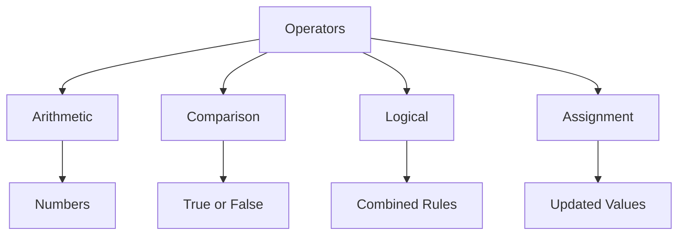

# Day 005 [Beginner]: Operators and Expressions

## Index

- [Goal](#goal)
- [Prerequisites](#prerequisites)
- [Explanation](#explanation)
- [Topic by Topic](#topic-by-topic)
- [Key Concepts](#key-concepts)
- [Visual Concept Map](#visual-concept-map)
- [End-to-End Practical](#end-to-end-practical)
- [Hands-on Coding](#hands-on-coding)
- [Mini Exercise](#mini-exercise)
- [Assessment Quiz](#assessment-quiz)
- [Task](#task)
- [Self Check](#self-check)
- [Interview Questions and Answers](#interview-questions-and-answers)
- [Day 005 Outcome](#day-005-outcome)

## Goal

Use Python operators and expressions correctly to calculate values, compare results, and build basic logic.

## Prerequisites

- Day 004 completed
- Comfortable with variables and input/output

## Explanation

Operators are symbols or keywords that perform actions on values. Expressions are combinations of values and operators that produce a result.

## Topic by Topic

### Topic 1: Arithmetic Operators

Theory:
Arithmetic operators are used for math operations like addition, subtraction, multiplication, and division.

Practical:
Use them to calculate totals, discounts, ages, and scores.

Code Example:

```python
total = 10 + 5
print(total)
```

**Explanation:**
This topic explains Arithmetic Operators in a practical Python context so you can write clear, reliable, and maintainable programs for real-world tasks.

**Key Points:**
- Understand the core idea behind Arithmetic Operators.
- Apply the practical pattern with good readability and validation habits.
- Keep the solution maintainable, testable, and safe for production use where relevant.

### Topic 2: Comparison Operators

Theory:
Comparison operators check relationships between values and return `True` or `False`.

Practical:
Use them to decide whether marks passed a limit or whether one price is greater than another.

Code Example:

```python
print(18 >= 18)
```

**Explanation:**
This topic explains Comparison Operators in a practical Python context so you can write clear, reliable, and maintainable programs for real-world tasks.

**Key Points:**
- Understand the core idea behind Comparison Operators.
- Apply the practical pattern with good readability and validation habits.
- Keep the solution maintainable, testable, and safe for production use where relevant.

### Topic 3: Logical Operators

Theory:
Logical operators combine conditions.

Practical:
Use `and`, `or`, and `not` when more than one rule matters.

Code Example:

```python
is_valid = True and True
print(is_valid)
```

**Explanation:**
This topic explains Logical Operators in a practical Python context so you can write clear, reliable, and maintainable programs for real-world tasks.

**Key Points:**
- Understand the core idea behind Logical Operators.
- Apply the practical pattern with good readability and validation habits.
- Keep the solution maintainable, testable, and safe for production use where relevant.

### Topic 4: Assignment Operators

Theory:
Assignment operators update variables efficiently.

Practical:
Use `+=` to increase a counter or score.

Code Example:

```python
score = 10
score += 5
print(score)
```

**Explanation:**
This topic explains Assignment Operators in a practical Python context so you can write clear, reliable, and maintainable programs for real-world tasks.

**Key Points:**
- Understand the core idea behind Assignment Operators.
- Apply the practical pattern with good readability and validation habits.
- Keep the solution maintainable, testable, and safe for production use where relevant.

### Topic 5: Operator Precedence

Theory:
Some operators run before others, so expression order matters.

Practical:
Use parentheses when you want the logic to be explicit.

Code Example:

```python
result = (2 + 3) * 4
print(result)
```

**Explanation:**
This topic explains Operator Precedence in a practical Python context so you can write clear, reliable, and maintainable programs for real-world tasks.

**Key Points:**
- Understand the core idea behind Operator Precedence.
- Apply the practical pattern with good readability and validation habits.
- Keep the solution maintainable, testable, and safe for production use where relevant.

### Topic 6: Writing Readable Expressions

Theory:
An expression can be correct but still hard to understand.

Practical:
Break large expressions into smaller steps when clarity matters more than compact code.

Code Example:

```python
subtotal = 500
tax = subtotal * 0.18
final_total = subtotal + tax
```

**Explanation:**
This topic explains Writing Readable Expressions in a practical Python context so you can write clear, reliable, and maintainable programs for real-world tasks.

**Key Points:**
- Understand the core idea behind Writing Readable Expressions.
- Apply the practical pattern with good readability and validation habits.
- Keep the solution maintainable, testable, and safe for production use where relevant.

## Key Concepts

- Arithmetic operators handle math
- Comparison operators return booleans
- Logical operators combine conditions
- Assignment operators update variables
- Parentheses improve correctness and clarity
- Readable expressions are easier to maintain

## Visual Concept Map



## End-to-End Practical

1. Create two number variables.
2. Apply arithmetic operations.
3. Compare the results.
4. Combine two comparisons using logical operators.
5. Rewrite one long expression into smaller steps.

## Hands-on Coding

### Example 1: Case - Bill Calculation

Scenario:
You want to calculate a shop bill with tax.

```python
price = 250
tax = price * 0.18
total = price + tax
print(total)
```

### Example 2: Case - Exam Pass Check

Scenario:
You want to check whether a student has passed.

```python
marks = 72
passed = marks >= 40
print(passed)
```

### Example 3: Case - Login Rule Example

Scenario:
You want to allow access only if age and membership conditions are satisfied.

```python
age = 20
has_membership = True
can_enter = age >= 18 and has_membership
print(can_enter)
```

## Mini Exercise

Scenario:
Build a simple shopping summary program using price, quantity, and discount. Show subtotal, discounted total, and whether the final amount is greater than 500.

Expected output:

- Use arithmetic operators
- Use at least one comparison
- Use readable multi-step calculations

## Assessment Quiz

### Quiz Questions

1. What is the result type of a comparison expression?
2. What does `+=` do?
3. True or False: Parentheses can change the result of an expression.
4. Which operator is used for logical AND in Python?
5. Why should large expressions sometimes be split into smaller steps?

### Quiz Answers

1. Boolean (`True` or `False`)
2. It adds a value and updates the same variable
3. True
4. `and`
5. To improve readability and reduce mistakes

## Task

- Build one calculator-style script with operators
- Use arithmetic, comparison, and logical operators
- Complete the mini exercise

## Self Check

- You can use Python operators correctly
- You understand how expressions are evaluated
- You can write clearer multi-step calculations

## Interview Questions and Answers

### Beginner

**Question:** What is an operator?

**Answer:** It is a symbol or keyword that performs an action on values.

**Question:** What is the difference between `=` and `==`?

**Answer:** `=` assigns a value, while `==` compares two values.

### Middle

**Question:** Why are logical operators useful?

**Answer:** They allow you to combine multiple conditions into one decision.

**Question:** Why use parentheses even when precedence rules exist?

**Answer:** Parentheses make intent clearer and reduce misunderstanding.

### Advanced

**Question:** Why is expression readability important in production code?

**Answer:** Other developers must review, debug, and safely change the code later.

**Question:** What common bug appears in beginner logic expressions?

**Answer:** Mixing assignment, comparison, and precedence rules in ways that produce unexpected results.

## Day 005 Outcome

- You can calculate, compare, and combine values with Python operators
- You can write readable expressions instead of confusing one-line logic
- You are ready for conditional statements on Day 006
  Harden the solution for failure, empty, and high-load situations.

### Example 3: Case - Production Refinement

Scenario:
Refactor for performance, maintainability, and team-scale readability.

## Mini Exercise

Scenario:
Build a small feature using "Operators and Expressions" and include one resilience improvement.

Expected output:

- Working core flow
- One edge case handled
- One quality improvement documented

## Assessment Quiz

### Quiz Questions

1. What problem does "Operators and Expressions" solve?
2. Which implementation pattern fits this lesson best?
3. True or False: Skipping edge-case handling is acceptable in production.
4. What is one common pitfall in this topic?
5. How do you validate readiness after implementation?

### Quiz Answers

1. It solves a specific architecture or implementation challenge in this domain.
2. The pattern demonstrated in Topic 2.
3. False.
4. The pitfall covered in Topic 3.
5. By scenario checks, tests, and review of tradeoffs.

## Task

- Implement one practical exercise for "Operators and Expressions".
- Document one tradeoff and one improvement.
- Complete mini exercise and quiz.

## Self Check

- You can explain "Operators and Expressions" clearly.
- You can implement it in a realistic scenario.
- You can answer at least 4 out of 5 quiz questions.

## Interview Questions and Answers

### Beginner

Question: What is "Operators and Expressions" in simple terms?

Answer: It is a practical concept used to build reliable software behavior in this phase of learning.

### Middle

Question: When should you use this approach instead of a simpler one?

Answer: Use it when scale, complexity, or maintainability needs justify the added structure.

### Advanced

Question: What tradeoffs would you highlight in a design review?

Answer: Complexity vs flexibility, performance vs maintainability, and short-term speed vs long-term reliability.

## Day 005 Outcome

- You can apply "Operators and Expressions" in practical development work.
- You can articulate design and implementation tradeoffs.
- You are ready for the next day progression.
