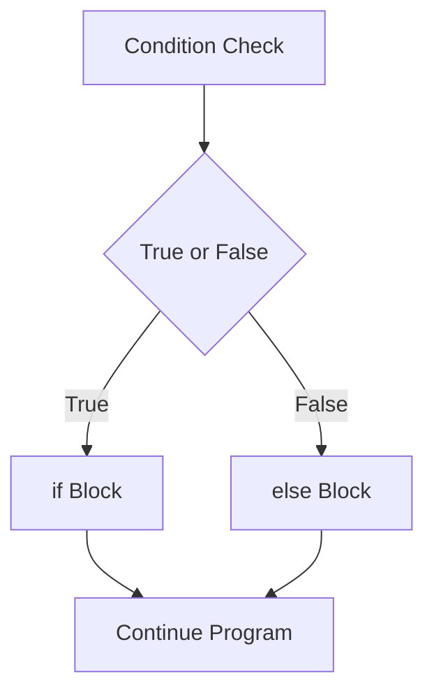

# Day 006 [Beginner]: Conditional Statements

## Index

- [Goal](#goal)
- [Prerequisites](#prerequisites)
- [Explanation](#explanation)
- [Topic by Topic](#topic-by-topic)
- [Key Concepts](#key-concepts)
- [Visual Concept Map](#visual-concept-map)
- [End-to-End Practical](#end-to-end-practical)
- [Hands-on Coding](#hands-on-coding)
- [Mini Exercise](#mini-exercise)
- [Assessment Quiz](#assessment-quiz)
- [Task](#task)
- [Self Check](#self-check)
- [Interview Questions and Answers](#interview-questions-and-answers)
- [Day 006 Outcome](#day-006-outcome)

## Goal

Use `if`, `elif`, and `else` to make Python programs take different actions based on conditions.

## Prerequisites

- Day 005 completed
- Comfortable with comparison and logical operators

## Explanation

Conditional statements help a program decide what to do. They are used when actions should change based on values, user input, or calculated results.

## Topic by Topic

### Topic 1: The `if` Statement

Theory:
An `if` block runs only when its condition is true.

Practical:
Use `if` to check whether a student passed, whether stock is available, or whether input is valid.

Code Example:

```python
marks = 75
if marks >= 40:
  print("Pass")
```

**Explanation:**
This topic explains The `if` Statement in a practical Python context so you can write clear, reliable, and maintainable programs for real-world tasks.

**Key Points:**
- Understand the core idea behind The `if` Statement.
- Apply the practical pattern with good readability and validation habits.
- Keep the solution maintainable, testable, and safe for production use where relevant.

### Topic 2: Using `else`

Theory:
`else` gives the fallback action when the `if` condition is false.

Practical:
Programs often need both success and failure output.

Code Example:

```python
age = 16
if age >= 18:
  print("Eligible")
else:
  print("Not eligible")
```

**Explanation:**
This topic explains Using `else` in a practical Python context so you can write clear, reliable, and maintainable programs for real-world tasks.

**Key Points:**
- Understand the core idea behind Using `else`.
- Apply the practical pattern with good readability and validation habits.
- Keep the solution maintainable, testable, and safe for production use where relevant.

### Topic 3: Multiple Checks with `elif`

Theory:
`elif` is used when you have more than two possible paths.

Practical:
Use it for grading systems, menu choices, and role-based logic.

Code Example:

```python
score = 82
if score >= 90:
  print("A")
elif score >= 75:
  print("B")
else:
  print("C")
```

**Explanation:**
This topic explains Multiple Checks with `elif` in a practical Python context so you can write clear, reliable, and maintainable programs for real-world tasks.

**Key Points:**
- Understand the core idea behind Multiple Checks with `elif`.
- Apply the practical pattern with good readability and validation habits.
- Keep the solution maintainable, testable, and safe for production use where relevant.

### Topic 4: Nested Conditions

Theory:
One condition can exist inside another when logic has layers.

Practical:
First check login status, then check admin rights.

Code Example:

```python
logged_in = True
is_admin = False

if logged_in:
  if is_admin:
    print("Admin access")
```

**Explanation:**
This topic explains Nested Conditions in a practical Python context so you can write clear, reliable, and maintainable programs for real-world tasks.

**Key Points:**
- Understand the core idea behind Nested Conditions.
- Apply the practical pattern with good readability and validation habits.
- Keep the solution maintainable, testable, and safe for production use where relevant.

### Topic 5: Using Logical Operators in Decisions

Theory:
Conditions become more powerful when combined with `and`, `or`, and `not`.

Practical:
Allow access only when both age and membership rules are satisfied.

Code Example:

```python
age = 21
has_id = True
if age >= 18 and has_id:
  print("Entry allowed")
```

**Explanation:**
This topic explains Using Logical Operators in Decisions in a practical Python context so you can write clear, reliable, and maintainable programs for real-world tasks.

**Key Points:**
- Understand the core idea behind Using Logical Operators in Decisions.
- Apply the practical pattern with good readability and validation habits.
- Keep the solution maintainable, testable, and safe for production use where relevant.

### Topic 6: Readable Decision Logic

Theory:
Correct logic is not enough; it should also be easy to understand.

Practical:
Keep conditions simple and move repeated logic into clear variables.

Code Example:

```python
is_passed = marks >= 40
if is_passed:
  print("Student passed")
```

**Explanation:**
This topic explains Readable Decision Logic in a practical Python context so you can write clear, reliable, and maintainable programs for real-world tasks.

**Key Points:**
- Understand the core idea behind Readable Decision Logic.
- Apply the practical pattern with good readability and validation habits.
- Keep the solution maintainable, testable, and safe for production use where relevant.

## Key Concepts

- `if` handles a true condition
- `else` provides a fallback path
- `elif` supports multiple decisions
- Nested conditions add layered logic
- Logical operators combine rules
- Readable conditions improve maintainability

## Visual Concept Map



## End-to-End Practical

1. Create one variable like `marks` or `age`.
2. Write an `if` condition.
3. Add an `else` block.
4. Extend it using `elif`.
5. Refactor one long condition into a readable variable.

## Hands-on Coding

### Example 1: Case - Pass or Fail

Scenario:
You want to show whether a student has passed the exam.

```python
marks = 36
if marks >= 40:
  print("Pass")
else:
  print("Fail")
```

### Example 2: Case - Ticket Pricing Rule

Scenario:
You want to classify a user into child, adult, or senior category.

```python
age = 62
if age < 18:
  print("Child ticket")
elif age < 60:
  print("Adult ticket")
else:
  print("Senior ticket")
```

### Example 3: Case - Login Access Check

Scenario:
You want to grant access only if the user is active and verified.

```python
is_active = True
is_verified = True

if is_active and is_verified:
  print("Access granted")
else:
  print("Access denied")
```

## Mini Exercise

Scenario:
Build a program that checks a user's exam score and prints `Excellent`, `Good`, `Pass`, or `Fail`.

Expected output:

- Use `if`, `elif`, and `else`
- Show one clear result
- Use readable conditions

## Assessment Quiz

### Quiz Questions

1. When do we use `elif`?
2. What does `else` represent?
3. True or False: Python conditions can use `and` and `or`.
4. Why are nested `if` blocks used?
5. What makes a condition easier to maintain?

### Quiz Answers

1. When there are multiple possible condition branches
2. The fallback path when earlier conditions are false
3. True
4. To handle layered decisions
5. Clear variable names and simple expressions

## Task

- Write one decision-based Python script
- Use `if`, `elif`, and `else`
- Complete the mini exercise

## Self Check

- You can write Python decision logic confidently
- You can combine multiple conditions safely
- You can read and explain nested logic

## Interview Questions and Answers

### Beginner

**Question:** What does an `if` statement do?

**Answer:** It runs a block of code only when a condition is true.

**Question:** Why use `else`?

**Answer:** It handles the alternative case when the main condition is false.

### Middle

**Question:** When should you use `elif` instead of many separate `if` statements?

**Answer:** Use `elif` when only one branch should run from multiple possible choices.

**Question:** Why can nested conditions become hard to manage?

**Answer:** They can reduce readability if too many levels are added.

### Advanced

**Question:** How do you keep business rules readable when conditions grow large?

**Answer:** Break logic into named boolean variables or small helper functions.

**Question:** What is a common bug in conditional logic?

**Answer:** Overlapping or missing condition ranges that produce wrong decisions.

## Day 006 Outcome

- You can build decision-making logic in Python
- You can use `if`, `elif`, and `else` in real scenarios
- You are ready for loops and iteration on Day 007
