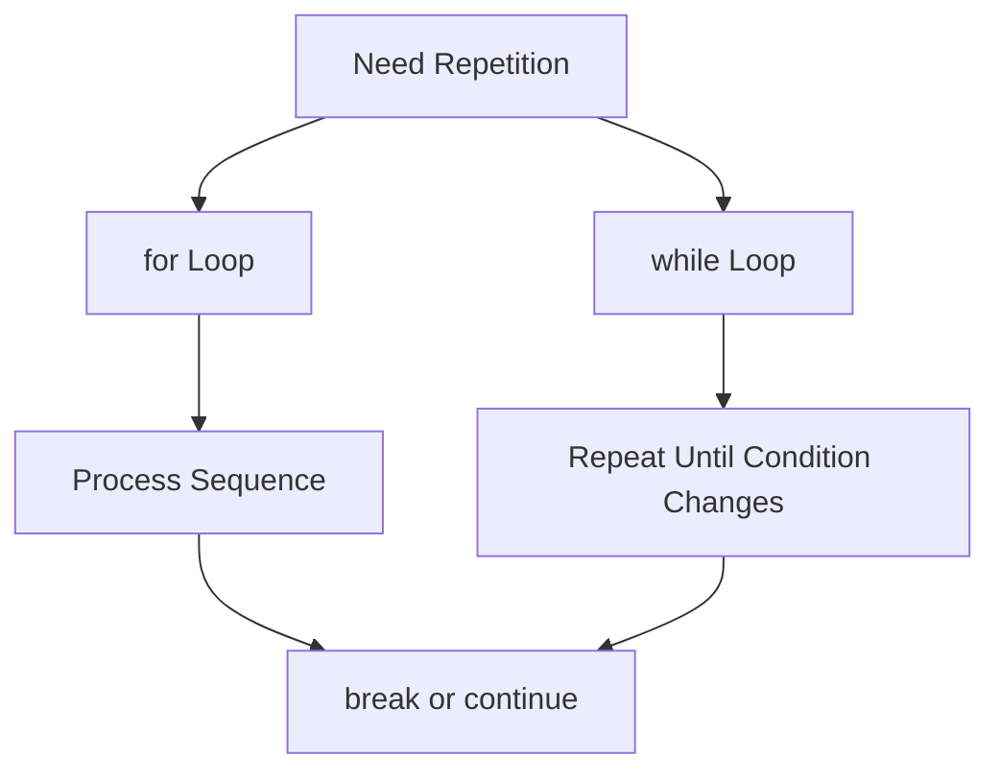

# Day 007 [Beginner]: Loops and Iteration

## Index

- [Goal](#goal)
- [Prerequisites](#prerequisites)
- [Explanation](#explanation)
- [Topic by Topic](#topic-by-topic)
- [Key Concepts](#key-concepts)
- [Visual Concept Map](#visual-concept-map)
- [End-to-End Practical](#end-to-end-practical)
- [Hands-on Coding](#hands-on-coding)
- [Mini Exercise](#mini-exercise)
- [Assessment Quiz](#assessment-quiz)
- [Task](#task)
- [Self Check](#self-check)
- [Interview Questions and Answers](#interview-questions-and-answers)
- [Day 007 Outcome](#day-007-outcome)

## Goal

Learn how to repeat work in Python using `for` loops, `while` loops, and loop control statements.

## Prerequisites

- Day 006 completed
- Comfortable with variables and conditions

## Explanation

Loops are used when the same kind of work must happen many times. Instead of writing repeated lines manually, Python lets you repeat logic using structured loop syntax.

## Topic by Topic

### Topic 1: Why Loops Matter

Theory:
Loops reduce repetition and make code shorter, cleaner, and easier to change.

Practical:
Print numbers, process items in a list, or retry until input becomes valid.

Code Example:

```python
for number in range(3):
  print(number)
```

**Explanation:**
This topic explains Why Loops Matter in a practical Python context so you can write clear, reliable, and maintainable programs for real-world tasks.

**Key Points:**
- Understand the core idea behind Why Loops Matter.
- Apply the practical pattern with good readability and validation habits.
- Keep the solution maintainable, testable, and safe for production use where relevant.

### Topic 2: `for` Loops

Theory:
`for` loops are used when you want to iterate over a sequence like a range, list, or string.

Practical:
Use `for` when the number of steps is known or when you are processing items one by one.

Code Example:

```python
for letter in "cat":
  print(letter)
```

**Explanation:**
This topic explains `for` Loops in a practical Python context so you can write clear, reliable, and maintainable programs for real-world tasks.

**Key Points:**
- Understand the core idea behind `for` Loops.
- Apply the practical pattern with good readability and validation habits.
- Keep the solution maintainable, testable, and safe for production use where relevant.

### Topic 3: `while` Loops

Theory:
A `while` loop runs as long as its condition stays true.

Practical:
Use it for repeated asking, retry systems, or countdown logic.

Code Example:

```python
count = 3
while count > 0:
  print(count)
  count -= 1
```

**Explanation:**
This topic explains `while` Loops in a practical Python context so you can write clear, reliable, and maintainable programs for real-world tasks.

**Key Points:**
- Understand the core idea behind `while` Loops.
- Apply the practical pattern with good readability and validation habits.
- Keep the solution maintainable, testable, and safe for production use where relevant.

### Topic 4: `break` and `continue`

Theory:
`break` stops a loop early, while `continue` skips the current round and moves to the next one.

Practical:
Use them to skip invalid values or stop after finding a target.

Code Example:

```python
for value in [1, 2, 3, 4]:
  if value == 3:
    break
  print(value)
```

**Explanation:**
This topic explains `break` and `continue` in a practical Python context so you can write clear, reliable, and maintainable programs for real-world tasks.

**Key Points:**
- Understand the core idea behind `break` and `continue`.
- Apply the practical pattern with good readability and validation habits.
- Keep the solution maintainable, testable, and safe for production use where relevant.

### Topic 5: Avoiding Infinite Loops

Theory:
A loop that never stops can freeze or waste resources.

Practical:
Always make sure a `while` loop changes toward a stopping condition.

Code Example:

```python
attempts = 0
while attempts < 3:
  attempts += 1
```

**Explanation:**
This topic explains Avoiding Infinite Loops in a practical Python context so you can write clear, reliable, and maintainable programs for real-world tasks.

**Key Points:**
- Understand the core idea behind Avoiding Infinite Loops.
- Apply the practical pattern with good readability and validation habits.
- Keep the solution maintainable, testable, and safe for production use where relevant.

### Topic 6: Readable Iteration Patterns

Theory:
Loop code should clearly show what is being processed and why.

Practical:
Use meaningful names like `student`, `price`, or `item` instead of single letters when possible.

Code Example:

```python
prices = [100, 200, 300]
for price in prices:
  print(price)
```

**Explanation:**
This topic explains Readable Iteration Patterns in a practical Python context so you can write clear, reliable, and maintainable programs for real-world tasks.

**Key Points:**
- Understand the core idea behind Readable Iteration Patterns.
- Apply the practical pattern with good readability and validation habits.
- Keep the solution maintainable, testable, and safe for production use where relevant.

## Key Concepts

- Loops repeat work efficiently
- `for` loops iterate over sequences
- `while` loops depend on conditions
- `break` and `continue` control loop flow
- Infinite loops must be avoided
- Clear iteration names improve readability

## Visual Concept Map



## End-to-End Practical

1. Print numbers using a `for` loop.
2. Process a small list.
3. Build a countdown with `while`.
4. Add `break` or `continue`.
5. Check that every loop has a clear stopping rule.

## Hands-on Coding

### Example 1: Case - Print Student Names

Scenario:
You want to display each student name from a list.

```python
students = ["Asha", "Ravi", "Kiran"]
for student in students:
  print(student)
```

### Example 2: Case - Password Retry Counter

Scenario:
You want to allow three attempts for an operation.

```python
attempts = 1
while attempts <= 3:
  print(f"Attempt {attempts}")
  attempts += 1
```

### Example 3: Case - Skip Invalid Values

Scenario:
You want to ignore negative values in a list.

```python
numbers = [5, -1, 8, -3, 10]
for number in numbers:
  if number < 0:
    continue
  print(number)
```

## Mini Exercise

Scenario:
Create a program that prints numbers from 1 to 10, but skips 5 and stops when it reaches 8.

Expected output:

- Use a loop
- Use `continue`
- Use `break`

## Assessment Quiz

### Quiz Questions

1. When should you use a `for` loop?
2. What is the difference between `break` and `continue`?
3. True or False: A `while` loop can run forever if the condition never changes.
4. Why are meaningful loop variable names useful?
5. What is a common risk with `while` loops?

### Quiz Answers

1. When iterating over a known sequence or range
2. `break` stops the loop; `continue` skips the current iteration
3. True
4. They improve readability
5. Infinite loops

## Task

- Write one `for` loop and one `while` loop
- Use either `break` or `continue`
- Complete the mini exercise

## Self Check

- You can choose between `for` and `while`
- You can stop or skip loop iterations correctly
- You can prevent common loop mistakes

## Interview Questions and Answers

### Beginner

**Question:** What does a loop do?

**Answer:** It repeats a block of code multiple times.

**Question:** What is a `for` loop commonly used for?

**Answer:** Iterating over a sequence like a list, string, or range.

### Middle

**Question:** When is a `while` loop a better choice than a `for` loop?

**Answer:** When repetition depends on a condition instead of a fixed sequence.

**Question:** Why can loop control statements be helpful?

**Answer:** They let you stop early or skip unwanted iterations.

### Advanced

**Question:** How do you reduce bugs in loops used for business logic?

**Answer:** Use clear stopping conditions, readable variable names, and small focused loop bodies.

**Question:** What makes loop-heavy code hard to maintain?

**Answer:** Deep nesting, unclear variable names, and hidden stop conditions.

## Day 007 Outcome

- You can repeat logic safely using Python loops
- You can control iteration with `break` and `continue`
- You are ready for functions fundamentals on Day 008
