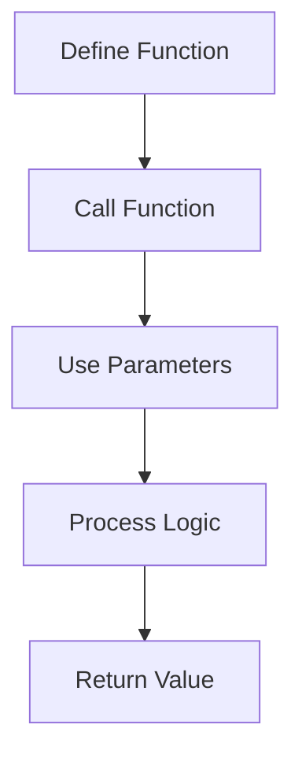

# Day 008 [Beginner]: Functions Fundamentals

## Index

- [Goal](#goal)
- [Prerequisites](#prerequisites)
- [Explanation](#explanation)
- [Topic by Topic](#topic-by-topic)
- [Key Concepts](#key-concepts)
- [Visual Concept Map](#visual-concept-map)
- [End-to-End Practical](#end-to-end-practical)
- [Hands-on Coding](#hands-on-coding)
- [Mini Exercise](#mini-exercise)
- [Assessment Quiz](#assessment-quiz)
- [Task](#task)
- [Self Check](#self-check)
- [Interview Questions and Answers](#interview-questions-and-answers)
- [Day 008 Outcome](#day-008-outcome)

## Goal

Understand how to define and call functions so code becomes reusable, cleaner, and easier to test.

## Prerequisites

- Day 007 completed
- Basic comfort with loops and conditions

## Explanation

Functions group related logic into reusable blocks. Instead of repeating the same code again and again, you can place it in one function and call it whenever needed.

## Topic by Topic

### Topic 1: What a Function Is

Theory:
A function is a named block of code that performs a specific task.

Practical:
Use a function for repeated operations like greetings, calculations, or validations.

Code Example:

```python
def greet():
  print("Hello")
```

**Explanation:**
This topic explains What a Function Is in a practical Python context so you can write clear, reliable, and maintainable programs for real-world tasks.

**Key Points:**
- Understand the core idea behind What a Function Is.
- Apply the practical pattern with good readability and validation habits.
- Keep the solution maintainable, testable, and safe for production use where relevant.

### Topic 2: Calling a Function

Theory:
Defining a function only creates it. The code inside runs when the function is called.

Practical:
After defining a function, call it using its name and parentheses.

Code Example:

```python
def greet():
  print("Hello")

greet()
```

**Explanation:**
This topic explains Calling a Function in a practical Python context so you can write clear, reliable, and maintainable programs for real-world tasks.

**Key Points:**
- Understand the core idea behind Calling a Function.
- Apply the practical pattern with good readability and validation habits.
- Keep the solution maintainable, testable, and safe for production use where relevant.

### Topic 3: Parameters and Arguments

Theory:
Parameters let a function accept values from outside.

Practical:
Create reusable functions like `greet_user(name)` instead of hardcoding one value.

Code Example:

```python
def greet_user(name):
  print(f"Hello, {name}")
```

**Explanation:**
This topic explains Parameters and Arguments in a practical Python context so you can write clear, reliable, and maintainable programs for real-world tasks.

**Key Points:**
- Understand the core idea behind Parameters and Arguments.
- Apply the practical pattern with good readability and validation habits.
- Keep the solution maintainable, testable, and safe for production use where relevant.

### Topic 4: Returning Values

Theory:
Functions can send a result back using `return`.

Practical:
Return calculated values instead of only printing them.

Code Example:

```python
def add(a, b):
  return a + b
```

**Explanation:**
This topic explains Returning Values in a practical Python context so you can write clear, reliable, and maintainable programs for real-world tasks.

**Key Points:**
- Understand the core idea behind Returning Values.
- Apply the practical pattern with good readability and validation habits.
- Keep the solution maintainable, testable, and safe for production use where relevant.

### Topic 5: Scope Basics

Theory:
Variables created inside a function usually stay inside that function.

Practical:
Use local variables for internal work and returned values for outside use.

Code Example:

```python
def build_message(name):
  message = f"Welcome, {name}"
  return message
```

**Explanation:**
This topic explains Scope Basics in a practical Python context so you can write clear, reliable, and maintainable programs for real-world tasks.

**Key Points:**
- Understand the core idea behind Scope Basics.
- Apply the practical pattern with good readability and validation habits.
- Keep the solution maintainable, testable, and safe for production use where relevant.

### Topic 6: Small, Focused Functions

Theory:
Good functions do one clear job.

Practical:
Instead of one huge function, split logic into smaller parts like `get_input()`, `calculate_total()`, and `show_result()`.

Code Example:

```python
def square(number):
  return number * number
```

**Explanation:**
This topic explains Small, Focused Functions in a practical Python context so you can write clear, reliable, and maintainable programs for real-world tasks.

**Key Points:**
- Understand the core idea behind Small, Focused Functions.
- Apply the practical pattern with good readability and validation habits.
- Keep the solution maintainable, testable, and safe for production use where relevant.

## Key Concepts

- Functions make code reusable
- Functions run when called
- Parameters accept external values
- `return` sends results back
- Local scope keeps internal variables contained
- Small functions are easier to test and maintain

## Visual Concept Map



## End-to-End Practical

1. Write a simple function.
2. Call it once.
3. Add one parameter.
4. Add a return value.
5. Reuse that function in two different places.

## Hands-on Coding

### Example 1: Case - Greeting Function

Scenario:
You want to greet multiple users without repeating print statements.

```python
def greet_user(name):
  print(f"Hello, {name}")

greet_user("Asha")
greet_user("Ravi")
```

### Example 2: Case - Total Calculation Function

Scenario:
You want one reusable function to add two numbers.

```python
def add_numbers(a, b):
  return a + b

total = add_numbers(10, 15)
print(total)
```

### Example 3: Case - Reusable Discount Logic

Scenario:
You want to calculate discounted price for different products.

```python
def apply_discount(price, discount_percent):
  discount = price * discount_percent / 100
  return price - discount

print(apply_discount(1000, 10))
```

## Mini Exercise

Scenario:
Create a function `check_even(number)` that returns whether a number is even, then call it with three different numbers.

Expected output:

- One function definition
- Use of `return`
- Three sample calls

## Assessment Quiz

### Quiz Questions

1. Why do we use functions?
2. What is the difference between a parameter and an argument?
3. True or False: A function always needs a `return` statement.
4. What does `return` do?
5. Why are small functions usually better?

### Quiz Answers

1. To organize and reuse code
2. A parameter is in the definition; an argument is the passed value
3. False
4. It sends a value back to the caller
5. They are easier to read, test, and maintain

## Task

- Create two small reusable functions
- Use one function with parameters and one with return value
- Complete the mini exercise

## Self Check

- You can define and call Python functions
- You can pass values into a function
- You can return results from a function

## Interview Questions and Answers

### Beginner

**Question:** What is a function?

**Answer:** A reusable block of code that performs a specific task.

**Question:** Why do we call a function after defining it?

**Answer:** Because the function body only runs when it is called.

### Middle

**Question:** When should a function return a value instead of printing it?

**Answer:** When the result needs to be reused in other logic.

**Question:** Why avoid one very large function?

**Answer:** Large functions are harder to debug, test, and understand.

### Advanced

**Question:** How do functions improve maintainability in bigger codebases?

**Answer:** They separate responsibilities and reduce repeated logic.

**Question:** What is a common design smell in beginner functions?

**Answer:** Mixing too many tasks, such as input, calculation, and display, in one place.

## Day 008 Outcome

- You can define, call, and reuse Python functions
- You can work with parameters and return values
- You are ready for the first mini project on Day 009
