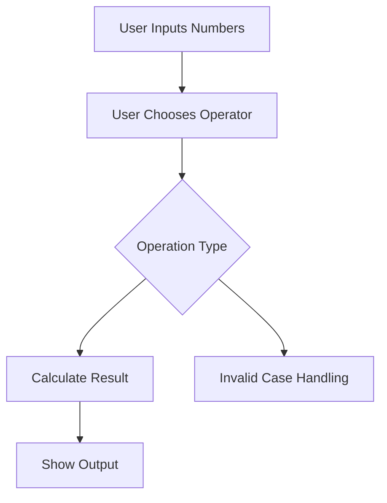

# Day 009 [Beginner]: Mini Project CLI Calculator

## Index

- [Goal](#goal)
- [Prerequisites](#prerequisites)
- [Explanation](#explanation)
- [Topic by Topic](#topic-by-topic)
- [Key Concepts](#key-concepts)
- [Visual Concept Map](#visual-concept-map)
- [End-to-End Practical](#end-to-end-practical)
- [Hands-on Coding](#hands-on-coding)
- [Mini Exercise](#mini-exercise)
- [Assessment Quiz](#assessment-quiz)
- [Task](#task)
- [Self Check](#self-check)
- [Interview Questions and Answers](#interview-questions-and-answers)
- [Day 009 Outcome](#day-009-outcome)

## Goal

Combine input, conditions, operators, and functions into a small command-line calculator project.

## Prerequisites

- Day 008 completed
- Comfortable with functions, input, and conditional logic

## Explanation

This mini project turns basic Python ideas into a complete interactive program. A CLI calculator is small enough for beginners but rich enough to teach structure, user flow, and error handling.

## Topic by Topic

### Topic 1: Project Breakdown

Theory:
Even small programs become easier when split into clear steps.

Practical:
Think of the calculator as input -> operator choice -> calculation -> output.

Code Example:

```python
# get values -> choose operation -> calculate -> print result
```

**Explanation:**
This topic explains Project Breakdown in a practical Python context so you can write clear, reliable, and maintainable programs for real-world tasks.

**Key Points:**
- Understand the core idea behind Project Breakdown.
- Apply the practical pattern with good readability and validation habits.
- Keep the solution maintainable, testable, and safe for production use where relevant.

### Topic 2: Reusing Functions

Theory:
Functions keep repeated logic clean and reusable.

Practical:
Create one function per operation or one helper function for calculation.

Code Example:

```python
def add(a, b):
  return a + b
```

**Explanation:**
This topic explains Reusing Functions in a practical Python context so you can write clear, reliable, and maintainable programs for real-world tasks.

**Key Points:**
- Understand the core idea behind Reusing Functions.
- Apply the practical pattern with good readability and validation habits.
- Keep the solution maintainable, testable, and safe for production use where relevant.

### Topic 3: User Input Flow

Theory:
Interactive programs must ask clear questions in the right order.

Practical:
First ask for two numbers, then ask for the operation symbol.

Code Example:

```python
first = float(input("Enter first number: "))
second = float(input("Enter second number: "))
operator = input("Choose +, -, *, /: ")
```

**Explanation:**
This topic explains User Input Flow in a practical Python context so you can write clear, reliable, and maintainable programs for real-world tasks.

**Key Points:**
- Understand the core idea behind User Input Flow.
- Apply the practical pattern with good readability and validation habits.
- Keep the solution maintainable, testable, and safe for production use where relevant.

### Topic 4: Decision Logic for Operations

Theory:
The program must choose the correct math based on the operator entered.

Practical:
Use `if` and `elif` to handle each operation.

Code Example:

```python
if operator == "+":
  print(first + second)
```

**Explanation:**
This topic explains Decision Logic for Operations in a practical Python context so you can write clear, reliable, and maintainable programs for real-world tasks.

**Key Points:**
- Understand the core idea behind Decision Logic for Operations.
- Apply the practical pattern with good readability and validation habits.
- Keep the solution maintainable, testable, and safe for production use where relevant.

### Topic 5: Handling Invalid Input

Theory:
Programs should not assume users always enter valid values.

Practical:
Handle unsupported operators and division by zero safely.

Code Example:

```python
if operator == "/" and second == 0:
  print("Cannot divide by zero")
```

**Explanation:**
This topic explains Handling Invalid Input in a practical Python context so you can write clear, reliable, and maintainable programs for real-world tasks.

**Key Points:**
- Understand the core idea behind Handling Invalid Input.
- Apply the practical pattern with good readability and validation habits.
- Keep the solution maintainable, testable, and safe for production use where relevant.

### Topic 6: Improving Project Structure

Theory:
Mini projects are a good place to learn how small functions and clear steps improve maintainability.

Practical:
Separate calculation logic from input/output logic so the program becomes easier to test later.

Code Example:

```python
def calculate(a, b, operator):
  if operator == "+":
    return a + b
```

**Explanation:**
This topic explains Improving Project Structure in a practical Python context so you can write clear, reliable, and maintainable programs for real-world tasks.

**Key Points:**
- Understand the core idea behind Improving Project Structure.
- Apply the practical pattern with good readability and validation habits.
- Keep the solution maintainable, testable, and safe for production use where relevant.

## Key Concepts

- Mini projects combine multiple basic concepts
- Functions keep calculator logic clean
- Input order shapes user experience
- Conditional branches control operation choice
- Invalid input should be handled safely
- Small project structure matters early

## Visual Concept Map



## End-to-End Practical

1. Ask the user for two numbers.
2. Ask which operation to perform.
3. Use conditions to choose the correct operation.
4. Print the result.
5. Add safe handling for invalid operator and division by zero.

## Hands-on Coding

### Example 1: Case - Simple Addition Calculator

Scenario:
You want a minimal calculator that adds two numbers.

```python
first = float(input("First number: "))
second = float(input("Second number: "))
print(first + second)
```

### Example 2: Case - Multi-Operation Calculator

Scenario:
You want one calculator that supports four operations.

```python
first = 10
second = 5
operator = "*"

if operator == "+":
  print(first + second)
elif operator == "-":
  print(first - second)
elif operator == "*":
  print(first * second)
elif operator == "/":
  print(first / second)
```

### Example 3: Case - Function-Based Calculator

Scenario:
You want cleaner logic that can be reused later.

```python
def calculate(a, b, operator):
  if operator == "+":
    return a + b
  if operator == "-":
    return a - b
  if operator == "*":
    return a * b
  if operator == "/":
    if b == 0:
      return "Cannot divide by zero"
    return a / b
  return "Invalid operator"

print(calculate(12, 3, "/"))
```

## Mini Exercise

Scenario:
Build a CLI calculator that supports `+`, `-`, `*`, and `/`. If the user enters an invalid operator, show a helpful message.

Expected output:

- Two user inputs for numbers
- One operator input
- One correct result or safe error message

## Assessment Quiz

### Quiz Questions

1. Why is a CLI calculator a good beginner project?
2. What Python concepts does it combine?
3. True or False: Division by zero should be ignored.
4. Why move calculator logic into a function?
5. What should happen if the operator is invalid?

### Quiz Answers

1. It combines multiple fundamentals in one useful program
2. Input, output, operators, conditions, and functions
3. False
4. To improve reuse, readability, and testing
5. Show a safe helpful message

## Task

- Build a working CLI calculator
- Support 4 operators
- Handle division by zero and invalid operator

## Self Check

- You can combine multiple Python basics into one project
- You can structure a small CLI program clearly
- You can handle common calculator edge cases

## Interview Questions and Answers

### Beginner

**Question:** Why is a calculator project useful for beginners?

**Answer:** It combines real input, logic, calculations, and output in one simple program.

**Question:** What is the first thing a calculator program usually asks for?

**Answer:** The values to calculate.

### Middle

**Question:** Why is division by zero an important edge case?

**Answer:** It causes an invalid mathematical operation and must be handled safely.

**Question:** How does project structure help even in a small script?

**Answer:** It makes the program easier to debug, extend, and reuse.

### Advanced

**Question:** How would you make this calculator easier to test later?

**Answer:** Separate the pure calculation logic from interactive input/output.

**Question:** What design smell appears if all calculator behavior is written in one large block?

**Answer:** Low readability, harder debugging, and poor reuse.

## Day 009 Outcome

- You can build a full beginner CLI mini project in Python
- You can apply functions, conditions, and safe input handling together
- You are ready for deeper string work on Day 010
