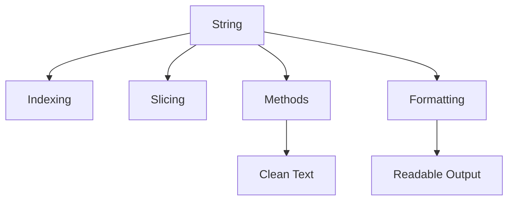

# Day 010 [Beginner]: Strings Deep Dive

## Index

- [Goal](#goal)
- [Prerequisites](#prerequisites)
- [Explanation](#explanation)
- [Topic by Topic](#topic-by-topic)
- [Key Concepts](#key-concepts)
- [Visual Concept Map](#visual-concept-map)
- [End-to-End Practical](#end-to-end-practical)
- [Hands-on Coding](#hands-on-coding)
- [Mini Exercise](#mini-exercise)
- [Assessment Quiz](#assessment-quiz)
- [Task](#task)
- [Self Check](#self-check)
- [Interview Questions and Answers](#interview-questions-and-answers)
- [Day 010 Outcome](#day-010-outcome)

## Goal

Understand how strings work in Python so you can create, inspect, modify, and format text safely.

## Prerequisites

- Day 009 completed
- Comfortable with input, variables, and functions

## Explanation

Strings are one of the most used data types in Python. They appear in names, messages, file paths, user input, logs, and API data. Strong string handling helps in almost every Python domain.

## Topic by Topic

### Topic 1: What a String Is

Theory:
A string is text stored inside quotes.

Practical:
Use strings for names, messages, sentences, and identifiers.

Code Example:

```python
message = "Hello, Python"
print(message)
```

**Explanation:**
This topic explains What a String Is in a practical Python context so you can write clear, reliable, and maintainable programs for real-world tasks.

**Key Points:**
- Understand the core idea behind What a String Is.
- Apply the practical pattern with good readability and validation habits.
- Keep the solution maintainable, testable, and safe for production use where relevant.

### Topic 2: Indexing and Slicing

Theory:
You can access individual characters or parts of a string using indexes and slices.

Practical:
Use indexing to get one character and slicing to get a substring.

Code Example:

```python
text = "Python"
print(text[0])
print(text[0:3])
```

**Explanation:**
This topic explains Indexing and Slicing in a practical Python context so you can write clear, reliable, and maintainable programs for real-world tasks.

**Key Points:**
- Understand the core idea behind Indexing and Slicing.
- Apply the practical pattern with good readability and validation habits.
- Keep the solution maintainable, testable, and safe for production use where relevant.

### Topic 3: Common String Methods

Theory:
Python provides helpful methods like `lower()`, `upper()`, `strip()`, and `replace()`.

Practical:
These methods help clean user input and normalize text before comparison.

Code Example:

```python
name = "  Ravi  "
print(name.strip().upper())
```

**Explanation:**
This topic explains Common String Methods in a practical Python context so you can write clear, reliable, and maintainable programs for real-world tasks.

**Key Points:**
- Understand the core idea behind Common String Methods.
- Apply the practical pattern with good readability and validation habits.
- Keep the solution maintainable, testable, and safe for production use where relevant.

### Topic 4: Searching Inside Strings

Theory:
Programs often need to check whether text contains another text.

Practical:
Use `in`, `find()`, or simple checks in filters and validations.

Code Example:

```python
email = "user@example.com"
print("@" in email)
```

**Explanation:**
This topic explains Searching Inside Strings in a practical Python context so you can write clear, reliable, and maintainable programs for real-world tasks.

**Key Points:**
- Understand the core idea behind Searching Inside Strings.
- Apply the practical pattern with good readability and validation habits.
- Keep the solution maintainable, testable, and safe for production use where relevant.

### Topic 5: String Formatting and Joining

Theory:
You often build output by combining multiple pieces of text.

Practical:
Use f-strings or `join()` for readable and efficient formatting.

Code Example:

```python
first = "Asha"
last = "Patel"
print(f"{first} {last}")
```

**Explanation:**
This topic explains String Formatting and Joining in a practical Python context so you can write clear, reliable, and maintainable programs for real-world tasks.

**Key Points:**
- Understand the core idea behind String Formatting and Joining.
- Apply the practical pattern with good readability and validation habits.
- Keep the solution maintainable, testable, and safe for production use where relevant.

### Topic 6: Strings Are Immutable

Theory:
Strings cannot be changed in place. Methods usually return a new string.

Practical:
When cleaning text, save the returned value instead of expecting the original variable to change automatically.

Code Example:

```python
city = "delhi"
city = city.capitalize()
print(city)
```

**Explanation:**
This topic explains Strings Are Immutable in a practical Python context so you can write clear, reliable, and maintainable programs for real-world tasks.

**Key Points:**
- Understand the core idea behind Strings Are Immutable.
- Apply the practical pattern with good readability and validation habits.
- Keep the solution maintainable, testable, and safe for production use where relevant.

## Key Concepts

- Strings store text values
- Indexing and slicing access text parts
- String methods clean and transform text
- Text search is common in validations and filters
- F-strings and joins build readable output
- Strings are immutable

## Visual Concept Map



## End-to-End Practical

1. Create a string variable.
2. Access one character using indexing.
3. Extract part of the string using slicing.
4. Clean the string using methods.
5. Build a formatted message using the final result.

## Hands-on Coding

### Example 1: Case - Clean User Name

Scenario:
You want to clean spaces from a name entered by the user.

```python
name = "  kavya  "
clean_name = name.strip().title()
print(clean_name)
```

### Example 2: Case - Check Email Format

Scenario:
You want to perform a very simple email check.

```python
email = "person@mail.com"
if "@" in email and "." in email:
    print("Looks valid")
```

### Example 3: Case - Build Full Name

Scenario:
You want to combine first and last name into one output.

```python
first_name = "Riya"
last_name = "Sharma"
full_name = f"{first_name} {last_name}"
print(full_name)
```

## Mini Exercise

Scenario:
Ask the user for a sentence, then print the first character, the last character, the sentence in uppercase, and the sentence without extra spaces.

Expected output:

- Use indexing
- Use one slicing or method operation
- Show cleaned and formatted text

## Assessment Quiz

### Quiz Questions

1. What is a string?
2. What does `text[0]` mean?
3. True or False: String methods usually change the original string directly.
4. Why use `strip()`?
5. What is one benefit of f-strings?

### Quiz Answers

1. A text value stored in quotes
2. The first character of the string
3. False
4. To remove extra spaces from the beginning and end
5. They make formatting readable and simple

## Task

- Write one script using indexing, slicing, and string methods
- Build one formatted output message
- Complete the mini exercise

## Self Check

- You can inspect and transform strings confidently
- You understand common text-cleaning operations
- You can format strings cleanly for output

## Interview Questions and Answers

### Beginner

**Question:** What is a string in Python?

**Answer:** A string is text stored inside quotes.

**Question:** What does `upper()` do?

**Answer:** It returns a new version of the string with all letters in uppercase.

### Middle

**Question:** What is the difference between indexing and slicing?

**Answer:** Indexing gets one character, while slicing gets a part of the string.

**Question:** Why is string cleaning important in user input?

**Answer:** Users may enter extra spaces or inconsistent letter casing.

### Advanced

**Question:** What does string immutability mean in Python?

**Answer:** A string value cannot be changed in place; operations return new strings instead.

**Question:** Why is strong string handling important in backend and data systems?

**Answer:** Text data appears in logs, user input, files, payloads, and validation logic everywhere.

## Day 010 Outcome

- You can work confidently with Python strings
- You can clean, inspect, and format text for real programs
- You are ready for collections like lists and tuples on Day 011
