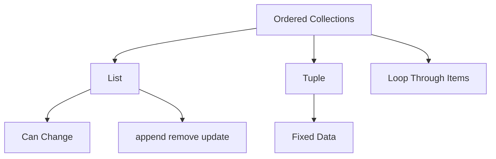

# Day 011 [Beginner]: Lists and Tuples

## Index

- [Goal](#goal)
- [Prerequisites](#prerequisites)
- [Explanation](#explanation)
- [Topic by Topic](#topic-by-topic)
- [Key Concepts](#key-concepts)
- [Visual Concept Map](#visual-concept-map)
- [End-to-End Practical](#end-to-end-practical)
- [Hands-on Coding](#hands-on-coding)
- [Mini Exercise](#mini-exercise)
- [Assessment Quiz](#assessment-quiz)
- [Task](#task)
- [Self Check](#self-check)
- [Interview Questions and Answers](#interview-questions-and-answers)
- [Day 011 Outcome](#day-011-outcome)

## Goal

Learn how to store ordered collections in Python using lists and tuples, and understand when each one is a better fit.

## Prerequisites

- Day 010 completed
- Comfortable with variables, loops, and strings

## Explanation

Programs often need to store many related values together. Lists and tuples both keep ordered collections, but they behave differently and are used in different situations.

## Topic by Topic

### Topic 1: What Lists Are

Theory:
A list is an ordered, changeable collection.

Practical:
Use lists for values that may grow, shrink, or be updated like marks, tasks, or product names.

Code Example:

```python
fruits = ["apple", "banana", "mango"]
print(fruits)
```

**Explanation:**
This topic explains What Lists Are in a practical Python context so you can write clear, reliable, and maintainable programs for real-world tasks.

**Key Points:**
- Understand the core idea behind What Lists Are.
- Apply the practical pattern with good readability and validation habits.
- Keep the solution maintainable, testable, and safe for production use where relevant.

### Topic 2: Accessing and Updating Lists

Theory:
You can read list items using indexes and update them directly.

Practical:
Replace one item, get the first value, or print the last entry.

Code Example:

```python
numbers = [10, 20, 30]
numbers[1] = 25
print(numbers[0])
```

**Explanation:**
This topic explains Accessing and Updating Lists in a practical Python context so you can write clear, reliable, and maintainable programs for real-world tasks.

**Key Points:**
- Understand the core idea behind Accessing and Updating Lists.
- Apply the practical pattern with good readability and validation habits.
- Keep the solution maintainable, testable, and safe for production use where relevant.

### Topic 3: Common List Operations

Theory:
Lists support methods like `append()`, `remove()`, and `pop()`.

Practical:
Use these to manage dynamic collections like shopping carts or task lists.

Code Example:

```python
tasks = ["read", "code"]
tasks.append("practice")
print(tasks)
```

**Explanation:**
This topic explains Common List Operations in a practical Python context so you can write clear, reliable, and maintainable programs for real-world tasks.

**Key Points:**
- Understand the core idea behind Common List Operations.
- Apply the practical pattern with good readability and validation habits.
- Keep the solution maintainable, testable, and safe for production use where relevant.

### Topic 4: What Tuples Are

Theory:
A tuple is an ordered collection that should not be changed after creation.

Practical:
Use tuples for fixed data like coordinates, RGB values, or constant record-like values.

Code Example:

```python
point = (10, 20)
print(point)
```

**Explanation:**
This topic explains What Tuples Are in a practical Python context so you can write clear, reliable, and maintainable programs for real-world tasks.

**Key Points:**
- Understand the core idea behind What Tuples Are.
- Apply the practical pattern with good readability and validation habits.
- Keep the solution maintainable, testable, and safe for production use where relevant.

### Topic 5: List vs Tuple Choice

Theory:
The main decision is whether the collection should be changeable.

Practical:
Choose a list for editable task items and a tuple for a fixed pair like `(latitude, longitude)`.

Code Example:

```python
menu_items = ["Tea", "Coffee"]
rgb_white = (255, 255, 255)
```

**Explanation:**
This topic explains List vs Tuple Choice in a practical Python context so you can write clear, reliable, and maintainable programs for real-world tasks.

**Key Points:**
- Understand the core idea behind List vs Tuple Choice.
- Apply the practical pattern with good readability and validation habits.
- Keep the solution maintainable, testable, and safe for production use where relevant.

### Topic 6: Iterating Over Collections

Theory:
Lists and tuples become most useful when combined with loops.

Practical:
Loop through items to display, check, or process each value.

Code Example:

```python
scores = [78, 85, 91]
for score in scores:
  print(score)
```

**Explanation:**
This topic explains Iterating Over Collections in a practical Python context so you can write clear, reliable, and maintainable programs for real-world tasks.

**Key Points:**
- Understand the core idea behind Iterating Over Collections.
- Apply the practical pattern with good readability and validation habits.
- Keep the solution maintainable, testable, and safe for production use where relevant.

## Key Concepts

- Lists are ordered and mutable
- Tuples are ordered and usually immutable
- Indexes help read and update collection values
- List methods support dynamic data handling
- Choosing the right collection improves clarity
- Collections often work together with loops

## Visual Concept Map



## End-to-End Practical

1. Create a list of three items.
2. Read one value using an index.
3. Update one list item.
4. Create a tuple for fixed data.
5. Loop through the list and print each value.

## Hands-on Coding

### Example 1: Case - Student Marks List

Scenario:
You want to store and update exam marks.

```python
marks = [70, 82, 91]
marks[0] = 75
print(marks)
```

### Example 2: Case - Product Sizes Tuple

Scenario:
You want fixed size options that should not be changed often.

```python
sizes = ("S", "M", "L")
print(sizes)
```

### Example 3: Case - Print Task List

Scenario:
You want to display every task to the user.

```python
tasks = ["install Python", "write code", "run script"]
for task in tasks:
  print(task)
```

## Mini Exercise

Scenario:
Create a list of 5 city names and a tuple of 3 fixed color values. Print the second city, then loop through all cities.

Expected output:

- One list and one tuple created
- Correct index access
- A loop over the list

## Assessment Quiz

### Quiz Questions

1. What is the main difference between a list and a tuple?
2. Which collection is better for editable items?
3. True or False: Tuples keep order.
4. What does `append()` do?
5. Why are tuples useful for fixed values?

### Quiz Answers

1. Lists are mutable, tuples are usually immutable
2. A list
3. True
4. It adds a new item to the end of a list
5. They make the fixed nature of the data clear

## Task

- Create and modify one list
- Create one tuple for fixed data
- Loop through a collection

## Self Check

- You can explain list vs tuple differences
- You can update list values safely
- You can choose the right collection for simple problems

## Interview Questions and Answers

### Beginner

**Question:** What is a list in Python?

**Answer:** A list is an ordered collection of items that can be changed.

**Question:** What is a tuple?

**Answer:** A tuple is an ordered collection usually used for values that should stay fixed.

### Middle

**Question:** When should you prefer a tuple over a list?

**Answer:** When the values represent fixed data that should not be changed frequently.

**Question:** Why are lists useful in real applications?

**Answer:** Because many app features manage dynamic collections like tasks, users, and products.

### Advanced

**Question:** Why does choosing the correct collection improve maintainability?

**Answer:** It communicates intent clearly and reduces accidental misuse of data.

**Question:** What common beginner mistake happens with indexes?

**Answer:** Accessing an index that does not exist, which raises an error.

## Day 011 Outcome

- You can work with Python lists and tuples confidently
- You can choose between mutable and fixed collections
- You are ready for dictionaries and sets on Day 012
