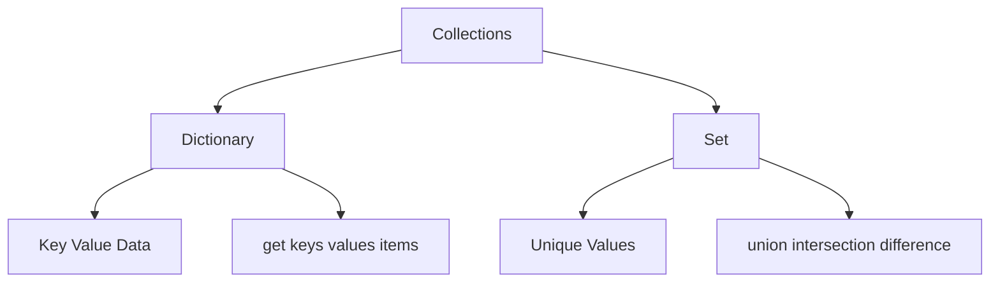

# Day 012 [Beginner]: Dictionaries and Sets

## Index

- [Goal](#goal)
- [Prerequisites](#prerequisites)
- [Explanation](#explanation)
- [Topic by Topic](#topic-by-topic)
- [Key Concepts](#key-concepts)
- [Visual Concept Map](#visual-concept-map)
- [End-to-End Practical](#end-to-end-practical)
- [Hands-on Coding](#hands-on-coding)
- [Mini Exercise](#mini-exercise)
- [Assessment Quiz](#assessment-quiz)
- [Task](#task)
- [Self Check](#self-check)
- [Interview Questions and Answers](#interview-questions-and-answers)
- [Day 012 Outcome](#day-012-outcome)

## Goal

Understand how to store key-value data with dictionaries and unique values with sets.

## Prerequisites

- Day 011 completed
- Comfortable with collections and loops

## Explanation

Lists are useful for ordered values, but sometimes you need named values or unique items. Dictionaries solve key-value storage, while sets help when duplicates should be removed or ignored.

## Topic by Topic

### Topic 1: What a Dictionary Is

Theory:
A dictionary stores data as key-value pairs.

Practical:
Use dictionaries for user profiles, product details, or configuration values.

Code Example:

```python
student = {"name": "Riya", "age": 20}
print(student)
```

**Explanation:**
This topic explains What a Dictionary Is in a practical Python context so you can write clear, reliable, and maintainable programs for real-world tasks.

**Key Points:**
- Understand the core idea behind What a Dictionary Is.
- Apply the practical pattern with good readability and validation habits.
- Keep the solution maintainable, testable, and safe for production use where relevant.

### Topic 2: Reading and Updating Dictionary Values

Theory:
Dictionary values are accessed using keys.

Practical:
Read a value like `name` and update `age` without changing the whole object.

Code Example:

```python
student = {"name": "Riya", "age": 20}
student["age"] = 21
print(student["name"])
```

**Explanation:**
This topic explains Reading and Updating Dictionary Values in a practical Python context so you can write clear, reliable, and maintainable programs for real-world tasks.

**Key Points:**
- Understand the core idea behind Reading and Updating Dictionary Values.
- Apply the practical pattern with good readability and validation habits.
- Keep the solution maintainable, testable, and safe for production use where relevant.

### Topic 3: Useful Dictionary Methods

Theory:
Methods like `get()`, `keys()`, `values()`, and `items()` help work with dictionaries safely.

Practical:
Use `get()` when a key may not exist.

Code Example:

```python
product = {"name": "Book", "price": 299}
print(product.get("stock", 0))
```

**Explanation:**
This topic explains Useful Dictionary Methods in a practical Python context so you can write clear, reliable, and maintainable programs for real-world tasks.

**Key Points:**
- Understand the core idea behind Useful Dictionary Methods.
- Apply the practical pattern with good readability and validation habits.
- Keep the solution maintainable, testable, and safe for production use where relevant.

### Topic 4: What a Set Is

Theory:
A set stores unique values and does not keep duplicates.

Practical:
Use sets for tags, unique users, or duplicate removal.

Code Example:

```python
numbers = {1, 2, 2, 3}
print(numbers)
```

**Explanation:**
This topic explains What a Set Is in a practical Python context so you can write clear, reliable, and maintainable programs for real-world tasks.

**Key Points:**
- Understand the core idea behind What a Set Is.
- Apply the practical pattern with good readability and validation habits.
- Keep the solution maintainable, testable, and safe for production use where relevant.

### Topic 5: Set Operations

Theory:
Sets support fast operations like union, intersection, and difference.

Practical:
Compare two groups of values to find common or missing items.

Code Example:

```python
group_a = {1, 2, 3}
group_b = {3, 4, 5}
print(group_a & group_b)
```

**Explanation:**
This topic explains Set Operations in a practical Python context so you can write clear, reliable, and maintainable programs for real-world tasks.

**Key Points:**
- Understand the core idea behind Set Operations.
- Apply the practical pattern with good readability and validation habits.
- Keep the solution maintainable, testable, and safe for production use where relevant.

### Topic 6: Choosing the Right Structure

Theory:
Use dictionaries when names matter and sets when uniqueness matters.

Practical:
Choose a dictionary for employee data and a set for unique department names.

Code Example:

```python
employee = {"id": 101, "name": "Aman"}
departments = {"HR", "IT", "IT"}
```

**Explanation:**
This topic explains Choosing the Right Structure in a practical Python context so you can write clear, reliable, and maintainable programs for real-world tasks.

**Key Points:**
- Understand the core idea behind Choosing the Right Structure.
- Apply the practical pattern with good readability and validation habits.
- Keep the solution maintainable, testable, and safe for production use where relevant.

## Key Concepts

- Dictionaries store key-value pairs
- Dictionary keys help fetch specific values
- `get()` helps avoid missing-key errors
- Sets store unique values
- Set operations compare grouped values
- Structure choice depends on problem shape

## Visual Concept Map



## End-to-End Practical

1. Create a dictionary with 3 keys.
2. Read one value and update another.
3. Create a set with duplicate values.
4. Observe how duplicates disappear.
5. Compare two sets using one set operation.

## Hands-on Coding

### Example 1: Case - Product Information Dictionary

Scenario:
You want to store product name, price, and stock.

```python
product = {"name": "Pen", "price": 20, "stock": 100}
print(product["price"])
```

### Example 2: Case - Unique City Names

Scenario:
You want to remove duplicate city names.

```python
cities = ["Delhi", "Mumbai", "Delhi", "Pune"]
unique_cities = set(cities)
print(unique_cities)
```

### Example 3: Case - Shared Skills Check

Scenario:
You want to find common skills between two learners.

```python
skills_a = {"python", "sql", "git"}
skills_b = {"python", "excel", "git"}
print(skills_a & skills_b)
```

## Mini Exercise

Scenario:
Create a dictionary for a book with keys `title`, `author`, and `price`. Then create a set of categories with one duplicate and print the final set.

Expected output:

- One dictionary created
- One value read from the dictionary
- One set with duplicates automatically removed

## Assessment Quiz

### Quiz Questions

1. What kind of data does a dictionary store?
2. Why might `get()` be safer than direct key access?
3. True or False: Sets allow duplicate values.
4. What does set intersection show?
5. When should you choose a dictionary over a list?

### Quiz Answers

1. Key-value pairs
2. It can provide a default when a key is missing
3. False
4. Common values between two sets
5. When values need named access by key

## Task

- Create one dictionary and one set
- Update dictionary data and perform one set operation
- Complete the mini exercise

## Self Check

- You can explain dictionary and set use cases
- You can access and update dictionary values
- You can use sets for uniqueness problems

## Interview Questions and Answers

### Beginner

**Question:** What is a dictionary in Python?

**Answer:** A dictionary stores data as key-value pairs.

**Question:** What is a set used for?

**Answer:** A set is used to store unique values without duplicates.

### Middle

**Question:** Why is `get()` useful on dictionaries?

**Answer:** It helps safely read values even when a key may be missing.

**Question:** Why are sets useful in data cleaning?

**Answer:** They remove duplicates automatically.

### Advanced

**Question:** Why does structure choice affect code quality?

**Answer:** The right structure makes data access clearer, faster, and easier to maintain.

**Question:** What common mistake happens with dictionaries?

**Answer:** Accessing a missing key directly without checking or using `get()`.

## Day 012 Outcome

- You can work confidently with dictionaries and sets
- You can choose key-value storage or unique-value storage correctly
- You are ready for comprehensions on Day 013
