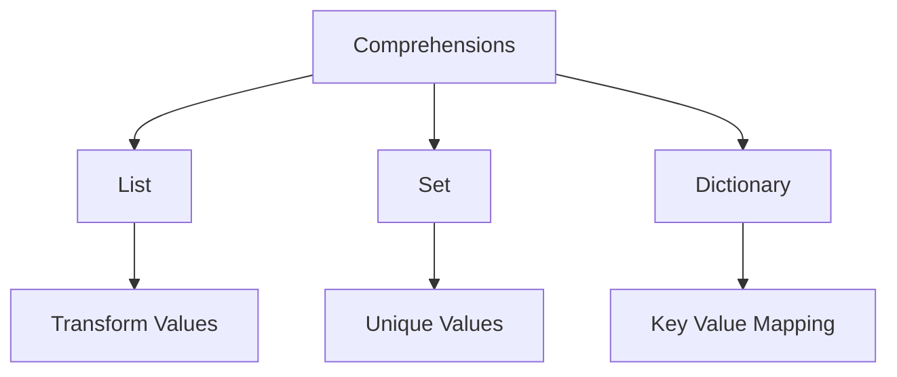

# Day 013 [Beginner]: Comprehensions

## Index

- [Goal](#goal)
- [Prerequisites](#prerequisites)
- [Explanation](#explanation)
- [Topic by Topic](#topic-by-topic)
- [Key Concepts](#key-concepts)
- [Visual Concept Map](#visual-concept-map)
- [End-to-End Practical](#end-to-end-practical)
- [Hands-on Coding](#hands-on-coding)
- [Mini Exercise](#mini-exercise)
- [Assessment Quiz](#assessment-quiz)
- [Task](#task)
- [Self Check](#self-check)
- [Interview Questions and Answers](#interview-questions-and-answers)
- [Day 013 Outcome](#day-013-outcome)

## Goal

Learn how list, set, and dictionary comprehensions help write shorter and clearer collection-building code.

## Prerequisites

- Day 012 completed
- Comfortable with loops, conditions, and collections

## Explanation

Comprehensions give a compact way to build new collections from existing ones. They are powerful, but they should stay readable and not become too complex.

## Topic by Topic

### Topic 1: What a List Comprehension Is

Theory:
A list comprehension creates a new list from an iterable in one expression.

Practical:
Use it when transforming or filtering values in a simple readable way.

Code Example:

```python
squares = [number * number for number in range(5)]
print(squares)
```

**Explanation:**
This topic explains What a List Comprehension Is in a practical Python context so you can write clear, reliable, and maintainable programs for real-world tasks.

**Key Points:**
- Understand the core idea behind What a List Comprehension Is.
- Apply the practical pattern with good readability and validation habits.
- Keep the solution maintainable, testable, and safe for production use where relevant.

### Topic 2: Adding Conditions to Comprehensions

Theory:
You can add an `if` condition to include only matching values.

Practical:
Use this to keep only even numbers, long words, or valid items.

Code Example:

```python
evens = [number for number in range(10) if number % 2 == 0]
```

**Explanation:**
This topic explains Adding Conditions to Comprehensions in a practical Python context so you can write clear, reliable, and maintainable programs for real-world tasks.

**Key Points:**
- Understand the core idea behind Adding Conditions to Comprehensions.
- Apply the practical pattern with good readability and validation habits.
- Keep the solution maintainable, testable, and safe for production use where relevant.

### Topic 3: Set Comprehensions

Theory:
Set comprehensions are useful when you want unique transformed values.

Practical:
Build a set of unique lowercase tags or letters.

Code Example:

```python
letters = {char.lower() for char in "Python"}
print(letters)
```

**Explanation:**
This topic explains Set Comprehensions in a practical Python context so you can write clear, reliable, and maintainable programs for real-world tasks.

**Key Points:**
- Understand the core idea behind Set Comprehensions.
- Apply the practical pattern with good readability and validation habits.
- Keep the solution maintainable, testable, and safe for production use where relevant.

### Topic 4: Dictionary Comprehensions

Theory:
Dictionary comprehensions build key-value pairs in a compact way.

Practical:
Use them for quick lookup tables like number-to-square mappings.

Code Example:

```python
table = {number: number * number for number in range(4)}
print(table)
```

**Explanation:**
This topic explains Dictionary Comprehensions in a practical Python context so you can write clear, reliable, and maintainable programs for real-world tasks.

**Key Points:**
- Understand the core idea behind Dictionary Comprehensions.
- Apply the practical pattern with good readability and validation habits.
- Keep the solution maintainable, testable, and safe for production use where relevant.

### Topic 5: Comprehension vs Regular Loop

Theory:
Comprehensions are useful when they stay simple; long logic is often clearer with normal loops.

Practical:
Prefer readability over one-line cleverness.

Code Example:

```python
names = [name.strip() for name in [" Asha ", " Ravi "]]
```

**Explanation:**
This topic explains Comprehension vs Regular Loop in a practical Python context so you can write clear, reliable, and maintainable programs for real-world tasks.

**Key Points:**
- Understand the core idea behind Comprehension vs Regular Loop.
- Apply the practical pattern with good readability and validation habits.
- Keep the solution maintainable, testable, and safe for production use where relevant.

### Topic 6: Avoiding Over-Complex Comprehensions

Theory:
If a comprehension is hard to explain quickly, it may be too complex.

Practical:
Break multi-step logic into a loop or helper function when clarity drops.

Code Example:

```python
clean_scores = [score for score in scores if score >= 40]
```

**Explanation:**
This topic explains Avoiding Over-Complex Comprehensions in a practical Python context so you can write clear, reliable, and maintainable programs for real-world tasks.

**Key Points:**
- Understand the core idea behind Avoiding Over-Complex Comprehensions.
- Apply the practical pattern with good readability and validation habits.
- Keep the solution maintainable, testable, and safe for production use where relevant.

## Key Concepts

- List comprehensions build new lists compactly
- Conditions can filter values during creation
- Set comprehensions create unique results
- Dictionary comprehensions create key-value mappings
- Simplicity matters more than shortness
- Readability should guide comprehension use

## Visual Concept Map



## End-to-End Practical

1. Create a list comprehension from a range.
2. Add a filter condition.
3. Create a set comprehension.
4. Create a dictionary comprehension.
5. Compare readability with a regular loop.

## Hands-on Coding

### Example 1: Case - Double Numbers

Scenario:
You want a new list where every number is doubled.

```python
numbers = [1, 2, 3, 4]
doubled = [number * 2 for number in numbers]
print(doubled)
```

### Example 2: Case - Filter Passing Marks

Scenario:
You want only marks that are 40 or above.

```python
marks = [25, 40, 68, 39, 91]
passing_marks = [mark for mark in marks if mark >= 40]
print(passing_marks)
```

### Example 3: Case - Quick Lookup Table

Scenario:
You want a dictionary that maps words to their lengths.

```python
words = ["python", "loop", "data"]
length_map = {word: len(word) for word in words}
print(length_map)
```

## Mini Exercise

Scenario:
Create a list of numbers from 1 to 10, then build:

- a list of squares
- a list of even numbers
- a dictionary mapping each number to its cube

Expected output:

- One list comprehension
- One filtered comprehension
- One dictionary comprehension

## Assessment Quiz

### Quiz Questions

1. What does a list comprehension do?
2. Can comprehensions include conditions?
3. True or False: Shorter code is always better code.
4. When is a regular loop better than a comprehension?
5. What kind of result does a dictionary comprehension create?

### Quiz Answers

1. It builds a new list from an iterable in a compact way
2. Yes
3. False
4. When the logic becomes too long or hard to read
5. A dictionary of key-value pairs

## Task

- Create one list, one set, and one dictionary comprehension
- Keep each example readable
- Complete the mini exercise

## Self Check

- You can write simple comprehensions confidently
- You know when to use a regular loop instead
- You can explain comprehension readability tradeoffs

## Interview Questions and Answers

### Beginner

**Question:** What is a list comprehension?

**Answer:** A short way to build a list from another iterable.

**Question:** Can you filter items inside a comprehension?

**Answer:** Yes, by using an `if` condition.

### Middle

**Question:** Why are comprehensions popular in Python?

**Answer:** They make common transformation tasks shorter and more expressive.

**Question:** What is a sign that a comprehension should be replaced with a loop?

**Answer:** When it becomes hard to read or explain.

### Advanced

**Question:** Why can overusing comprehensions hurt maintainability?

**Answer:** Dense one-line logic can hide intent and make debugging harder.

**Question:** What principle should guide comprehension usage?

**Answer:** Clear code first, compact code second.

## Day 013 Outcome

- You can build collections using Python comprehensions
- You can choose between concise syntax and clearer loops wisely
- You are ready for error handling basics on Day 014
