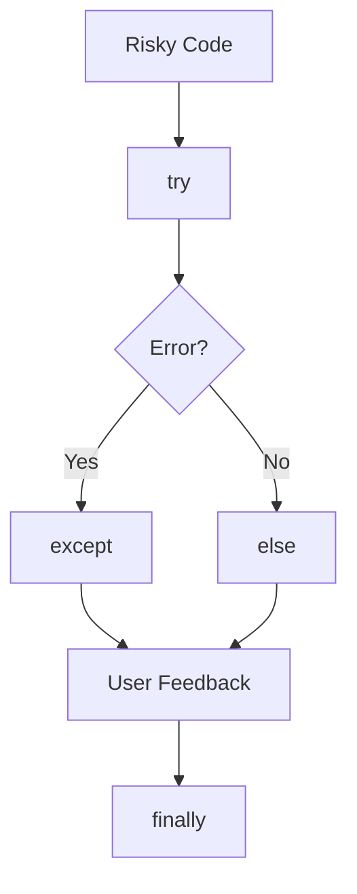

# Day 014 [Beginner]: Error Handling Basics

## Index

- [Goal](#goal)
- [Prerequisites](#prerequisites)
- [Explanation](#explanation)
- [Topic by Topic](#topic-by-topic)
- [Key Concepts](#key-concepts)
- [Visual Concept Map](#visual-concept-map)
- [End-to-End Practical](#end-to-end-practical)
- [Hands-on Coding](#hands-on-coding)
- [Mini Exercise](#mini-exercise)
- [Assessment Quiz](#assessment-quiz)
- [Task](#task)
- [Self Check](#self-check)
- [Interview Questions and Answers](#interview-questions-and-answers)
- [Day 014 Outcome](#day-014-outcome)

## Goal

Learn how to detect, handle, and explain common runtime errors without crashing the whole program.

## Prerequisites

- Day 013 completed
- Comfortable with functions, input, and collections

## Explanation

Errors are normal in programming. Good programs do not assume everything always works perfectly. They detect problems, handle them safely, and give useful feedback.

## Topic by Topic

### Topic 1: What an Exception Is

Theory:
An exception is an error that happens while a program is running.

Practical:
Examples include dividing by zero, converting bad input, or reading a missing file.

Code Example:

```python
print(10 / 0)
```

**Explanation:**
This topic explains What an Exception Is in a practical Python context so you can write clear, reliable, and maintainable programs for real-world tasks.

**Key Points:**
- Understand the core idea behind What an Exception Is.
- Apply the practical pattern with good readability and validation habits.
- Keep the solution maintainable, testable, and safe for production use where relevant.

### Topic 2: `try` and `except`

Theory:
`try` contains risky code and `except` handles the error if it occurs.

Practical:
Use this when converting user input to numbers.

Code Example:

```python
try:
  age = int(input("Enter age: "))
except ValueError:
  print("Please enter a valid number")
```

**Explanation:**
This topic explains `try` and `except` in a practical Python context so you can write clear, reliable, and maintainable programs for real-world tasks.

**Key Points:**
- Understand the core idea behind `try` and `except`.
- Apply the practical pattern with good readability and validation habits.
- Keep the solution maintainable, testable, and safe for production use where relevant.

### Topic 3: Handling Specific Exceptions

Theory:
It is better to catch specific errors than to hide everything.

Practical:
Handle `ValueError` for bad numbers and `ZeroDivisionError` for invalid division.

Code Example:

```python
try:
  result = 10 / 0
except ZeroDivisionError:
  print("Division by zero is not allowed")
```

**Explanation:**
This topic explains Handling Specific Exceptions in a practical Python context so you can write clear, reliable, and maintainable programs for real-world tasks.

**Key Points:**
- Understand the core idea behind Handling Specific Exceptions.
- Apply the practical pattern with good readability and validation habits.
- Keep the solution maintainable, testable, and safe for production use where relevant.

### Topic 4: `else` and `finally`

Theory:
`else` runs when no error happens, and `finally` runs whether an error happens or not.

Practical:
Use `finally` for cleanup messages or resource closing.

Code Example:

```python
try:
  number = int("5")
except ValueError:
  print("Bad input")
else:
  print(number)
finally:
  print("Done")
```

**Explanation:**
This topic explains `else` and `finally` in a practical Python context so you can write clear, reliable, and maintainable programs for real-world tasks.

**Key Points:**
- Understand the core idea behind `else` and `finally`.
- Apply the practical pattern with good readability and validation habits.
- Keep the solution maintainable, testable, and safe for production use where relevant.

### Topic 5: Raising Your Own Errors

Theory:
Sometimes your program should create an error intentionally when data is invalid.

Practical:
Raise a `ValueError` when age is negative.

Code Example:

```python
age = -1
if age < 0:
  raise ValueError("Age cannot be negative")
```

**Explanation:**
This topic explains Raising Your Own Errors in a practical Python context so you can write clear, reliable, and maintainable programs for real-world tasks.

**Key Points:**
- Understand the core idea behind Raising Your Own Errors.
- Apply the practical pattern with good readability and validation habits.
- Keep the solution maintainable, testable, and safe for production use where relevant.

### Topic 6: User-Friendly Error Messages

Theory:
Error handling is not only for developers; users also need clear feedback.

Practical:
Show helpful messages like `Enter a valid number` instead of confusing raw traces in beginner programs.

Code Example:

```python
print("Invalid choice. Please try again.")
```

**Explanation:**
This topic explains User-Friendly Error Messages in a practical Python context so you can write clear, reliable, and maintainable programs for real-world tasks.

**Key Points:**
- Understand the core idea behind User-Friendly Error Messages.
- Apply the practical pattern with good readability and validation habits.
- Keep the solution maintainable, testable, and safe for production use where relevant.

## Key Concepts

- Exceptions are runtime errors
- `try` and `except` protect risky code
- Specific exceptions are better than broad handling
- `else` and `finally` support clearer flow
- `raise` creates intentional validation errors
- Helpful messages improve user experience

## Visual Concept Map



## End-to-End Practical

1. Ask for a number using input.
2. Convert it inside a `try` block.
3. Handle bad input with `except`.
4. Print success in `else`.
5. Add `finally` to show the program step is complete.

## Hands-on Coding

### Example 1: Case - Safe Number Input

Scenario:
You want to avoid a crash when a user enters text instead of a number.

```python
try:
  number = int(input("Enter a number: "))
  print(number)
except ValueError:
  print("That was not a valid integer")
```

### Example 2: Case - Safe Division

Scenario:
You want to divide two values without crashing on zero.

```python
try:
  result = 10 / 0
except ZeroDivisionError:
  print("Cannot divide by zero")
```

### Example 3: Case - Manual Validation

Scenario:
You want to reject impossible user data.

```python
salary = -500
if salary < 0:
  raise ValueError("Salary cannot be negative")
```

## Mini Exercise

Scenario:
Write a small program that asks for two numbers and divides the first by the second. Handle invalid numbers and division by zero safely.

Expected output:

- Use `try` and `except`
- Handle at least two error cases
- Show a clear success or error message

## Assessment Quiz

### Quiz Questions

1. What is an exception?
2. Why is catching specific errors better?
3. True or False: `finally` only runs when an error happens.
4. What does `raise` do?
5. Why are helpful error messages important?

### Quiz Answers

1. A runtime error
2. It keeps handling precise and easier to understand
3. False
4. It creates an exception intentionally
5. They help users and developers understand what went wrong

## Task

- Write one safe input program
- Handle `ValueError` and one more common error
- Complete the mini exercise

## Self Check

- You can explain how Python handles runtime errors
- You can write basic `try/except` blocks
- You can provide clearer error feedback to users

## Interview Questions and Answers

### Beginner

**Question:** What is error handling?

**Answer:** It is the process of detecting and responding to problems safely while the program runs.

**Question:** What does `except` do?

**Answer:** It handles an error if one happens inside the `try` block.

### Middle

**Question:** Why should you avoid bare `except` in normal code?

**Answer:** It can hide unexpected issues and make debugging harder.

**Question:** When is `finally` useful?

**Answer:** When some cleanup or closing step should always happen.

### Advanced

**Question:** Why is good error handling part of software quality?

**Answer:** It improves reliability, debuggability, and user trust.

**Question:** What is a common beginner mistake in exception handling?

**Answer:** Catching all exceptions without understanding the real error.

## Day 014 Outcome

- You can handle common Python runtime errors safely
- You can use `try`, `except`, `else`, `finally`, and `raise`
- You are ready for file handling on Day 015
