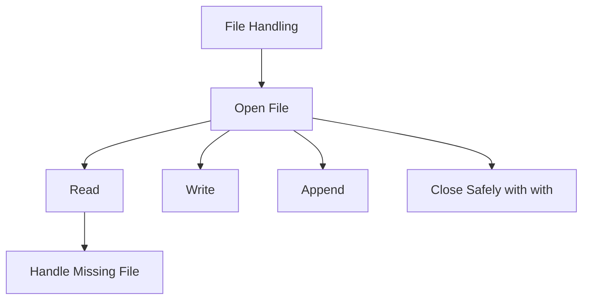

# Day 015 [Beginner]: File Handling

## Index

- [Goal](#goal)
- [Prerequisites](#prerequisites)
- [Explanation](#explanation)
- [Topic by Topic](#topic-by-topic)
- [Key Concepts](#key-concepts)
- [Visual Concept Map](#visual-concept-map)
- [End-to-End Practical](#end-to-end-practical)
- [Hands-on Coding](#hands-on-coding)
- [Mini Exercise](#mini-exercise)
- [Assessment Quiz](#assessment-quiz)
- [Task](#task)
- [Self Check](#self-check)
- [Interview Questions and Answers](#interview-questions-and-answers)
- [Day 015 Outcome](#day-015-outcome)

## Goal

Learn how to read from files, write to files, and work with file resources safely in Python.

## Prerequisites

- Day 014 completed
- Comfortable with strings and error handling basics

## Explanation

File handling lets programs store information outside memory. This is useful for logs, reports, saved notes, configuration files, and simple data exchange.

## Topic by Topic

### Topic 1: Opening a File

Theory:
Python uses `open()` to access files.

Practical:
You can open a file for reading, writing, or appending depending on what your program needs.

Code Example:

```python
file = open("notes.txt", "r")
```

**Explanation:**
This topic explains Opening a File in a practical Python context so you can write clear, reliable, and maintainable programs for real-world tasks.

**Key Points:**
- Understand the core idea behind Opening a File.
- Apply the practical pattern with good readability and validation habits.
- Keep the solution maintainable, testable, and safe for production use where relevant.

### Topic 2: Reading File Content

Theory:
You can read the whole file or line by line.

Practical:
Use `read()` for a full file and loops for line-based processing.

Code Example:

```python
with open("notes.txt", "r") as file:
  content = file.read()
  print(content)
```

**Explanation:**
This topic explains Reading File Content in a practical Python context so you can write clear, reliable, and maintainable programs for real-world tasks.

**Key Points:**
- Understand the core idea behind Reading File Content.
- Apply the practical pattern with good readability and validation habits.
- Keep the solution maintainable, testable, and safe for production use where relevant.

### Topic 3: Writing and Appending

Theory:
Writing replaces content, while appending adds new content at the end.

Practical:
Choose `w` when creating or replacing a file, and `a` when adding more data later.

Code Example:

```python
with open("notes.txt", "a") as file:
  file.write("\nNew note")
```

**Explanation:**
This topic explains Writing and Appending in a practical Python context so you can write clear, reliable, and maintainable programs for real-world tasks.

**Key Points:**
- Understand the core idea behind Writing and Appending.
- Apply the practical pattern with good readability and validation habits.
- Keep the solution maintainable, testable, and safe for production use where relevant.

### Topic 4: Why `with` Is Important

Theory:
The `with` statement closes files automatically, even when errors happen.

Practical:
Prefer `with open(...)` over manual open/close in beginner and production code.

Code Example:

```python
with open("report.txt", "w") as file:
  file.write("Report created")
```

**Explanation:**
This topic explains Why `with` Is Important in a practical Python context so you can write clear, reliable, and maintainable programs for real-world tasks.

**Key Points:**
- Understand the core idea behind Why `with` Is Important.
- Apply the practical pattern with good readability and validation habits.
- Keep the solution maintainable, testable, and safe for production use where relevant.

### Topic 5: Handling Missing Files Safely

Theory:
Trying to read a missing file raises an error.

Practical:
Use `try/except` around file reading if the file may not exist.

Code Example:

```python
try:
  with open("missing.txt", "r") as file:
    print(file.read())
except FileNotFoundError:
  print("File not found")
```

**Explanation:**
This topic explains Handling Missing Files Safely in a practical Python context so you can write clear, reliable, and maintainable programs for real-world tasks.

**Key Points:**
- Understand the core idea behind Handling Missing Files Safely.
- Apply the practical pattern with good readability and validation habits.
- Keep the solution maintainable, testable, and safe for production use where relevant.

### Topic 6: File Handling Habits

Theory:
Good file handling includes clear file names, safe modes, and careful overwrite decisions.

Practical:
Avoid writing to important files without understanding whether you should append or replace.

Code Example:

```python
filename = "daily_notes.txt"
```

**Explanation:**
This topic explains File Handling Habits in a practical Python context so you can write clear, reliable, and maintainable programs for real-world tasks.

**Key Points:**
- Understand the core idea behind File Handling Habits.
- Apply the practical pattern with good readability and validation habits.
- Keep the solution maintainable, testable, and safe for production use where relevant.

## Key Concepts

- `open()` accesses files
- Files can be read, written, or appended
- `with` closes files safely
- Reading missing files can raise errors
- File mode choice changes behavior
- Safe file habits prevent accidental data loss

## Visual Concept Map



## End-to-End Practical

1. Create a text file.
2. Write one line into it.
3. Reopen and read the file.
4. Append one more line.
5. Add safe handling for missing-file read.

## Hands-on Coding

### Example 1: Case - Save a Note

Scenario:
You want to save one note into a text file.

```python
with open("notes.txt", "w") as file:
  file.write("Python practice note")
```

### Example 2: Case - Read a Report

Scenario:
You want to show report content stored in a file.

```python
with open("notes.txt", "r") as file:
  print(file.read())
```

### Example 3: Case - Add More Data

Scenario:
You want to add one more line without deleting the old content.

```python
with open("notes.txt", "a") as file:
  file.write("\nSecond line")
```

## Mini Exercise

Scenario:
Create a file named `tasks.txt`, write three tasks into it, then read the file and print its content. After that, append one more task.

Expected output:

- One file created
- Three initial lines written
- One appended line added later

## Assessment Quiz

### Quiz Questions

1. What does `w` mode do?
2. Why is `with open(...)` recommended?
3. True or False: `a` mode removes old content first.
4. What error can happen when a file does not exist?
5. When should you choose append instead of write?

### Quiz Answers

1. It writes to a file and can replace existing content
2. It closes the file automatically and safely
3. False
4. `FileNotFoundError`
5. When you want to keep old data and add new content

## Task

- Create, read, and append to one file
- Use `with open(...)`
- Complete the mini exercise

## Self Check

- You can read and write files safely
- You understand file modes clearly
- You can avoid basic file handling mistakes

## Interview Questions and Answers

### Beginner

**Question:** What is file handling?

**Answer:** It is working with files to read, write, or store data outside the running program.

**Question:** Why do we use `with` while opening files?

**Answer:** It closes the file automatically after the block finishes.

### Middle

**Question:** What is the difference between write and append mode?

**Answer:** Write can replace existing content, while append adds new content to the end.

**Question:** Why should file reading often use error handling?

**Answer:** Because the file may be missing, moved, or inaccessible.

### Advanced

**Question:** Why is file mode choice an important engineering decision?

**Answer:** Using the wrong mode can overwrite important data or fail to preserve history.

**Question:** What common mistake do beginners make with files?

**Answer:** Forgetting to close files or using write mode when append mode was needed.

## Day 015 Outcome

- You can read, write, and append files in Python
- You can use `with` for safe file handling
- You are ready for modules and packages on Day 016
