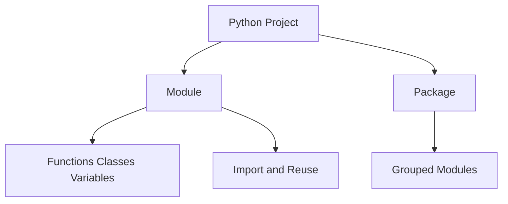

# Day 016 [Beginner]: Modules and Packages

## Index

- [Goal](#goal)
- [Prerequisites](#prerequisites)
- [Explanation](#explanation)
- [Topic by Topic](#topic-by-topic)
- [Key Concepts](#key-concepts)
- [Visual Concept Map](#visual-concept-map)
- [End-to-End Practical](#end-to-end-practical)
- [Hands-on Coding](#hands-on-coding)
- [Mini Exercise](#mini-exercise)
- [Assessment Quiz](#assessment-quiz)
- [Task](#task)
- [Self Check](#self-check)
- [Interview Questions and Answers](#interview-questions-and-answers)
- [Day 016 Outcome](#day-016-outcome)

## Goal

Understand how Python modules and packages help organize code into reusable, maintainable parts.

## Prerequisites

- Day 015 completed
- Comfortable with functions and file handling basics

## Explanation

As programs grow, keeping all code in one file becomes hard to manage. Modules and packages help split code into logical parts so teams can reuse and maintain it more easily.

## Topic by Topic

### Topic 1: What a Module Is

Theory:
A module is a Python file that contains reusable code such as functions, classes, or variables.

Practical:
Create one file for helper logic and another file that imports and uses it.

Code Example:

```python
# helpers.py
def greet(name):
  return f"Hello, {name}"
```

**Explanation:**
This topic explains What a Module Is in a practical Python context so you can write clear, reliable, and maintainable programs for real-world tasks.

**Key Points:**
- Understand the core idea behind What a Module Is.
- Apply the practical pattern with good readability and validation habits.
- Keep the solution maintainable, testable, and safe for production use where relevant.

### Topic 2: Importing from a Module

Theory:
Python uses `import` to bring code from one module into another.

Practical:
Import a function instead of copying the same code into many files.

Code Example:

```python
from helpers import greet
print(greet("Ravi"))
```

**Explanation:**
This topic explains Importing from a Module in a practical Python context so you can write clear, reliable, and maintainable programs for real-world tasks.

**Key Points:**
- Understand the core idea behind Importing from a Module.
- Apply the practical pattern with good readability and validation habits.
- Keep the solution maintainable, testable, and safe for production use where relevant.

### Topic 3: What a Package Is

Theory:
A package is a folder that groups related Python modules together.

Practical:
Use packages when a project has multiple related files like math helpers, user utilities, or data tools.

Code Example:

```python
# utils/
#   formatters.py
#   validators.py
```

**Explanation:**
This topic explains What a Package Is in a practical Python context so you can write clear, reliable, and maintainable programs for real-world tasks.

**Key Points:**
- Understand the core idea behind What a Package Is.
- Apply the practical pattern with good readability and validation habits.
- Keep the solution maintainable, testable, and safe for production use where relevant.

### Topic 4: Standard Library vs Your Own Modules

Theory:
Python has built-in modules like `math`, `random`, and `datetime`, but you can also create your own.

Practical:
Import from the standard library for common tasks before writing everything yourself.

Code Example:

```python
import math
print(math.sqrt(16))
```

**Explanation:**
This topic explains Standard Library vs Your Own Modules in a practical Python context so you can write clear, reliable, and maintainable programs for real-world tasks.

**Key Points:**
- Understand the core idea behind Standard Library vs Your Own Modules.
- Apply the practical pattern with good readability and validation habits.
- Keep the solution maintainable, testable, and safe for production use where relevant.

### Topic 5: Naming and Organization

Theory:
Clear file names and focused modules improve readability.

Practical:
Keep one purpose per file where possible, such as `calculator.py` or `validators.py`.

Code Example:

```python
# auth.py
# payments.py
# reports.py
```

**Explanation:**
This topic explains Naming and Organization in a practical Python context so you can write clear, reliable, and maintainable programs for real-world tasks.

**Key Points:**
- Understand the core idea behind Naming and Organization.
- Apply the practical pattern with good readability and validation habits.
- Keep the solution maintainable, testable, and safe for production use where relevant.

### Topic 6: Why Code Organization Matters Early

Theory:
Learning modules early prevents the habit of building large, hard-to-maintain single files.

Practical:
Move helper logic out of your main script as soon as repeated code appears.

Code Example:

```python
from calculator import add
print(add(2, 3))
```

**Explanation:**
This topic explains Why Code Organization Matters Early in a practical Python context so you can write clear, reliable, and maintainable programs for real-world tasks.

**Key Points:**
- Understand the core idea behind Why Code Organization Matters Early.
- Apply the practical pattern with good readability and validation habits.
- Keep the solution maintainable, testable, and safe for production use where relevant.

## Key Concepts

- A module is a reusable Python file
- Imports connect code across files
- A package groups related modules
- Standard library modules solve common problems
- Good names improve project structure
- Early organization improves maintainability

## Visual Concept Map



## End-to-End Practical

1. Create one helper file.
2. Add a small function inside it.
3. Import that function into another file.
4. Run the main file.
5. Group related helpers into a folder structure idea.

## Hands-on Coding

### Example 1: Case - Calculator Helper Module

Scenario:
You want arithmetic logic in a separate file.

```python
# calculator.py
def add(a, b):
  return a + b
```

### Example 2: Case - Using the Module

Scenario:
You want to use the helper without rewriting the function.

```python
from calculator import add
print(add(10, 5))
```

### Example 3: Case - Built-in Module Usage

Scenario:
You want a random number without writing custom logic.

```python
import random
print(random.randint(1, 10))
```

## Mini Exercise

Scenario:
Create a module named `greetings.py` with two functions: `say_hello(name)` and `say_bye(name)`. Import both in another file and call them.

Expected output:

- One custom module created
- Two imported function calls
- Clean separation between helper file and main file

## Assessment Quiz

### Quiz Questions

1. What is a module in Python?
2. What does `import` do?
3. True or False: A package is used to group related modules.
4. Why use the standard library?
5. Why should a large script be split into modules?

### Quiz Answers

1. A Python file containing reusable code
2. It brings code from another module into the current file
3. True
4. It provides tested built-in tools for common tasks
5. To improve reuse, readability, and maintainability

## Task

- Create one custom module
- Import it into another file
- Complete the mini exercise

## Self Check

- You can explain modules and packages clearly
- You can import functions from another file
- You understand why code organization matters

## Interview Questions and Answers

### Beginner

**Question:** What is a Python module?

**Answer:** A Python file that contains reusable code.

**Question:** Why use imports?

**Answer:** To reuse code from another file instead of rewriting it.

### Middle

**Question:** What is the difference between a module and a package?

**Answer:** A module is one file; a package is a group of related modules.

**Question:** Why is code splitting useful in real projects?

**Answer:** It keeps code easier to test, change, and understand.

### Advanced

**Question:** What project problem appears when everything stays in one file?

**Answer:** Low maintainability, repeated logic, and harder collaboration.

**Question:** Why is structure a technical decision, not only a style decision?

**Answer:** Structure affects reuse, testing, debugging, and how quickly teams can safely change code.

## Day 016 Outcome

- You can organize Python code using modules and packages
- You can reuse functions across files with imports
- You are ready for virtual environments and pip on Day 017
