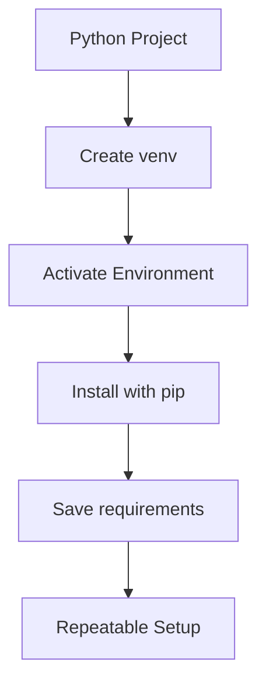

# Day 017 [Beginner]: Virtual Environments and pip

## Index

- [Goal](#goal)
- [Prerequisites](#prerequisites)
- [Explanation](#explanation)
- [Topic by Topic](#topic-by-topic)
- [Key Concepts](#key-concepts)
- [Visual Concept Map](#visual-concept-map)
- [End-to-End Practical](#end-to-end-practical)
- [Hands-on Coding](#hands-on-coding)
- [Mini Exercise](#mini-exercise)
- [Assessment Quiz](#assessment-quiz)
- [Task](#task)
- [Self Check](#self-check)
- [Interview Questions and Answers](#interview-questions-and-answers)
- [Day 017 Outcome](#day-017-outcome)

## Goal

Learn how to isolate project dependencies using virtual environments and install packages safely with `pip`.

## Prerequisites

- Day 016 completed
- Comfortable with terminal basics and Python files

## Explanation

Different Python projects can require different library versions. Virtual environments keep dependencies isolated so one project's package changes do not break another project.

## Topic by Topic

### Topic 1: Why Virtual Environments Matter

Theory:
Global package installation can create version conflicts across projects.

Practical:
Use a separate environment for each project to keep dependencies predictable.

Code Example:

```python
# terminal command
# python -m venv .venv
```

**Explanation:**
This topic explains Why Virtual Environments Matter in a practical Python context so you can write clear, reliable, and maintainable programs for real-world tasks.

**Key Points:**
- Understand the core idea behind Why Virtual Environments Matter.
- Apply the practical pattern with good readability and validation habits.
- Keep the solution maintainable, testable, and safe for production use where relevant.

### Topic 2: Creating and Activating an Environment

Theory:
Python can create an isolated environment using the built-in `venv` module.

Practical:
Create one environment folder and activate it before installing packages.

Code Example:

```python
# Windows PowerShell
# .\.venv\Scripts\Activate.ps1
```

**Explanation:**
This topic explains Creating and Activating an Environment in a practical Python context so you can write clear, reliable, and maintainable programs for real-world tasks.

**Key Points:**
- Understand the core idea behind Creating and Activating an Environment.
- Apply the practical pattern with good readability and validation habits.
- Keep the solution maintainable, testable, and safe for production use where relevant.

### Topic 3: Installing Packages with `pip`

Theory:
`pip` is Python's common package installer.

Practical:
Install libraries like `requests` or `pytest` inside the active environment.

Code Example:

```python
# pip install requests
```

**Explanation:**
This topic explains Installing Packages with `pip` in a practical Python context so you can write clear, reliable, and maintainable programs for real-world tasks.

**Key Points:**
- Understand the core idea behind Installing Packages with `pip`.
- Apply the practical pattern with good readability and validation habits.
- Keep the solution maintainable, testable, and safe for production use where relevant.

### Topic 4: Checking Installed Packages

Theory:
You should know what is installed in your environment.

Practical:
Use `pip list` or `pip show` to inspect installed packages.

Code Example:

```python
# pip list
```

**Explanation:**
This topic explains Checking Installed Packages in a practical Python context so you can write clear, reliable, and maintainable programs for real-world tasks.

**Key Points:**
- Understand the core idea behind Checking Installed Packages.
- Apply the practical pattern with good readability and validation habits.
- Keep the solution maintainable, testable, and safe for production use where relevant.

### Topic 5: Saving Dependencies

Theory:
Projects should record their package requirements for repeatable setup.

Practical:
Use `requirements.txt` so another machine can install the same dependencies.

Code Example:

```python
# pip freeze > requirements.txt
```

**Explanation:**
This topic explains Saving Dependencies in a practical Python context so you can write clear, reliable, and maintainable programs for real-world tasks.

**Key Points:**
- Understand the core idea behind Saving Dependencies.
- Apply the practical pattern with good readability and validation habits.
- Keep the solution maintainable, testable, and safe for production use where relevant.

### Topic 6: Environment Hygiene Basics

Theory:
Healthy projects avoid mixing global and local dependencies carelessly.

Practical:
Activate the right environment before installing or running project-specific tools.

Code Example:

```python
# pip install -r requirements.txt
```

**Explanation:**
This topic explains Environment Hygiene Basics in a practical Python context so you can write clear, reliable, and maintainable programs for real-world tasks.

**Key Points:**
- Understand the core idea behind Environment Hygiene Basics.
- Apply the practical pattern with good readability and validation habits.
- Keep the solution maintainable, testable, and safe for production use where relevant.

## Key Concepts

- Virtual environments isolate dependencies
- `venv` creates project-specific environments
- `pip` installs Python packages
- Package lists should be inspectable
- `requirements.txt` supports reproducible setup
- Clean environment habits reduce breakage

## Visual Concept Map



## End-to-End Practical

1. Create a new project folder.
2. Create a virtual environment.
3. Activate it.
4. Install one package with `pip`.
5. Save dependencies to `requirements.txt`.

## Hands-on Coding

### Example 1: Case - Create a Local Environment

Scenario:
You want to isolate dependencies for a practice project.

```python
# python -m venv .venv
```

### Example 2: Case - Install a Package

Scenario:
You want to use the `requests` library in a script.

```python
# pip install requests
```

### Example 3: Case - Save Project Dependencies

Scenario:
You want another developer to install the same packages quickly.

```python
# pip freeze > requirements.txt
```

## Mini Exercise

Scenario:
Create a new Python project folder, add a virtual environment, install one package, and save a `requirements.txt` file.

Expected output:

- One environment created
- One package installed inside it
- One dependency file generated

## Assessment Quiz

### Quiz Questions

1. Why are virtual environments used?
2. What does `pip` do?
3. True or False: All packages should always be installed globally.
4. What is `requirements.txt` used for?
5. Why should you activate the correct environment first?

### Quiz Answers

1. To isolate dependencies per project
2. It installs and manages Python packages
3. False
4. To record dependencies for repeatable setup
5. To ensure packages go into the correct project environment

## Task

- Create and activate one virtual environment
- Install one package with `pip`
- Generate `requirements.txt`

## Self Check

- You can explain why dependency isolation matters
- You can create and activate an environment
- You can save package requirements for a project

## Interview Questions and Answers

### Beginner

**Question:** What is a virtual environment?

**Answer:** It is an isolated Python environment for one project.

**Question:** What is `pip` used for?

**Answer:** It installs and manages Python packages.

### Middle

**Question:** Why is `requirements.txt` important?

**Answer:** It helps recreate the same dependency setup on another machine.

**Question:** What problem appears when packages are installed carelessly across projects?

**Answer:** Version conflicts and broken project behavior.

### Advanced

**Question:** Why is environment isolation part of software reliability?

**Answer:** It makes builds more reproducible and reduces hidden dependency drift.

**Question:** What early habit improves team onboarding in Python projects?

**Answer:** Keep dependency setup documented and reproducible with isolated environments.

## Day 017 Outcome

- You can manage project dependencies more safely
- You can use virtual environments and `pip` correctly
- You are ready for object-oriented programming basics on Day 018
