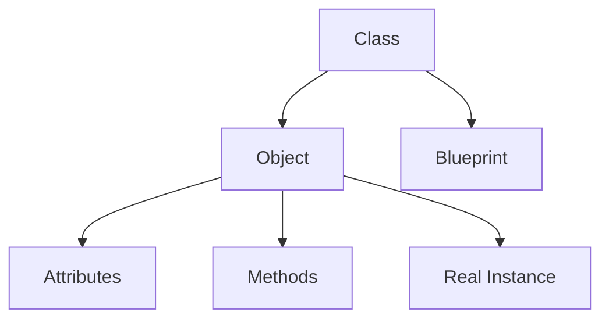

# Day 018 [Beginner]: Object Oriented Programming Basics

## Index

- [Goal](#goal)
- [Prerequisites](#prerequisites)
- [Explanation](#explanation)
- [Topic by Topic](#topic-by-topic)
- [Key Concepts](#key-concepts)
- [Visual Concept Map](#visual-concept-map)
- [End-to-End Practical](#end-to-end-practical)
- [Hands-on Coding](#hands-on-coding)
- [Mini Exercise](#mini-exercise)
- [Assessment Quiz](#assessment-quiz)
- [Task](#task)
- [Self Check](#self-check)
- [Interview Questions and Answers](#interview-questions-and-answers)
- [Day 018 Outcome](#day-018-outcome)

## Goal

Understand the basic ideas of object-oriented programming so you can model real-world entities using classes and objects.

## Prerequisites

- Day 017 completed
- Comfortable with functions, collections, and modules

## Explanation

Object-oriented programming, or OOP, is a way to structure code around objects that combine data and behavior. It becomes useful when programs model things like users, products, accounts, or orders.

## Topic by Topic

### Topic 1: What OOP Tries to Solve

Theory:
OOP helps group related data and actions together instead of spreading logic across many disconnected variables and functions.

Practical:
Instead of storing `name`, `price`, and `stock` separately, create one `Product` object.

Code Example:

```python
class Product:
  pass
```

**Explanation:**
This topic explains What OOP Tries to Solve in a practical Python context so you can write clear, reliable, and maintainable programs for real-world tasks.

**Key Points:**
- Understand the core idea behind What OOP Tries to Solve.
- Apply the practical pattern with good readability and validation habits.
- Keep the solution maintainable, testable, and safe for production use where relevant.

### Topic 2: What a Class Is

Theory:
A class is a blueprint that defines how objects of that type should look and behave.

Practical:
Use a class when many similar objects should share the same structure.

Code Example:

```python
class Student:
  pass
```

**Explanation:**
This topic explains What a Class Is in a practical Python context so you can write clear, reliable, and maintainable programs for real-world tasks.

**Key Points:**
- Understand the core idea behind What a Class Is.
- Apply the practical pattern with good readability and validation habits.
- Keep the solution maintainable, testable, and safe for production use where relevant.

### Topic 3: What an Object Is

Theory:
An object is a real instance created from a class.

Practical:
Create many student objects from one `Student` class definition.

Code Example:

```python
student_one = Student()
student_two = Student()
```

**Explanation:**
This topic explains What an Object Is in a practical Python context so you can write clear, reliable, and maintainable programs for real-world tasks.

**Key Points:**
- Understand the core idea behind What an Object Is.
- Apply the practical pattern with good readability and validation habits.
- Keep the solution maintainable, testable, and safe for production use where relevant.

### Topic 4: Attributes and Behavior

Theory:
Objects can hold data as attributes and actions as methods.

Practical:
A `Car` object may have `color` and `speed`, and a method like `start()`.

Code Example:

```python
class Car:
  def start(self):
    print("Car started")
```

**Explanation:**
This topic explains Attributes and Behavior in a practical Python context so you can write clear, reliable, and maintainable programs for real-world tasks.

**Key Points:**
- Understand the core idea behind Attributes and Behavior.
- Apply the practical pattern with good readability and validation habits.
- Keep the solution maintainable, testable, and safe for production use where relevant.

### Topic 5: Why OOP Is Useful

Theory:
OOP improves organization when data and behavior belong together.

Practical:
In small scripts, functions may be enough, but in bigger systems classes can make code clearer.

Code Example:

```python
class BankAccount:
  pass
```

**Explanation:**
This topic explains Why OOP Is Useful in a practical Python context so you can write clear, reliable, and maintainable programs for real-world tasks.

**Key Points:**
- Understand the core idea behind Why OOP Is Useful.
- Apply the practical pattern with good readability and validation habits.
- Keep the solution maintainable, testable, and safe for production use where relevant.

### Topic 6: OOP with Simplicity

Theory:
Not every problem needs a class. Use OOP when it genuinely improves clarity.

Practical:
Use a simple function for one calculation, but use a class for a reusable entity with state and behavior.

Code Example:

```python
class Task:
  pass
```

**Explanation:**
This topic explains OOP with Simplicity in a practical Python context so you can write clear, reliable, and maintainable programs for real-world tasks.

**Key Points:**
- Understand the core idea behind OOP with Simplicity.
- Apply the practical pattern with good readability and validation habits.
- Keep the solution maintainable, testable, and safe for production use where relevant.

## Key Concepts

- OOP groups related data and behavior
- A class is a blueprint
- An object is an instance of a class
- Attributes store object data
- Methods define object behavior
- OOP should improve clarity, not add unnecessary complexity

## Visual Concept Map



## End-to-End Practical

1. Create a simple class.
2. Create two objects from it.
3. Add one method.
4. Call the method from an object.
5. Explain why this structure is useful.

## Hands-on Coding

### Example 1: Case - Empty Class

Scenario:
You want a starting point for a reusable student type.

```python
class Student:
  pass

student = Student()
print(student)
```

### Example 2: Case - Object Method Example

Scenario:
You want an object that can perform one action.

```python
class Light:
  def turn_on(self):
    print("Light is on")

room_light = Light()
room_light.turn_on()
```

### Example 3: Case - Modeling a Product

Scenario:
You want a clearer structure for a shop item.

```python
class Product:
  def show_type(self):
    print("This is a product object")
```

## Mini Exercise

Scenario:
Create a class named `Book` and create two objects from it. Add one method named `describe()` that prints a short line.

Expected output:

- One class created
- Two objects created
- One method called successfully

## Assessment Quiz

### Quiz Questions

1. What is a class?
2. What is an object?
3. True or False: OOP means every problem must use a class.
4. What is the purpose of a method?
5. Why can OOP help larger programs?

### Quiz Answers

1. A blueprint for creating objects
2. An instance created from a class
3. False
4. To define behavior for objects
5. It groups related data and behavior more clearly

## Task

- Create one class and two objects
- Add one method and call it
- Complete the mini exercise

## Self Check

- You can explain class vs object clearly
- You can identify when OOP may help
- You can create a very simple class structure

## Interview Questions and Answers

### Beginner

**Question:** What is a class in Python?

**Answer:** A class is a blueprint used to create objects.

**Question:** What is an object?

**Answer:** An object is a real instance created from a class.

### Middle

**Question:** Why would you choose OOP over plain variables and functions?

**Answer:** When related data and actions should stay together in a clearer reusable model.

**Question:** What is a common beginner OOP mistake?

**Answer:** Creating classes even when a small function or simple data structure would be enough.

### Advanced

**Question:** Why should OOP decisions be guided by domain modeling instead of habit?

**Answer:** Good structure comes from problem shape, not from forcing one programming style everywhere.

**Question:** What makes an object model harder to maintain?

**Answer:** Too many vague classes, unclear responsibilities, and unnecessary abstraction.

## Day 018 Outcome

- You understand the core idea behind object-oriented programming
- You can explain classes, objects, methods, and attributes
- You are ready to build real classes and objects on Day 019
