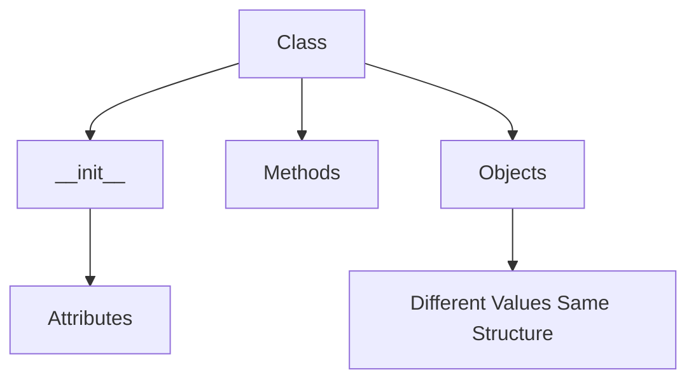

# Day 019 [Beginner]: Classes and Objects

## Index

- [Goal](#goal)
- [Prerequisites](#prerequisites)
- [Explanation](#explanation)
- [Topic by Topic](#topic-by-topic)
- [Key Concepts](#key-concepts)
- [Visual Concept Map](#visual-concept-map)
- [End-to-End Practical](#end-to-end-practical)
- [Hands-on Coding](#hands-on-coding)
- [Mini Exercise](#mini-exercise)
- [Assessment Quiz](#assessment-quiz)
- [Task](#task)
- [Self Check](#self-check)
- [Interview Questions and Answers](#interview-questions-and-answers)
- [Day 019 Outcome](#day-019-outcome)

## Goal

Build real Python classes and objects with attributes, methods, and constructors.

## Prerequisites

- Day 018 completed
- Basic understanding of OOP ideas

## Explanation

Now that you know what OOP is, the next step is writing actual classes that store values and perform behavior. This is where object modeling becomes practical.

## Topic by Topic

### Topic 1: Creating a Class with Attributes

Theory:
Classes become useful when they hold meaningful data.

Practical:
Store object details like name, price, or title inside attributes.

Code Example:

```python
class Book:
  pass
```

**Explanation:**
This topic explains Creating a Class with Attributes in a practical Python context so you can write clear, reliable, and maintainable programs for real-world tasks.

**Key Points:**
- Understand the core idea behind Creating a Class with Attributes.
- Apply the practical pattern with good readability and validation habits.
- Keep the solution maintainable, testable, and safe for production use where relevant.

### Topic 2: Using `__init__`

Theory:
The `__init__` method runs when an object is created and is used to initialize attributes.

Practical:
Use it to assign values like `name`, `age`, or `price` at creation time.

Code Example:

```python
class Student:
  def __init__(self, name, age):
    self.name = name
    self.age = age
```

**Explanation:**
This topic explains Using `__init__` in a practical Python context so you can write clear, reliable, and maintainable programs for real-world tasks.

**Key Points:**
- Understand the core idea behind Using `__init__`.
- Apply the practical pattern with good readability and validation habits.
- Keep the solution maintainable, testable, and safe for production use where relevant.

### Topic 3: Understanding `self`

Theory:
`self` refers to the current object instance.

Practical:
Use `self` to store and access object-specific data.

Code Example:

```python
class Car:
  def __init__(self, color):
    self.color = color
```

**Explanation:**
This topic explains Understanding `self` in a practical Python context so you can write clear, reliable, and maintainable programs for real-world tasks.

**Key Points:**
- Understand the core idea behind Understanding `self`.
- Apply the practical pattern with good readability and validation habits.
- Keep the solution maintainable, testable, and safe for production use where relevant.

### Topic 4: Writing Instance Methods

Theory:
Methods define what an object can do.

Practical:
Add methods like `describe()`, `start()`, or `show_price()`.

Code Example:

```python
class Book:
  def __init__(self, title):
    self.title = title

  def describe(self):
    print(f"Book title: {self.title}")
```

**Explanation:**
This topic explains Writing Instance Methods in a practical Python context so you can write clear, reliable, and maintainable programs for real-world tasks.

**Key Points:**
- Understand the core idea behind Writing Instance Methods.
- Apply the practical pattern with good readability and validation habits.
- Keep the solution maintainable, testable, and safe for production use where relevant.

### Topic 5: Creating Multiple Objects

Theory:
One class can create many objects with different values.

Practical:
Create two student objects with different names but the same shared class structure.

Code Example:

```python
student_one = Student("Asha", 20)
student_two = Student("Ravi", 22)
```

**Explanation:**
This topic explains Creating Multiple Objects in a practical Python context so you can write clear, reliable, and maintainable programs for real-world tasks.

**Key Points:**
- Understand the core idea behind Creating Multiple Objects.
- Apply the practical pattern with good readability and validation habits.
- Keep the solution maintainable, testable, and safe for production use where relevant.

### Topic 6: Keeping Classes Focused

Theory:
A class should represent one clear concept.

Practical:
Avoid putting unrelated work into one large class.

Code Example:

```python
class Product:
  def show_name(self):
    print(self.name)
```

**Explanation:**
This topic explains Keeping Classes Focused in a practical Python context so you can write clear, reliable, and maintainable programs for real-world tasks.

**Key Points:**
- Understand the core idea behind Keeping Classes Focused.
- Apply the practical pattern with good readability and validation habits.
- Keep the solution maintainable, testable, and safe for production use where relevant.

## Key Concepts

- Classes define reusable object structure
- `__init__` initializes object data
- `self` refers to the current object
- Methods define object behavior
- One class can create many objects
- Focused classes are easier to maintain

## Visual Concept Map



## End-to-End Practical

1. Create one class.
2. Add `__init__` with two attributes.
3. Add one method.
4. Create two objects.
5. Call the method on both objects.

## Hands-on Coding

### Example 1: Case - Student Class

Scenario:
You want to model students with a name and age.

```python
class Student:
  def __init__(self, name, age):
    self.name = name
    self.age = age

  def introduce(self):
    print(f"I am {self.name} and I am {self.age} years old.")

student = Student("Asha", 20)
student.introduce()
```

### Example 2: Case - Product Class

Scenario:
You want to store product name and price.

```python
class Product:
  def __init__(self, name, price):
    self.name = name
    self.price = price

  def show_price(self):
    print(f"{self.name}: {self.price}")
```

### Example 3: Case - Library Book Objects

Scenario:
You want many books created from the same class.

```python
book_one = Book("Python Basics")
book_two = Book("Data Structures")
```

## Mini Exercise

Scenario:
Create a class `Employee` with attributes `name` and `department`, then add a method `show_details()` and create two employee objects.

Expected output:

- One class definition
- Two objects created
- One method prints different details for each object

## Assessment Quiz

### Quiz Questions

1. Why is `__init__` useful?
2. What does `self` represent?
3. True or False: Every object created from a class must have the same attribute values.
4. What is a method?
5. Why should a class stay focused?

### Quiz Answers

1. It initializes object data during creation
2. The current object instance
3. False
4. A function defined inside a class
5. To keep design clear and maintainable

## Task

- Create one class using `__init__`
- Add at least one method
- Create multiple objects from the same class

## Self Check

- You can write a class with attributes and methods
- You understand `self` and object creation
- You can model small real-world entities clearly

## Interview Questions and Answers

### Beginner

**Question:** What is `__init__` in Python?

**Answer:** It is the constructor method used to initialize object attributes when an object is created.

**Question:** Why do methods use `self`?

**Answer:** `self` lets the method access the current object's data.

### Middle

**Question:** Why create many objects from one class?

**Answer:** Because the class provides shared structure while each object can hold different values.

**Question:** What is a common beginner mistake with `self`?

**Answer:** Forgetting to include it in method definitions.

### Advanced

**Question:** Why should constructors stay simple when possible?

**Answer:** Heavy constructor logic can make objects harder to understand, test, and create safely.

**Question:** What design smell appears if a class has too many unrelated methods?

**Answer:** The class likely has too many responsibilities and needs to be split.

## Day 019 Outcome

- You can create useful classes and objects in Python
- You can initialize data with `__init__` and use methods confidently
- You are ready for inheritance and polymorphism on Day 020
