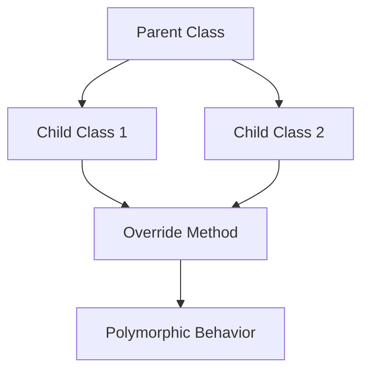

# Day 020 [Beginner]: Inheritance and Polymorphism

## Index

- [Goal](#goal)
- [Prerequisites](#prerequisites)
- [Explanation](#explanation)
- [Topic by Topic](#topic-by-topic)
- [Key Concepts](#key-concepts)
- [Visual Concept Map](#visual-concept-map)
- [End-to-End Practical](#end-to-end-practical)
- [Hands-on Coding](#hands-on-coding)
- [Mini Exercise](#mini-exercise)
- [Assessment Quiz](#assessment-quiz)
- [Task](#task)
- [Self Check](#self-check)
- [Interview Questions and Answers](#interview-questions-and-answers)
- [Day 020 Outcome](#day-020-outcome)

## Goal

Understand how inheritance and polymorphism help reuse object-oriented code and make designs more flexible.

## Prerequisites

- Day 019 completed
- Comfortable with classes, objects, methods, and `__init__`

## Explanation

Inheritance lets one class build on another class. Polymorphism lets different objects respond to the same method name in their own way. Together, these ideas help reduce duplication and support extensible designs.

## Topic by Topic

### Topic 1: What Inheritance Is

Theory:
Inheritance allows a child class to reuse data and behavior from a parent class.

Practical:
Use it when several classes share common fields or actions.

Code Example:

```python
class Animal:
  pass

class Dog(Animal):
  pass
```

**Explanation:**
This topic explains What Inheritance Is in a practical Python context so you can write clear, reliable, and maintainable programs for real-world tasks.

**Key Points:**
- Understand the core idea behind What Inheritance Is.
- Apply the practical pattern with good readability and validation habits.
- Keep the solution maintainable, testable, and safe for production use where relevant.

### Topic 2: Reusing Parent Behavior

Theory:
A child class automatically gets methods from the parent unless it changes them.

Practical:
Define a common method once in the parent and use it across child classes.

Code Example:

```python
class Animal:
  def eat(self):
    print("Eating")
```

**Explanation:**
This topic explains Reusing Parent Behavior in a practical Python context so you can write clear, reliable, and maintainable programs for real-world tasks.

**Key Points:**
- Understand the core idea behind Reusing Parent Behavior.
- Apply the practical pattern with good readability and validation habits.
- Keep the solution maintainable, testable, and safe for production use where relevant.

### Topic 3: Method Overriding

Theory:
A child class can replace parent behavior by defining a method with the same name.

Practical:
Let each child class provide its own sound or action.

Code Example:

```python
class Dog(Animal):
  def sound(self):
    print("Bark")
```

**Explanation:**
This topic explains Method Overriding in a practical Python context so you can write clear, reliable, and maintainable programs for real-world tasks.

**Key Points:**
- Understand the core idea behind Method Overriding.
- Apply the practical pattern with good readability and validation habits.
- Keep the solution maintainable, testable, and safe for production use where relevant.

### Topic 4: What Polymorphism Means

Theory:
Polymorphism means the same method call can behave differently depending on the object.

Practical:
Call `sound()` on different animal objects and get different outputs.

Code Example:

```python
for animal in [Dog(), Cat()]:
  animal.sound()
```

**Explanation:**
This topic explains What Polymorphism Means in a practical Python context so you can write clear, reliable, and maintainable programs for real-world tasks.

**Key Points:**
- Understand the core idea behind What Polymorphism Means.
- Apply the practical pattern with good readability and validation habits.
- Keep the solution maintainable, testable, and safe for production use where relevant.

### Topic 5: Using `super()`

Theory:
`super()` lets a child class call parent class behavior.

Practical:
Use it when the child wants to extend, not fully replace, the parent setup.

Code Example:

```python
class Dog(Animal):
  def __init__(self, name):
    super().__init__(name)
```

**Explanation:**
This topic explains Using `super()` in a practical Python context so you can write clear, reliable, and maintainable programs for real-world tasks.

**Key Points:**
- Understand the core idea behind Using `super()`.
- Apply the practical pattern with good readability and validation habits.
- Keep the solution maintainable, testable, and safe for production use where relevant.

### Topic 6: Prefer Clear Hierarchies

Theory:
Inheritance is useful, but not every relationship should become a class hierarchy.

Practical:
Use inheritance for true "is-a" relationships, not just because two classes share one small detail.

Code Example:

```python
# Dog is an Animal, so inheritance makes sense.
```

**Explanation:**
This topic explains Prefer Clear Hierarchies in a practical Python context so you can write clear, reliable, and maintainable programs for real-world tasks.

**Key Points:**
- Understand the core idea behind Prefer Clear Hierarchies.
- Apply the practical pattern with good readability and validation habits.
- Keep the solution maintainable, testable, and safe for production use where relevant.

## Key Concepts

- Inheritance reuses parent class behavior
- Child classes can override methods
- Polymorphism supports flexible shared interfaces
- `super()` helps extend parent behavior
- Good hierarchies reduce duplication
- Inheritance should match real relationships

## Visual Concept Map



## End-to-End Practical

1. Create one parent class.
2. Create two child classes.
3. Add one shared parent method.
4. Override one child method.
5. Call the same method on multiple child objects.

## Hands-on Coding

### Example 1: Case - Animal Hierarchy

Scenario:
You want a shared animal structure with specific child behavior.

```python
class Animal:
  def sound(self):
    print("Some sound")

class Dog(Animal):
  def sound(self):
    print("Bark")

class Cat(Animal):
  def sound(self):
    print("Meow")
```

### Example 2: Case - Employee Role Extension

Scenario:
You want a base employee class and specialized roles.

```python
class Employee:
  def __init__(self, name):
    self.name = name

class Manager(Employee):
  pass
```

### Example 3: Case - Polymorphic Action Loop

Scenario:
You want to process different objects through one common method name.

```python
animals = [Dog(), Cat()]
for animal in animals:
  animal.sound()
```

## Mini Exercise

Scenario:
Create a parent class `Vehicle` with a method `move()`. Create child classes `Car` and `Bike` that override `move()` with different output.

Expected output:

- One parent class
- Two child classes
- Same method name with different results

## Assessment Quiz

### Quiz Questions

1. What is inheritance?
2. What is method overriding?
3. True or False: Polymorphism allows the same method name to behave differently across objects.
4. What does `super()` help with?
5. When should inheritance be used carefully?

### Quiz Answers

1. Reusing behavior from a parent class in a child class
2. Replacing a parent method in a child class
3. True
4. Calling parent class behavior from the child class
5. When the class relationship is unclear or forced

## Task

- Build one parent class and two child classes
- Override at least one method
- Complete the mini exercise

## Self Check

- You can explain inheritance and polymorphism clearly
- You can build simple parent-child class relationships
- You know when inheritance makes sense and when it may not

## Interview Questions and Answers

### Beginner

**Question:** What is inheritance in Python?

**Answer:** It allows a child class to reuse behavior from a parent class.

**Question:** What is polymorphism?

**Answer:** It allows the same method name to behave differently for different objects.

### Middle

**Question:** Why would you override a method in a child class?

**Answer:** To provide behavior specific to that child class.

**Question:** What is a common sign that inheritance may be overused?

**Answer:** The parent-child relationship feels forced or unclear.

### Advanced

**Question:** Why should inheritance follow an "is-a" relationship?

**Answer:** Because inheritance models specialization, not just code sharing.

**Question:** What design problem appears when class hierarchies become too deep?

**Answer:** The model becomes harder to understand, test, and safely change.

## Day 020 Outcome

- You can model basic inheritance and polymorphism in Python
- You can override methods and understand shared interfaces
- You are ready for deeper OOP patterns ahead
