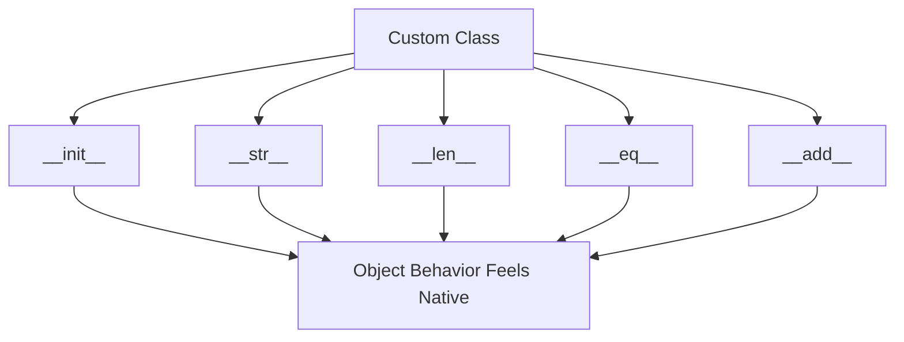

# Day 021 [Beginner]: Magic Methods and Dunder

## Index

- [Goal](#goal)
- [Prerequisites](#prerequisites)
- [Explanation](#explanation)
- [Topic by Topic](#topic-by-topic)
- [Key Concepts](#key-concepts)
- [Visual Concept Map](#visual-concept-map)
- [End-to-End Practical](#end-to-end-practical)
- [Hands-on Coding](#hands-on-coding)
- [Mini Exercise](#mini-exercise)
- [Assessment Quiz](#assessment-quiz)
- [Task](#task)
- [Self Check](#self-check)
- [Interview Questions and Answers](#interview-questions-and-answers)
- [Day 021 Outcome](#day-021-outcome)

## Goal

Understand how Python's special double-underscore methods make objects behave like built-in types.

## Prerequisites

- Day 020 completed
- Comfortable with classes, objects, and methods

## Explanation

Magic methods, also called dunder methods, are special methods with names like `__init__` and `__str__`. They allow Python objects to integrate with built-in operations such as printing, comparison, length checks, and addition.

## Topic by Topic

### Topic 1: What Dunder Methods Are

Theory:
Dunder means double underscore. These methods have special meaning to Python.

Practical:
You already used one common dunder method: `__init__`.

Code Example:

```python
class User:
  def __init__(self, name):
    self.name = name
```

**Explanation:**
This topic explains What Dunder Methods Are in a practical Python context so you can write clear, reliable, and maintainable programs for real-world tasks.

**Key Points:**
- Understand the core idea behind What Dunder Methods Are.
- Apply the practical pattern with good readability and validation habits.
- Keep the solution maintainable, testable, and safe for production use where relevant.

### Topic 2: Using `__str__`

Theory:
`__str__` controls how an object appears when printed.

Practical:
Without it, printing an object often gives an unhelpful default memory-style output.

Code Example:

```python
class Book:
  def __init__(self, title):
    self.title = title

  def __str__(self):
    return f"Book: {self.title}"
```

**Explanation:**
This topic explains Using `__str__` in a practical Python context so you can write clear, reliable, and maintainable programs for real-world tasks.

**Key Points:**
- Understand the core idea behind Using `__str__`.
- Apply the practical pattern with good readability and validation habits.
- Keep the solution maintainable, testable, and safe for production use where relevant.

### Topic 3: Using `__len__`

Theory:
`__len__` lets your object respond to `len()`.

Practical:
Useful when an object contains a collection internally.

Code Example:

```python
class Team:
  def __init__(self, members):
    self.members = members

  def __len__(self):
    return len(self.members)
```

**Explanation:**
This topic explains Using `__len__` in a practical Python context so you can write clear, reliable, and maintainable programs for real-world tasks.

**Key Points:**
- Understand the core idea behind Using `__len__`.
- Apply the practical pattern with good readability and validation habits.
- Keep the solution maintainable, testable, and safe for production use where relevant.

### Topic 4: Using `__eq__`

Theory:
`__eq__` defines how objects should be compared with `==`.

Practical:
Two objects may be considered equal if their key data matches.

Code Example:

```python
class Product:
  def __init__(self, sku):
    self.sku = sku

  def __eq__(self, other):
    return self.sku == other.sku
```

**Explanation:**
This topic explains Using `__eq__` in a practical Python context so you can write clear, reliable, and maintainable programs for real-world tasks.

**Key Points:**
- Understand the core idea behind Using `__eq__`.
- Apply the practical pattern with good readability and validation habits.
- Keep the solution maintainable, testable, and safe for production use where relevant.

### Topic 5: Using Arithmetic-like Magic Methods

Theory:
Methods like `__add__` let objects work with operators like `+`.

Practical:
This can make custom classes more natural to use.

Code Example:

```python
class Wallet:
  def __init__(self, amount):
    self.amount = amount

  def __add__(self, other):
    return Wallet(self.amount + other.amount)
```

**Explanation:**
This topic explains Using Arithmetic-like Magic Methods in a practical Python context so you can write clear, reliable, and maintainable programs for real-world tasks.

**Key Points:**
- Understand the core idea behind Using Arithmetic-like Magic Methods.
- Apply the practical pattern with good readability and validation habits.
- Keep the solution maintainable, testable, and safe for production use where relevant.

### Topic 6: Use Dunder Methods Carefully

Theory:
Magic methods should make code clearer, not more surprising.

Practical:
Only define special behavior when it matches what users naturally expect.

Code Example:

```python
# A clear __str__ helps more than a confusing custom operator.
```

**Explanation:**
This topic explains Use Dunder Methods Carefully in a practical Python context so you can write clear, reliable, and maintainable programs for real-world tasks.

**Key Points:**
- Understand the core idea behind Use Dunder Methods Carefully.
- Apply the practical pattern with good readability and validation habits.
- Keep the solution maintainable, testable, and safe for production use where relevant.

## Key Concepts

- Dunder methods give special meaning to object behavior
- `__str__` improves printed output
- `__len__` supports `len()`
- `__eq__` controls equality checks
- Operator overloading is possible with methods like `__add__`
- Special behavior should stay intuitive

## Visual Concept Map



## End-to-End Practical

1. Create a small class.
2. Add `__str__`.
3. Add one more dunder method like `__len__` or `__eq__`.
4. Use the object with a built-in function.
5. Check whether the behavior feels natural.

## Hands-on Coding

### Example 1: Case - Friendly Print Output

Scenario:
You want printed objects to show useful text.

```python
class Student:
  def __init__(self, name):
    self.name = name

  def __str__(self):
    return f"Student({self.name})"
```

### Example 2: Case - Length Support

Scenario:
You want `len(team)` to return the number of members.

```python
team = Team(["Asha", "Ravi", "Kiran"])
print(len(team))
```

### Example 3: Case - Compare Two Products

Scenario:
You want two products with the same SKU to be treated as equal.

```python
first = Product("ABC123")
second = Product("ABC123")
print(first == second)
```

## Mini Exercise

Scenario:
Create a class `Playlist` with a list of songs. Add `__str__` to print a friendly description and `__len__` to return the number of songs.

Expected output:

- One class with 2 dunder methods
- Friendly print output
- `len()` works on the custom object

## Assessment Quiz

### Quiz Questions

1. What does dunder mean?
2. What does `__str__` help with?
3. True or False: `__len__` can be used to support `len()` on custom objects.
4. What does `__eq__` control?
5. Why should magic methods be used carefully?

### Quiz Answers

1. Double underscore
2. Printed string representation of an object
3. True
4. Equality comparison using `==`
5. Because surprising behavior makes code harder to understand

## Task

- Create one class with `__str__`
- Add one more dunder method
- Complete the mini exercise

## Self Check

- You understand why magic methods exist
- You can improve custom object behavior with dunder methods
- You can explain when dunder methods are helpful

## Interview Questions and Answers

### Beginner

**Question:** What is a magic method in Python?

**Answer:** A special double-underscore method that gives built-in meaning to custom objects.

**Question:** Why use `__str__`?

**Answer:** It makes printed object output more readable.

### Middle

**Question:** What does `__eq__` help solve?

**Answer:** It defines when two custom objects should be considered equal.

**Question:** Why can `__len__` be useful?

**Answer:** It lets built-in functions work naturally with custom classes.

### Advanced

**Question:** What is the design risk of overusing custom operator behavior?

**Answer:** The class may become less intuitive if operators behave unexpectedly.

**Question:** What should guide dunder method design?

**Answer:** Whether the behavior matches what a Python user would naturally expect.

## Day 021 Outcome

- You can explain and use common Python dunder methods
- You can make custom objects behave more naturally
- You are ready for dataclasses and typing on Day 022
