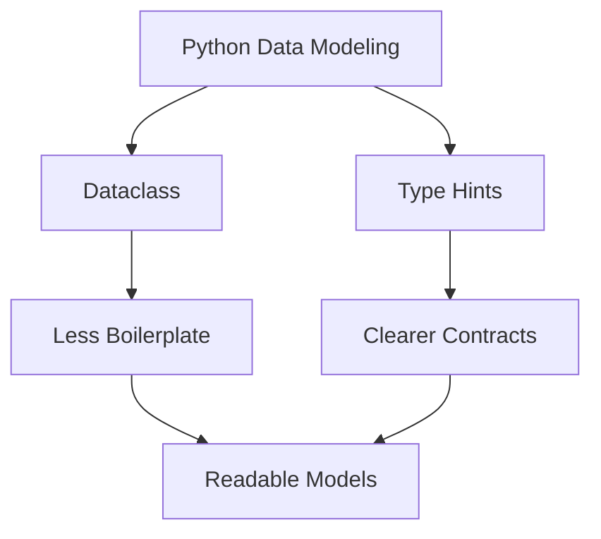

# Day 022 [Beginner]: Dataclasses and Typing

## Index

- [Goal](#goal)
- [Prerequisites](#prerequisites)
- [Explanation](#explanation)
- [Topic by Topic](#topic-by-topic)
- [Key Concepts](#key-concepts)
- [Visual Concept Map](#visual-concept-map)
- [End-to-End Practical](#end-to-end-practical)
- [Hands-on Coding](#hands-on-coding)
- [Mini Exercise](#mini-exercise)
- [Assessment Quiz](#assessment-quiz)
- [Task](#task)
- [Self Check](#self-check)
- [Interview Questions and Answers](#interview-questions-and-answers)
- [Day 022 Outcome](#day-022-outcome)

## Goal

Learn how dataclasses reduce boilerplate and how type hints improve readability and tooling support.

## Prerequisites

- Day 021 completed
- Comfortable with classes and object attributes

## Explanation

Dataclasses help create simple data-focused classes with less manual code. Type hints describe expected value types, making code easier to understand and easier for tools to check.

## Topic by Topic

### Topic 1: Why Dataclasses Exist

Theory:
Many classes only store data, so writing repetitive constructors and representations can feel unnecessary.

Practical:
Dataclasses generate common methods automatically for data-heavy classes.

Code Example:

```python
from dataclasses import dataclass
```

**Explanation:**
This topic explains Why Dataclasses Exist in a practical Python context so you can write clear, reliable, and maintainable programs for real-world tasks.

**Key Points:**
- Understand the core idea behind Why Dataclasses Exist.
- Apply the practical pattern with good readability and validation habits.
- Keep the solution maintainable, testable, and safe for production use where relevant.

### Topic 2: Creating a Dataclass

Theory:
The `@dataclass` decorator can generate `__init__`, `__repr__`, and more.

Practical:
Use it when a class mainly holds values.

Code Example:

```python
from dataclasses import dataclass

@dataclass
class User:
  name: str
  age: int
```

**Explanation:**
This topic explains Creating a Dataclass in a practical Python context so you can write clear, reliable, and maintainable programs for real-world tasks.

**Key Points:**
- Understand the core idea behind Creating a Dataclass.
- Apply the practical pattern with good readability and validation habits.
- Keep the solution maintainable, testable, and safe for production use where relevant.

### Topic 3: What Type Hints Do

Theory:
Type hints describe the expected type of variables, parameters, and return values.

Practical:
They help both people and editor tools understand code faster.

Code Example:

```python
def add(a: int, b: int) -> int:
  return a + b
```

**Explanation:**
This topic explains What Type Hints Do in a practical Python context so you can write clear, reliable, and maintainable programs for real-world tasks.

**Key Points:**
- Understand the core idea behind What Type Hints Do.
- Apply the practical pattern with good readability and validation habits.
- Keep the solution maintainable, testable, and safe for production use where relevant.

### Topic 4: Type Hints in Collections

Theory:
Type hints can describe lists, dictionaries, and optional values too.

Practical:
Use types like `list[str]` or `dict[str, int]` for clearer data contracts.

Code Example:

```python
def total_scores(scores: list[int]) -> int:
  return sum(scores)
```

**Explanation:**
This topic explains Type Hints in Collections in a practical Python context so you can write clear, reliable, and maintainable programs for real-world tasks.

**Key Points:**
- Understand the core idea behind Type Hints in Collections.
- Apply the practical pattern with good readability and validation habits.
- Keep the solution maintainable, testable, and safe for production use where relevant.

### Topic 5: Dataclasses vs Normal Classes

Theory:
Dataclasses are great for data containers, while normal classes are still useful for richer behavior.

Practical:
Use a dataclass for a record like `Product`, but a normal class when behavior is more important than stored fields.

Code Example:

```python
@dataclass
class Product:
  name: str
  price: float
```

**Explanation:**
This topic explains Dataclasses vs Normal Classes in a practical Python context so you can write clear, reliable, and maintainable programs for real-world tasks.

**Key Points:**
- Understand the core idea behind Dataclasses vs Normal Classes.
- Apply the practical pattern with good readability and validation habits.
- Keep the solution maintainable, testable, and safe for production use where relevant.

### Topic 6: Typing Improves Team Communication

Theory:
Type hints do not replace thinking, but they reduce ambiguity.

Practical:
Use type hints early so others can understand function expectations without guessing.

Code Example:

```python
def greet(name: str) -> str:
  return f"Hello, {name}"
```

**Explanation:**
This topic explains Typing Improves Team Communication in a practical Python context so you can write clear, reliable, and maintainable programs for real-world tasks.

**Key Points:**
- Understand the core idea behind Typing Improves Team Communication.
- Apply the practical pattern with good readability and validation habits.
- Keep the solution maintainable, testable, and safe for production use where relevant.

## Key Concepts

- Dataclasses reduce repetitive class code
- Type hints explain expected value shapes
- Functions can declare parameter and return types
- Collections can also be typed
- Dataclasses work best for data-focused models
- Typing improves readability and tooling support

## Visual Concept Map



## End-to-End Practical

1. Create one normal class.
2. Rewrite it as a dataclass.
3. Add type hints to fields.
4. Add type hints to one function.
5. Compare readability before and after.

## Hands-on Coding

### Example 1: Case - Student Dataclass

Scenario:
You want a simple data container for student information.

```python
from dataclasses import dataclass

@dataclass
class Student:
  name: str
  marks: int
```

### Example 2: Case - Typed Discount Function

Scenario:
You want a function with a clear expected input and output.

```python
def apply_discount(price: float, discount: float) -> float:
  return price - discount
```

### Example 3: Case - Typed Task List

Scenario:
You want a function that processes a list of task names.

```python
def show_tasks(tasks: list[str]) -> None:
  for task in tasks:
    print(task)
```

## Mini Exercise

Scenario:
Create a dataclass `Book` with fields `title`, `author`, and `price`. Then write one typed function that receives a list of books and prints their titles.

Expected output:

- One dataclass created
- Type hints added to fields
- One typed function working with the dataclass

## Assessment Quiz

### Quiz Questions

1. What problem do dataclasses help solve?
2. What do type hints improve?
3. True or False: Type hints force Python to behave like a compiled typed language at runtime.
4. When is a dataclass a good choice?
5. Why are typed function signatures useful?

### Quiz Answers

1. Repetitive boilerplate in data-heavy classes
2. Readability and tooling support
3. False
4. When a class mainly stores data
5. They make expected inputs and outputs clearer

## Task

- Create one dataclass
- Add type hints to at least one function and one collection
- Complete the mini exercise

## Self Check

- You can explain what dataclasses are for
- You can add type hints to basic Python code
- You can choose when a dataclass is useful

## Interview Questions and Answers

### Beginner

**Question:** What is a dataclass?

**Answer:** A Python feature that helps create data-focused classes with less boilerplate code.

**Question:** What are type hints?

**Answer:** Type hints describe the expected types of values in code.

### Middle

**Question:** Why do teams use type hints even in Python?

**Answer:** They improve clarity, editor support, and confidence during changes.

**Question:** When might a normal class still be better than a dataclass?

**Answer:** When the class has more behavior and custom logic than simple data storage.

### Advanced

**Question:** How do dataclasses and typing improve maintainability together?

**Answer:** Dataclasses reduce repetitive code while typing makes data flow more explicit and safer to change.

**Question:** What mistake should you avoid when using type hints?

**Answer:** Adding hints mechanically without keeping the actual code and data model clear.

## Day 022 Outcome

- You can use dataclasses and type hints confidently
- You can reduce class boilerplate and improve code clarity
- You are ready for iterators and generators on Day 023
