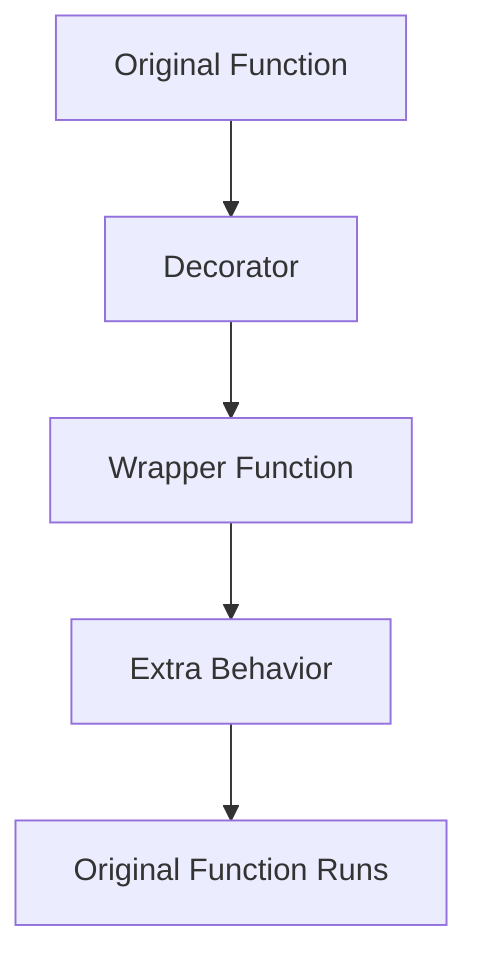

# Day 024 [Beginner]: Decorators Basics

## Index

- [Goal](#goal)
- [Prerequisites](#prerequisites)
- [Explanation](#explanation)
- [Topic by Topic](#topic-by-topic)
- [Key Concepts](#key-concepts)
- [Visual Concept Map](#visual-concept-map)
- [End-to-End Practical](#end-to-end-practical)
- [Hands-on Coding](#hands-on-coding)
- [Mini Exercise](#mini-exercise)
- [Assessment Quiz](#assessment-quiz)
- [Task](#task)
- [Self Check](#self-check)
- [Interview Questions and Answers](#interview-questions-and-answers)
- [Day 024 Outcome](#day-024-outcome)

## Goal

Understand the basic idea behind decorators and how they can add behavior to functions without changing the original function body.

## Prerequisites

- Day 023 completed
- Comfortable with functions and nested logic

## Explanation

Decorators are a Python pattern used to wrap functions with extra behavior. They are common in logging, authorization, timing, caching, and framework code.

## Topic by Topic

### Topic 1: Functions as Values

Theory:
In Python, functions can be passed around like other values.

Practical:
This is the reason decorators are possible.

Code Example:

```python
def greet():
  print("Hello")

another_name = greet
another_name()
```

**Explanation:**
This topic explains Functions as Values in a practical Python context so you can write clear, reliable, and maintainable programs for real-world tasks.

**Key Points:**
- Understand the core idea behind Functions as Values.
- Apply the practical pattern with good readability and validation habits.
- Keep the solution maintainable, testable, and safe for production use where relevant.

### Topic 2: Wrapper Function Idea

Theory:
A decorator works by creating one function that wraps another.

Practical:
The wrapper can print logs, check rules, or measure time before and after the original function runs.

Code Example:

```python
def wrapper():
  print("Before")
```

**Explanation:**
This topic explains Wrapper Function Idea in a practical Python context so you can write clear, reliable, and maintainable programs for real-world tasks.

**Key Points:**
- Understand the core idea behind Wrapper Function Idea.
- Apply the practical pattern with good readability and validation habits.
- Keep the solution maintainable, testable, and safe for production use where relevant.

### Topic 3: Writing a Basic Decorator

Theory:
A basic decorator takes a function, defines an inner wrapper, and returns that wrapper.

Practical:
Use it to add a message before a function runs.

Code Example:

```python
def simple_decorator(func):
  def wrapper():
    print("Before function")
    func()
  return wrapper
```

**Explanation:**
This topic explains Writing a Basic Decorator in a practical Python context so you can write clear, reliable, and maintainable programs for real-world tasks.

**Key Points:**
- Understand the core idea behind Writing a Basic Decorator.
- Apply the practical pattern with good readability and validation habits.
- Keep the solution maintainable, testable, and safe for production use where relevant.

### Topic 4: Using `@decorator_name`

Theory:
The `@` syntax is a clean way to apply a decorator.

Practical:
Instead of manually reassigning the function, place the decorator above it.

Code Example:

```python
@simple_decorator
def say_hi():
  print("Hi")
```

**Explanation:**
This topic explains Using `@decorator_name` in a practical Python context so you can write clear, reliable, and maintainable programs for real-world tasks.

**Key Points:**
- Understand the core idea behind Using `@decorator_name`.
- Apply the practical pattern with good readability and validation habits.
- Keep the solution maintainable, testable, and safe for production use where relevant.

### Topic 5: Decorators with Arguments

Theory:
If the original function takes arguments, the wrapper should accept them too.

Practical:
Use `*args` and `**kwargs` to forward arguments safely.

Code Example:

```python
def log_call(func):
  def wrapper(*args, **kwargs):
    print("Calling function")
    return func(*args, **kwargs)
  return wrapper
```

**Explanation:**
This topic explains Decorators with Arguments in a practical Python context so you can write clear, reliable, and maintainable programs for real-world tasks.

**Key Points:**
- Understand the core idea behind Decorators with Arguments.
- Apply the practical pattern with good readability and validation habits.
- Keep the solution maintainable, testable, and safe for production use where relevant.

### Topic 6: Keep Decorators Understandable

Theory:
Decorators are powerful, but beginners should use them only when they improve clarity.

Practical:
If a normal helper function is easier to understand, choose the simpler option.

Code Example:

```python
# Clear code first, decorator usage second.
```

**Explanation:**
This topic explains Keep Decorators Understandable in a practical Python context so you can write clear, reliable, and maintainable programs for real-world tasks.

**Key Points:**
- Understand the core idea behind Keep Decorators Understandable.
- Apply the practical pattern with good readability and validation habits.
- Keep the solution maintainable, testable, and safe for production use where relevant.

## Key Concepts

- Functions can be treated like values
- Decorators wrap existing functions
- Wrapper functions add behavior before or after execution
- `@decorator` syntax is shorthand for applying wrappers
- `*args` and `**kwargs` support flexible wrapping
- Decorators should improve code clarity, not reduce it

## Visual Concept Map



## End-to-End Practical

1. Write one plain function.
2. Write a basic decorator.
3. Apply the decorator manually.
4. Apply the same decorator with `@` syntax.
5. Extend it to support function arguments.

## Hands-on Coding

### Example 1: Case - Before-Call Message

Scenario:
You want to print a message before a function executes.

```python
def log_before(func):
  def wrapper():
    print("Starting...")
    func()
  return wrapper
```

### Example 2: Case - Greeting with Decorator

Scenario:
You want to decorate a greeting function.

```python
@log_before
def greet_user():
  print("Welcome user")
```

### Example 3: Case - Decorator with Arguments

Scenario:
You want the decorated function to still receive input values.

```python
def debug(func):
  def wrapper(*args, **kwargs):
    print("Function called")
    return func(*args, **kwargs)
  return wrapper
```

## Mini Exercise

Scenario:
Create a decorator that prints `Function is running` before the original function. Apply it to a function that prints a user's name.

Expected output:

- One decorator defined
- One decorated function
- Message shown before the function's output

## Assessment Quiz

### Quiz Questions

1. What is the main purpose of a decorator?
2. Why can decorators exist in Python?
3. True or False: Decorators always replace the original function logic completely.
4. Why are `*args` and `**kwargs` often used in decorators?
5. When should you avoid using a decorator?

### Quiz Answers

1. To add behavior around an existing function
2. Because functions can be passed and returned like values
3. False
4. To support functions with different parameters
5. When a simpler approach is clearer

## Task

- Create one decorator
- Apply it using `@` syntax
- Support one decorated function with arguments

## Self Check

- You can explain the basic decorator pattern
- You can write a simple wrapper function
- You know when a decorator helps and when it is unnecessary

## Interview Questions and Answers

### Beginner

**Question:** What is a decorator?

**Answer:** A decorator is a way to add behavior to a function without changing the original function body directly.

**Question:** What does the `@` syntax do?

**Answer:** It applies a decorator to a function in a short readable form.

### Middle

**Question:** Why do many decorators use wrapper functions?

**Answer:** Because the wrapper adds extra logic before or after the original function runs.

**Question:** Why are decorators common in frameworks?

**Answer:** They make it easy to attach repeated behaviors like logging, routing, or validation.

### Advanced

**Question:** What makes decorator-heavy code hard to maintain?

**Answer:** Too many hidden layers can make control flow harder to follow.

**Question:** What should guide the decision to use a decorator?

**Answer:** Whether it improves reuse and readability more than a simpler alternative.

## Day 024 Outcome

- You can understand and build basic Python decorators
- You can apply decorators with and without `@` syntax
- You are ready for context managers on Day 025
