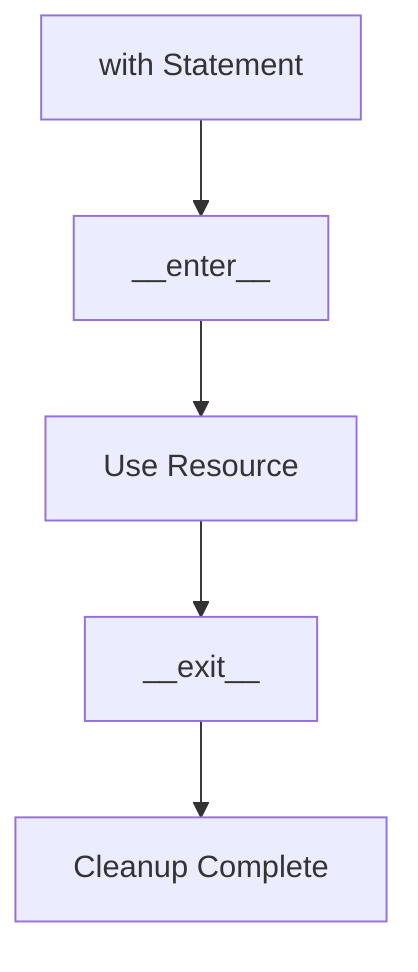

# Day 025 [Beginner]: Context Managers

## Index

- [Goal](#goal)
- [Prerequisites](#prerequisites)
- [Explanation](#explanation)
- [Topic by Topic](#topic-by-topic)
- [Key Concepts](#key-concepts)
- [Visual Concept Map](#visual-concept-map)
- [End-to-End Practical](#end-to-end-practical)
- [Hands-on Coding](#hands-on-coding)
- [Mini Exercise](#mini-exercise)
- [Assessment Quiz](#assessment-quiz)
- [Task](#task)
- [Self Check](#self-check)
- [Interview Questions and Answers](#interview-questions-and-answers)
- [Day 025 Outcome](#day-025-outcome)

## Goal

Understand how context managers handle setup and cleanup safely, especially when working with files and external resources.

## Prerequisites

- Day 024 completed
- Comfortable with file handling and classes

## Explanation

Context managers are commonly used with `with` statements. They help ensure resources are cleaned up correctly, even when errors happen. This pattern improves reliability and reduces manual cleanup mistakes.

## Topic by Topic

### Topic 1: The Problem Context Managers Solve

Theory:
Many resources need setup and cleanup, such as files, locks, or connections.

Practical:
If cleanup is forgotten, the program can leak resources or behave unpredictably.

Code Example:

```python
with open("notes.txt", "r") as file:
  print(file.read())
```

**Explanation:**
This topic explains The Problem Context Managers Solve in a practical Python context so you can write clear, reliable, and maintainable programs for real-world tasks.

**Key Points:**
- Understand the core idea behind The Problem Context Managers Solve.
- Apply the practical pattern with good readability and validation habits.
- Keep the solution maintainable, testable, and safe for production use where relevant.

### Topic 2: How `with` Works

Theory:
The `with` block starts a resource safely and guarantees cleanup when the block ends.

Practical:
This is why `with open(...)` is preferred over manual open and close.

Code Example:

```python
with open("report.txt", "w") as file:
  file.write("Hello")
```

**Explanation:**
This topic explains How `with` Works in a practical Python context so you can write clear, reliable, and maintainable programs for real-world tasks.

**Key Points:**
- Understand the core idea behind How `with` Works.
- Apply the practical pattern with good readability and validation habits.
- Keep the solution maintainable, testable, and safe for production use where relevant.

### Topic 3: `__enter__` and `__exit__`

Theory:
Custom context managers work through `__enter__` and `__exit__` methods.

Practical:
These methods define what happens at the start and end of a `with` block.

Code Example:

```python
class DemoContext:
  def __enter__(self):
    print("Start")
    return self

  def __exit__(self, exc_type, exc_value, traceback):
    print("End")
```

**Explanation:**
This topic explains `__enter__` and `__exit__` in a practical Python context so you can write clear, reliable, and maintainable programs for real-world tasks.

**Key Points:**
- Understand the core idea behind `__enter__` and `__exit__`.
- Apply the practical pattern with good readability and validation habits.
- Keep the solution maintainable, testable, and safe for production use where relevant.

### Topic 4: Building a Simple Custom Context Manager

Theory:
You can create reusable setup-cleanup patterns using a class.

Practical:
Useful for timing blocks, temporary configuration, or controlled resource access.

Code Example:

```python
with DemoContext():
  print("Inside block")
```

**Explanation:**
This topic explains Building a Simple Custom Context Manager in a practical Python context so you can write clear, reliable, and maintainable programs for real-world tasks.

**Key Points:**
- Understand the core idea behind Building a Simple Custom Context Manager.
- Apply the practical pattern with good readability and validation habits.
- Keep the solution maintainable, testable, and safe for production use where relevant.

### Topic 5: Safer Cleanup on Errors

Theory:
Context managers are helpful because cleanup still happens if an error occurs.

Practical:
This makes them safer than manual cleanup that might be skipped.

Code Example:

```python
try:
  with open("file.txt", "r") as file:
    data = file.read()
except FileNotFoundError:
  print("Missing file")
```

**Explanation:**
This topic explains Safer Cleanup on Errors in a practical Python context so you can write clear, reliable, and maintainable programs for real-world tasks.

**Key Points:**
- Understand the core idea behind Safer Cleanup on Errors.
- Apply the practical pattern with good readability and validation habits.
- Keep the solution maintainable, testable, and safe for production use where relevant.

### Topic 6: Use Context Managers by Default for Resources

Theory:
When a resource needs opening and closing, context managers are often the cleanest choice.

Practical:
Make `with` your default habit for files and similar resources.

Code Example:

```python
# Prefer with open(...) over manual open/close.
```

**Explanation:**
This topic explains Use Context Managers by Default for Resources in a practical Python context so you can write clear, reliable, and maintainable programs for real-world tasks.

**Key Points:**
- Understand the core idea behind Use Context Managers by Default for Resources.
- Apply the practical pattern with good readability and validation habits.
- Keep the solution maintainable, testable, and safe for production use where relevant.

## Key Concepts

- Context managers handle setup and cleanup
- `with` is safer than manual cleanup in many cases
- `__enter__` starts the managed context
- `__exit__` handles cleanup at the end
- Cleanup still happens even when errors occur
- Resource-handling code should default to context managers when possible

## Visual Concept Map



## End-to-End Practical

1. Use `with open(...)` on a file.
2. Observe that no manual close call is needed.
3. Create a small custom context manager class.
4. Use it inside a `with` block.
5. Trigger an error mentally and reason about cleanup.

## Hands-on Coding

### Example 1: Case - Safe File Reading

Scenario:
You want to read a file and ensure it always closes properly.

```python
with open("notes.txt", "r") as file:
  content = file.read()
  print(content)
```

### Example 2: Case - Custom Demo Context

Scenario:
You want a class that announces the start and end of a block.

```python
class DemoContext:
  def __enter__(self):
    print("Entering context")
    return self

  def __exit__(self, exc_type, exc_value, traceback):
    print("Exiting context")
```

### Example 3: Case - Temporary Resource Block

Scenario:
You want a clear boundary where a resource is active only inside a block.

```python
with DemoContext():
  print("Work is happening")
```

## Mini Exercise

Scenario:
Create a custom context manager that prints `Session started` when entering and `Session ended` when exiting. Use it in a `with` block.

Expected output:

- One custom context manager class
- Entry message printed before the block
- Exit message printed after the block

## Assessment Quiz

### Quiz Questions

1. Why are context managers useful?
2. What does `__enter__` do?
3. True or False: `with` is only useful for file handling.
4. What does `__exit__` handle?
5. Why is `with` safer than manual cleanup in many cases?

### Quiz Answers

1. They manage setup and cleanup automatically
2. It prepares and enters the managed context
3. False
4. Cleanup when the block ends
5. Because cleanup still happens even if errors occur

## Task

- Use `with open(...)` in one script
- Build one custom context manager
- Complete the mini exercise

## Self Check

- You understand why context managers exist
- You can explain `__enter__` and `__exit__`
- You can use `with` confidently in resource-handling code

## Interview Questions and Answers

### Beginner

**Question:** What is a context manager?

**Answer:** A context manager is a pattern that handles setup and cleanup around a block of code.

**Question:** Why use `with` when opening files?

**Answer:** It closes the file automatically when the block ends.

### Middle

**Question:** What do `__enter__` and `__exit__` do?

**Answer:** They define how a custom context manager starts and ends its managed block.

**Question:** Why are context managers useful beyond files?

**Answer:** They can manage any resource that needs safe setup and cleanup.

### Advanced

**Question:** Why are context managers a reliability feature, not just a syntax feature?

**Answer:** They reduce cleanup mistakes and make resource handling safer under exceptions.

**Question:** What common maintenance problem do context managers help prevent?

**Answer:** Forgotten cleanup code scattered across many paths.

## Day 025 Outcome

- You can explain and use context managers in Python
- You understand why `with` improves resource safety
- You are ready for functional tools like `map`, `filter`, and `reduce` on Day 026
