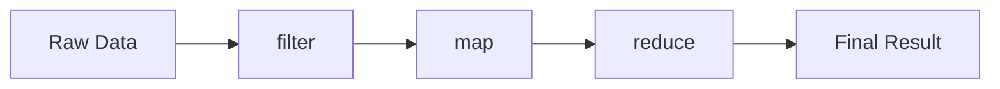

# Day 026 [Beginner]: Functional Tools Map Filter Reduce

## Index

- [Goal](#goal)
- [Prerequisites](#prerequisites)
- [Explanation](#explanation)
- [Topic by Topic](#topic-by-topic)
- [Key Concepts](#key-concepts)
- [Visual Concept Map](#visual-concept-map)
- [End-to-End Practical](#end-to-end-practical)
- [Hands-on Coding](#hands-on-coding)
- [Mini Exercise](#mini-exercise)
- [Assessment Quiz](#assessment-quiz)
- [Task](#task)
- [Self Check](#self-check)
- [Interview Questions and Answers](#interview-questions-and-answers)
- [Day 026 Outcome](#day-026-outcome)

## Goal

Learn how to use map, filter, and reduce to transform data clearly and efficiently in Python.

## Prerequisites

- Day 025 completed
- Comfortable with lists, loops, and functions

## Explanation

Functional tools help you process collections in small, reusable steps. They are useful when you want readable data pipelines, but they should be used with clarity in mind.

## Topic by Topic

### Topic 1: Why Functional Tools Matter

Theory:
Many tasks involve transforming one list into another, selecting items, or combining many values into one result.

Practical:
Instead of writing long loops every time, you can use built-in tools for common patterns.

Code Example:

```python
prices = [100, 250, 400]
taxed_prices = list(map(lambda p: p * 1.18, prices))
print(taxed_prices)
```

**Explanation:**
This topic explains Why Functional Tools Matter in a practical Python context so you can write clear, reliable, and maintainable programs for real-world tasks.

**Key Points:**
- Understand the core idea behind Why Functional Tools Matter.
- Apply the practical pattern with good readability and validation habits.
- Keep the solution maintainable, testable, and safe for production use where relevant.

### Topic 2: Using map for Transformation

Theory:
map applies a function to each item and returns an iterator.

Practical:
Use map when you need one-to-one transformation.

Code Example:

```python
names = ["ria", "aman", "zoe"]
capitalized = list(map(str.title, names))
print(capitalized)
```

**Explanation:**
This topic explains Using map for Transformation in a practical Python context so you can write clear, reliable, and maintainable programs for real-world tasks.

**Key Points:**
- Understand the core idea behind Using map for Transformation.
- Apply the practical pattern with good readability and validation habits.
- Keep the solution maintainable, testable, and safe for production use where relevant.

### Topic 3: Using filter for Selection

Theory:
filter keeps only items where the condition is True.

Practical:
Useful for cleaning data before later processing.

Code Example:

```python
scores = [34, 76, 59, 88, 41]
passed = list(filter(lambda s: s >= 50, scores))
print(passed)
```

**Explanation:**
This topic explains Using filter for Selection in a practical Python context so you can write clear, reliable, and maintainable programs for real-world tasks.

**Key Points:**
- Understand the core idea behind Using filter for Selection.
- Apply the practical pattern with good readability and validation habits.
- Keep the solution maintainable, testable, and safe for production use where relevant.

### Topic 4: Using reduce for Aggregation

Theory:
reduce combines items one by one into a single value.

Practical:
Great for totals, products, and custom accumulation logic.

Code Example:

```python
from functools import reduce

numbers = [2, 3, 4]
product = reduce(lambda a, b: a * b, numbers)
print(product)
```

**Explanation:**
This topic explains Using reduce for Aggregation in a practical Python context so you can write clear, reliable, and maintainable programs for real-world tasks.

**Key Points:**
- Understand the core idea behind Using reduce for Aggregation.
- Apply the practical pattern with good readability and validation habits.
- Keep the solution maintainable, testable, and safe for production use where relevant.

### Topic 5: Chaining map, filter, and reduce

Theory:
You can build a processing pipeline in stages.

Practical:
First filter valid data, then transform, then aggregate.

Code Example:

```python
from functools import reduce

amounts = [120, -30, 250, 0, 80]
valid = filter(lambda x: x > 0, amounts)
with_fee = map(lambda x: x + 10, valid)
total = reduce(lambda a, b: a + b, with_fee)
print(total)
```

**Explanation:**
This topic explains Chaining map, filter, and reduce in a practical Python context so you can write clear, reliable, and maintainable programs for real-world tasks.

**Key Points:**
- Understand the core idea behind Chaining map, filter, and reduce.
- Apply the practical pattern with good readability and validation habits.
- Keep the solution maintainable, testable, and safe for production use where relevant.

### Topic 6: Readability First, Tool Second

Theory:
Functional style is useful only when it remains easy to read.

Practical:
If a chain is hard to understand, split it into clear steps or use a loop.

Code Example:

```python
# Clear intermediate variables are often better than one dense line.
```

**Explanation:**
This topic explains Readability First, Tool Second in a practical Python context so you can write clear, reliable, and maintainable programs for real-world tasks.

**Key Points:**
- Understand the core idea behind Readability First, Tool Second.
- Apply the practical pattern with good readability and validation habits.
- Keep the solution maintainable, testable, and safe for production use where relevant.

## Key Concepts

- map transforms each item
- filter selects matching items
- reduce combines items into one result
- These tools return iterators in Python 3
- Chaining can build simple pipelines
- Readability is the final decision factor

## Visual Concept Map



## End-to-End Practical

1. Start with a raw list of transaction values.
2. Filter out invalid entries.
3. Transform values into business format.
4. Reduce the list to a final metric.
5. Compare readability with a loop-based version.

## Hands-on Coding

### Example 1: Case - Cleanup and Sum

Scenario:
You need the total amount from positive values only.

```python
from functools import reduce

values = [100, -20, 55, -5, 10]
positive = filter(lambda x: x > 0, values)
total = reduce(lambda a, b: a + b, positive)
print(total)
```

### Example 2: Case - Normalize Names

Scenario:
You want consistent title-cased names.

```python
raw_names = ["riya", "ARUN", "mEgha"]
clean_names = list(map(lambda n: n.strip().title(), raw_names))
print(clean_names)
```

### Example 3: Case - Report Pipeline

Scenario:
Create a final score from valid entries only.

```python
from functools import reduce

scores = [82, 0, 90, -1, 76]
valid_scores = filter(lambda s: s > 0, scores)
weighted = map(lambda s: s * 1.1, valid_scores)
final_score = reduce(lambda a, b: a + b, weighted)
print(round(final_score, 2))
```

## Mini Exercise

Scenario:
Given a list of cart values, keep only values greater than 100, add 5 percent service charge to each, and compute the final sum.

Expected output:

- One filtered list step
- One mapped list step
- One reduced final total

## Assessment Quiz

### Quiz Questions

1. What is the job of map?
2. What is the job of filter?
3. True or False: reduce is available without import.
4. When should you avoid long functional chains?
5. Why do we often call list on map and filter outputs?

### Quiz Answers

1. Transform each item
2. Keep only items matching a condition
3. False
4. When readability drops
5. Because they return iterators in Python 3

## Task

- Solve one data-cleaning problem with map and filter
- Add reduce to compute a final summary value
- Rewrite the same logic with loops and compare readability

## Self Check

- You can explain map, filter, and reduce separately
- You can chain them in a simple pipeline
- You know when not to overuse them

## Interview Questions and Answers

### Beginner

**Question:** What does map do in Python?

**Answer:** It applies a function to every element in an iterable.

**Question:** Why is filter useful?

**Answer:** It keeps only the values that satisfy a condition.

### Middle

**Question:** Why is reduce in functools?

**Answer:** Because it is not a built-in function in modern Python and must be imported.

**Question:** When is a loop better than map/filter/reduce?

**Answer:** When the transformation is complex and a loop is easier to read and debug.

### Advanced

**Question:** What tradeoff appears in functional pipelines?

**Answer:** You gain concise composition but can lose readability if too many transformations are chained.

**Question:** How do you keep functional code maintainable?

**Answer:** Use named functions, clear step variables, and limit chain length.

## Day 026 Outcome

- You can apply map, filter, and reduce to real data tasks
- You can build readable transformation pipelines
- You are ready to learn text pattern matching with regex on Day 027
