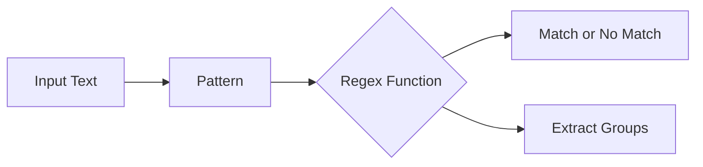

# Day 027 [Beginner]: Regular Expressions

## Index

- [Goal](#goal)
- [Prerequisites](#prerequisites)
- [Explanation](#explanation)
- [Topic by Topic](#topic-by-topic)
- [Key Concepts](#key-concepts)
- [Visual Concept Map](#visual-concept-map)
- [End-to-End Practical](#end-to-end-practical)
- [Hands-on Coding](#hands-on-coding)
- [Mini Exercise](#mini-exercise)
- [Assessment Quiz](#assessment-quiz)
- [Task](#task)
- [Self Check](#self-check)
- [Interview Questions and Answers](#interview-questions-and-answers)
- [Day 027 Outcome](#day-027-outcome)

## Goal

Understand regular expressions and use them safely for searching, validating, and extracting text in Python.

## Prerequisites

- Day 026 completed
- Comfortable with strings and conditions

## Explanation

Regular expressions, often called regex, let you describe text patterns. They are powerful for validation and extraction, but they should be written carefully for readability.

## Topic by Topic

### Topic 1: What Regex Solves

Theory:
Some string tasks are difficult with plain split and find, especially when patterns vary.

Practical:
Regex helps when you need pattern-based matching like email-like text or phone formats.

Code Example:

```python
import re

text = "Order ID: ORD-2026-991"
match = re.search(r"ORD-\d{4}-\d{3}", text)
print(match.group() if match else "No match")
```

**Explanation:**
This topic explains What Regex Solves in a practical Python context so you can write clear, reliable, and maintainable programs for real-world tasks.

**Key Points:**
- Understand the core idea behind What Regex Solves.
- Apply the practical pattern with good readability and validation habits.
- Keep the solution maintainable, testable, and safe for production use where relevant.

### Topic 2: Common Pattern Symbols

Theory:
Symbols like dot, star, plus, and braces define pattern behavior.

Practical:
Start with simple patterns before moving to advanced combinations.

Code Example:

```python
import re

result = re.findall(r"cat", "cat catalog scatter")
print(result)
```

**Explanation:**
This topic explains Common Pattern Symbols in a practical Python context so you can write clear, reliable, and maintainable programs for real-world tasks.

**Key Points:**
- Understand the core idea behind Common Pattern Symbols.
- Apply the practical pattern with good readability and validation habits.
- Keep the solution maintainable, testable, and safe for production use where relevant.

### Topic 3: Matching vs Finding All

Theory:
Different regex functions serve different goals.

Practical:
Use search for one match, findall for all matches, and fullmatch for full-string validation.

Code Example:

```python
import re

print(re.search(r"\d+", "Room 44"))
print(re.findall(r"\d+", "A1 B22 C333"))
print(re.fullmatch(r"\d{4}", "2026"))
```

**Explanation:**
This topic explains Matching vs Finding All in a practical Python context so you can write clear, reliable, and maintainable programs for real-world tasks.

**Key Points:**
- Understand the core idea behind Matching vs Finding All.
- Apply the practical pattern with good readability and validation habits.
- Keep the solution maintainable, testable, and safe for production use where relevant.

### Topic 4: Groups for Extraction

Theory:
Parentheses capture parts of a matched pattern.

Practical:
Groups are useful for extracting structured pieces such as date parts.

Code Example:

```python
import re

date_text = "2026-07-24"
m = re.match(r"(\d{4})-(\d{2})-(\d{2})", date_text)
if m:
  year, month, day = m.groups()
  print(year, month, day)
```

**Explanation:**
This topic explains Groups for Extraction in a practical Python context so you can write clear, reliable, and maintainable programs for real-world tasks.

**Key Points:**
- Understand the core idea behind Groups for Extraction.
- Apply the practical pattern with good readability and validation habits.
- Keep the solution maintainable, testable, and safe for production use where relevant.

### Topic 5: Validation Patterns

Theory:
Validation should usually use anchors and full matches.

Practical:
Use fullmatch to avoid partial false positives.

Code Example:

```python
import re

pin = "560001"
is_valid = re.fullmatch(r"\d{6}", pin) is not None
print(is_valid)
```

**Explanation:**
This topic explains Validation Patterns in a practical Python context so you can write clear, reliable, and maintainable programs for real-world tasks.

**Key Points:**
- Understand the core idea behind Validation Patterns.
- Apply the practical pattern with good readability and validation habits.
- Keep the solution maintainable, testable, and safe for production use where relevant.

### Topic 6: Write Regex That Teammates Can Read

Theory:
Complex regex can become hard to maintain.

Practical:
Keep patterns small, use raw strings, and comment complex rules.

Code Example:

```python
# Prefer smaller patterns and clear naming over one huge expression.
```

**Explanation:**
This topic explains Write Regex That Teammates Can Read in a practical Python context so you can write clear, reliable, and maintainable programs for real-world tasks.

**Key Points:**
- Understand the core idea behind Write Regex That Teammates Can Read.
- Apply the practical pattern with good readability and validation habits.
- Keep the solution maintainable, testable, and safe for production use where relevant.

## Key Concepts

- Regex describes text patterns
- Use raw string literals for regex patterns
- search, findall, and fullmatch have different roles
- Groups help extract sub-parts from matches
- Validation should avoid partial matches
- Readability and maintainability are essential

## Visual Concept Map



## End-to-End Practical

1. Define one realistic validation problem.
2. Write a simple regex pattern.
3. Test with valid and invalid examples.
4. Use groups if extraction is needed.
5. Refactor the pattern for readability.

## Hands-on Coding

### Example 1: Case - Email-like Check

Scenario:
You need basic format validation for email-like input.

```python
import re

email = "user1@example.com"
ok = re.fullmatch(r"[a-zA-Z0-9_.+-]+@[a-zA-Z0-9-]+\.[a-zA-Z0-9-.]+", email)
print(ok is not None)
```

### Example 2: Case - Extract Invoice Number

Scenario:
Find invoice numbers from a paragraph.

```python
import re

text = "Invoices: INV-1001, INV-1002, and INV-1050"
numbers = re.findall(r"INV-(\d{4})", text)
print(numbers)
```

### Example 3: Case - Validate User ID Rule

Scenario:
User ID must start with two letters followed by four digits.

```python
import re

user_id = "AB1234"
is_valid = re.fullmatch(r"[A-Za-z]{2}\d{4}", user_id) is not None
print(is_valid)
```

## Mini Exercise

Scenario:
Write regex checks for three values: 10-digit phone, 6-digit pincode, and date in YYYY-MM-DD format.

Expected output:

- Three fullmatch checks
- True or False result for each check
- At least one invalid test case included

## Assessment Quiz

### Quiz Questions

1. Why use raw string format for regex?
2. Which function is best for full validation?
3. True or False: findall returns only one match.
4. What are groups used for?
5. What is one risk of very complex regex?

### Quiz Answers

1. To avoid escape confusion in pattern strings
2. fullmatch
3. False
4. Extracting sub-parts of a match
5. Poor readability and maintenance difficulty

## Task

- Create one regex validator for each of: email-like input, pincode, and user ID
- Add at least five test values per validator
- Document one edge case that failed first and how you fixed it

## Self Check

- You can explain basic regex symbols
- You can choose the correct regex function for the task
- You can write readable validation patterns

## Interview Questions and Answers

### Beginner

**Question:** What is regex in Python?

**Answer:** It is a pattern language used to match and process text.

**Question:** Which module provides regex support?

**Answer:** The re module.

### Middle

**Question:** What is the difference between search and fullmatch?

**Answer:** search finds a matching part anywhere in text, while fullmatch requires the complete string to match.

**Question:** Why are capture groups useful?

**Answer:** They let you directly extract structured parts from matched text.

### Advanced

**Question:** Why can regex be risky in production code?

**Answer:** Hard-to-read patterns can introduce validation bugs and become difficult to maintain.

**Question:** How do you make regex maintainable in a team?

**Answer:** Keep patterns focused, test edge cases, and document intent clearly.

## Day 027 Outcome

- You can use regex for search, extraction, and validation
- You can avoid common regex readability pitfalls
- You are ready to work with dates and time handling on Day 028
