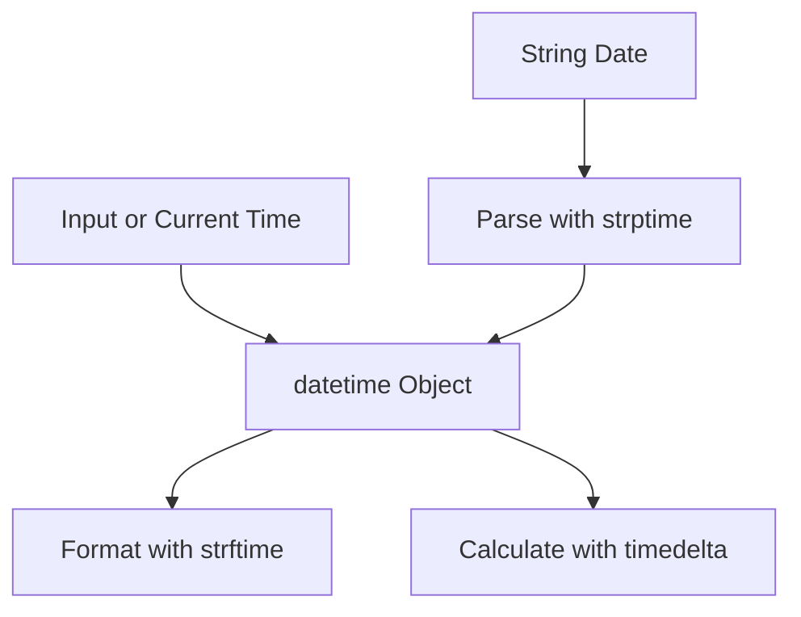

# Day 028 [Beginner]: Date and Time Handling

## Index

- [Goal](#goal)
- [Prerequisites](#prerequisites)
- [Explanation](#explanation)
- [Topic by Topic](#topic-by-topic)
- [Key Concepts](#key-concepts)
- [Visual Concept Map](#visual-concept-map)
- [End-to-End Practical](#end-to-end-practical)
- [Hands-on Coding](#hands-on-coding)
- [Mini Exercise](#mini-exercise)
- [Assessment Quiz](#assessment-quiz)
- [Task](#task)
- [Self Check](#self-check)
- [Interview Questions and Answers](#interview-questions-and-answers)
- [Day 028 Outcome](#day-028-outcome)

## Goal

Learn to create, format, compare, and calculate dates and times correctly in Python.

## Prerequisites

- Day 027 completed
- Comfortable with strings and basic functions

## Explanation

Date and time logic appears in logs, scheduling, reporting, and APIs. Python provides the datetime module to work with these values in a reliable and consistent way.

## Topic by Topic

### Topic 1: Getting Current Date and Time

Theory:
datetime.now gives the current local date and time.

Practical:
Use it to timestamp events and actions.

Code Example:

```python
from datetime import datetime

now = datetime.now()
print(now)
```

**Explanation:**
This topic explains Getting Current Date and Time in a practical Python context so you can write clear, reliable, and maintainable programs for real-world tasks.

**Key Points:**
- Understand the core idea behind Getting Current Date and Time.
- Apply the practical pattern with good readability and validation habits.
- Keep the solution maintainable, testable, and safe for production use where relevant.

### Topic 2: Creating Date and Time Objects

Theory:
You can create specific date and datetime values directly.

Practical:
Useful for deadlines, reminders, and fixed schedule values.

Code Example:

```python
from datetime import date, datetime

launch_date = date(2026, 9, 1)
meeting_time = datetime(2026, 9, 1, 14, 30)
print(launch_date, meeting_time)
```

**Explanation:**
This topic explains Creating Date and Time Objects in a practical Python context so you can write clear, reliable, and maintainable programs for real-world tasks.

**Key Points:**
- Understand the core idea behind Creating Date and Time Objects.
- Apply the practical pattern with good readability and validation habits.
- Keep the solution maintainable, testable, and safe for production use where relevant.

### Topic 3: Formatting Dates for Display

Theory:
strftime converts date-time objects into readable strings.

Practical:
Use specific formats for users, reports, and logs.

Code Example:

```python
from datetime import datetime

now = datetime.now()
print(now.strftime("%d-%m-%Y %H:%M:%S"))
```

**Explanation:**
This topic explains Formatting Dates for Display in a practical Python context so you can write clear, reliable, and maintainable programs for real-world tasks.

**Key Points:**
- Understand the core idea behind Formatting Dates for Display.
- Apply the practical pattern with good readability and validation habits.
- Keep the solution maintainable, testable, and safe for production use where relevant.

### Topic 4: Parsing Strings into Date-Time

Theory:
strptime converts formatted strings into datetime objects.

Practical:
Essential when receiving date input from users or files.

Code Example:

```python
from datetime import datetime

raw = "24-07-2026 18:20"
parsed = datetime.strptime(raw, "%d-%m-%Y %H:%M")
print(parsed)
```

**Explanation:**
This topic explains Parsing Strings into Date-Time in a practical Python context so you can write clear, reliable, and maintainable programs for real-world tasks.

**Key Points:**
- Understand the core idea behind Parsing Strings into Date-Time.
- Apply the practical pattern with good readability and validation habits.
- Keep the solution maintainable, testable, and safe for production use where relevant.

### Topic 5: Date Arithmetic with timedelta

Theory:
timedelta helps add or subtract time periods.

Practical:
Use it for due dates, expiry windows, and reminders.

Code Example:

```python
from datetime import datetime, timedelta

today = datetime.now()
due = today + timedelta(days=7)
print(due)
```

**Explanation:**
This topic explains Date Arithmetic with timedelta in a practical Python context so you can write clear, reliable, and maintainable programs for real-world tasks.

**Key Points:**
- Understand the core idea behind Date Arithmetic with timedelta.
- Apply the practical pattern with good readability and validation habits.
- Keep the solution maintainable, testable, and safe for production use where relevant.

### Topic 6: Common Time Handling Mistakes

Theory:
Mixing formats or comparing strings as dates causes bugs.

Practical:
Convert to date or datetime objects before calculations.

Code Example:

```python
# Always compare datetime objects, not raw date strings.
```

**Explanation:**
This topic explains Common Time Handling Mistakes in a practical Python context so you can write clear, reliable, and maintainable programs for real-world tasks.

**Key Points:**
- Understand the core idea behind Common Time Handling Mistakes.
- Apply the practical pattern with good readability and validation habits.
- Keep the solution maintainable, testable, and safe for production use where relevant.

## Key Concepts

- datetime.now gives current local date and time
- Use date and datetime objects for structured time data
- strftime formats for output
- strptime parses input strings
- timedelta supports time arithmetic
- Always operate on date objects, not plain strings

## Visual Concept Map



## End-to-End Practical

1. Read a user date input string.
2. Parse it to datetime.
3. Add 3 days using timedelta.
4. Compare with current date.
5. Print a friendly formatted result.

## Hands-on Coding

### Example 1: Case - Subscription Expiry

Scenario:
Calculate expiry date 30 days after signup.

```python
from datetime import datetime, timedelta

signup = datetime.strptime("2026-07-01", "%Y-%m-%d")
expiry = signup + timedelta(days=30)
print(expiry.strftime("%Y-%m-%d"))
```

### Example 2: Case - Event Countdown

Scenario:
Find days remaining until an event date.

```python
from datetime import date

today = date.today()
event = date(2026, 12, 31)
print((event - today).days)
```

### Example 3: Case - Format for Report

Scenario:
Store timestamps in a consistent report format.

```python
from datetime import datetime

stamp = datetime.now().strftime("%Y-%m-%d %H:%M:%S")
print(f"Report generated at: {stamp}")
```

## Mini Exercise

Scenario:
Take an input date in DD-MM-YYYY, parse it, add 15 days, and print result in YYYY/MM/DD.

Expected output:

- One strptime usage
- One timedelta usage
- One strftime output

## Assessment Quiz

### Quiz Questions

1. Which function converts datetime to formatted string?
2. Which function parses a string into datetime?
3. True or False: Comparing date strings is always safe.
4. What does timedelta represent?
5. Why should you standardize output format?

### Quiz Answers

1. strftime
2. strptime
3. False
4. A duration for date-time arithmetic
5. To avoid ambiguity and parsing issues

## Task

- Build a due-date calculator using timedelta
- Parse at least three input date strings
- Print all outputs in one consistent format

## Self Check

- You can create and parse date-time values
- You can add and subtract durations
- You can format dates for user-friendly output

## Interview Questions and Answers

### Beginner

**Question:** Which module is used for date and time in Python?

**Answer:** The datetime module.

**Question:** What does datetime.now return?

**Answer:** The current local date and time.

### Middle

**Question:** What is the difference between strftime and strptime?

**Answer:** strftime formats datetime to string, while strptime parses string to datetime.

**Question:** Why use timedelta instead of manual day arithmetic?

**Answer:** It handles date arithmetic safely and clearly.

### Advanced

**Question:** What common bug occurs in time handling projects?

**Answer:** Treating date strings as comparable values instead of converting to datetime objects.

**Question:** How do you keep time-handling code maintainable?

**Answer:** Use a standard format policy and centralize parsing and formatting rules.

## Day 028 Outcome

- You can manage date and time operations confidently
- You can parse, format, and calculate date values correctly
- You are ready for data serialization with JSON and YAML on Day 029
