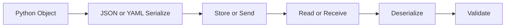

# Day 029 [Beginner]: JSON and YAML Processing

## Index

- [Goal](#goal)
- [Prerequisites](#prerequisites)
- [Explanation](#explanation)
- [Topic by Topic](#topic-by-topic)
- [Key Concepts](#key-concepts)
- [Visual Concept Map](#visual-concept-map)
- [End-to-End Practical](#end-to-end-practical)
- [Hands-on Coding](#hands-on-coding)
- [Mini Exercise](#mini-exercise)
- [Assessment Quiz](#assessment-quiz)
- [Task](#task)
- [Self Check](#self-check)
- [Interview Questions and Answers](#interview-questions-and-answers)
- [Day 029 Outcome](#day-029-outcome)

## Goal

Learn to convert Python data to JSON and YAML, and read them back safely for real-world applications.

## Prerequisites

- Day 028 completed
- Comfortable with dictionaries and lists

## Explanation

JSON and YAML are widely used data formats. JSON is common in APIs, while YAML is common in configuration files. Python can serialize and deserialize both formats for smooth data exchange.

## Topic by Topic

### Topic 1: What Serialization Means

Theory:
Serialization converts Python objects into text formats for storage or transfer.

Practical:
Deserialization turns that text back into Python objects.

Code Example:

```python
import json

user = {"name": "Riya", "age": 24}
text = json.dumps(user)
print(text)
print(type(text))
```

**Explanation:**
This topic explains What Serialization Means in a practical Python context so you can write clear, reliable, and maintainable programs for real-world tasks.

**Key Points:**
- Understand the core idea behind What Serialization Means.
- Apply the practical pattern with good readability and validation habits.
- Keep the solution maintainable, testable, and safe for production use where relevant.

### Topic 2: JSON with json Module

Theory:
json.dumps returns a JSON string, and json.loads parses JSON string.

Practical:
These functions are used in API request and response flows.

Code Example:

```python
import json

raw = '{"city": "Pune", "temp": 31}'
data = json.loads(raw)
print(data["city"])
```

**Explanation:**
This topic explains JSON with json Module in a practical Python context so you can write clear, reliable, and maintainable programs for real-world tasks.

**Key Points:**
- Understand the core idea behind JSON with json Module.
- Apply the practical pattern with good readability and validation habits.
- Keep the solution maintainable, testable, and safe for production use where relevant.

### Topic 3: Reading and Writing JSON Files

Theory:
json.dump writes to file, and json.load reads from file.

Practical:
Useful for local persistence and export features.

Code Example:

```python
import json

config = {"debug": True, "port": 5000}
with open("config.json", "w") as file:
  json.dump(config, file, indent=2)
```

**Explanation:**
This topic explains Reading and Writing JSON Files in a practical Python context so you can write clear, reliable, and maintainable programs for real-world tasks.

**Key Points:**
- Understand the core idea behind Reading and Writing JSON Files.
- Apply the practical pattern with good readability and validation habits.
- Keep the solution maintainable, testable, and safe for production use where relevant.

### Topic 4: YAML Basics

Theory:
YAML is human-readable and often used in deployment and app config.

Practical:
Python uses the pyyaml package for YAML operations.

Code Example:

```python
import yaml

settings = {"service": "billing", "retries": 3}
yaml_text = yaml.safe_dump(settings)
print(yaml_text)
```

**Explanation:**
This topic explains YAML Basics in a practical Python context so you can write clear, reliable, and maintainable programs for real-world tasks.

**Key Points:**
- Understand the core idea behind YAML Basics.
- Apply the practical pattern with good readability and validation habits.
- Keep the solution maintainable, testable, and safe for production use where relevant.

### Topic 5: Safe Loading and Validation

Theory:
Never trust external data blindly.

Practical:
Use safe loaders and check expected keys and types after parsing.

Code Example:

```python
import yaml

raw = "name: Asha\nrole: admin"
data = yaml.safe_load(raw)
if "name" in data and "role" in data:
  print("Valid data")
```

**Explanation:**
This topic explains Safe Loading and Validation in a practical Python context so you can write clear, reliable, and maintainable programs for real-world tasks.

**Key Points:**
- Understand the core idea behind Safe Loading and Validation.
- Apply the practical pattern with good readability and validation habits.
- Keep the solution maintainable, testable, and safe for production use where relevant.

### Topic 6: Choosing JSON vs YAML

Theory:
Choose format based on use case and ecosystem needs.

Practical:
JSON is better for APIs, YAML is often better for readable configs.

Code Example:

```python
# API payloads usually use JSON; human-edited config often uses YAML.
```

**Explanation:**
This topic explains Choosing JSON vs YAML in a practical Python context so you can write clear, reliable, and maintainable programs for real-world tasks.

**Key Points:**
- Understand the core idea behind Choosing JSON vs YAML.
- Apply the practical pattern with good readability and validation habits.
- Keep the solution maintainable, testable, and safe for production use where relevant.

## Key Concepts

- Serialization converts object to text format
- Deserialization converts text back to object
- json module supports dumps, loads, dump, load
- YAML needs pyyaml and safe functions
- Validate parsed data before use
- Format choice depends on context

## Visual Concept Map



## End-to-End Practical

1. Create a Python dictionary for app settings.
2. Save it as JSON file and read it back.
3. Convert same data to YAML string.
4. Parse YAML string back to object.
5. Validate required keys before using data.

## Hands-on Coding

### Example 1: Case - API Payload JSON

Scenario:
Prepare order data as JSON payload.

```python
import json

order = {"id": 102, "amount": 799.5, "currency": "INR"}
payload = json.dumps(order)
print(payload)
```

### Example 2: Case - Config File in YAML

Scenario:
Export feature flags in YAML format.

```python
import yaml

flags = {"new_checkout": True, "beta_mode": False}
print(yaml.safe_dump(flags))
```

### Example 3: Case - Robust Parsing

Scenario:
Read incoming JSON text and handle malformed input.

```python
import json

raw = '{"user":"Nina","active":true}'
try:
  data = json.loads(raw)
  print(data["user"])
except json.JSONDecodeError:
  print("Invalid JSON")
```

## Mini Exercise

Scenario:
Create a student dictionary, save to student.json, read it back, then convert to YAML text and print it.

Expected output:

- JSON write and read flow
- YAML conversion output
- Validation check for at least one key

## Assessment Quiz

### Quiz Questions

1. What does json.dumps return?
2. Which function reads JSON from a file object?
3. True or False: yaml.safe_load is preferred over yaml.load for untrusted input.
4. Why is validation needed after parsing?
5. When is YAML usually preferred?

### Quiz Answers

1. JSON string
2. json.load
3. True
4. To ensure required keys and correct types exist
5. For human-readable configuration files

## Task

- Build one JSON export and import flow
- Build one YAML export and import flow
- Add at least two validation checks before using parsed data

## Self Check

- You can serialize and deserialize JSON
- You can work with YAML safely
- You can choose the right format for the use case

## Interview Questions and Answers

### Beginner

**Question:** What is JSON commonly used for?

**Answer:** Data exchange, especially in web APIs.

**Question:** What is YAML commonly used for?

**Answer:** Human-readable configuration files.

### Middle

**Question:** What is the difference between json.dump and json.dumps?

**Answer:** dump writes to file, while dumps returns a string.

**Question:** Why use safe_load in YAML processing?

**Answer:** It avoids unsafe object construction from untrusted content.

### Advanced

**Question:** What production risk exists in deserialization flows?

**Answer:** Assuming external payload structure without validation can cause runtime failures or security issues.

**Question:** How do teams keep data format handling robust?

**Answer:** Use explicit schema checks, safe loaders, and defensive error handling.

## Day 029 Outcome

- You can process JSON and YAML data confidently
- You can add safe parsing and validation steps
- You are ready to track runtime behavior with logging on Day 030
