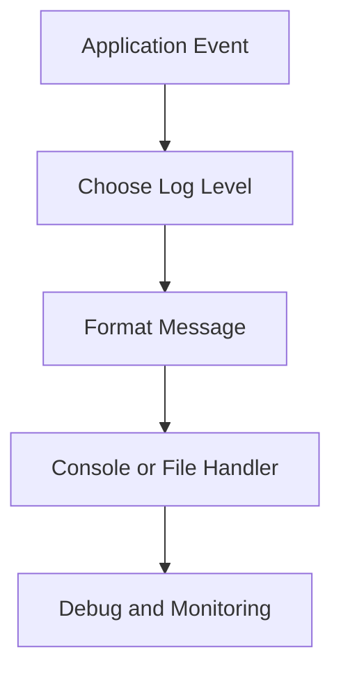

# Day 030 [Beginner]: Logging Fundamentals

## Index

- [Goal](#goal)
- [Prerequisites](#prerequisites)
- [Explanation](#explanation)
- [Topic by Topic](#topic-by-topic)
- [Key Concepts](#key-concepts)
- [Visual Concept Map](#visual-concept-map)
- [End-to-End Practical](#end-to-end-practical)
- [Hands-on Coding](#hands-on-coding)
- [Mini Exercise](#mini-exercise)
- [Assessment Quiz](#assessment-quiz)
- [Task](#task)
- [Self Check](#self-check)
- [Interview Questions and Answers](#interview-questions-and-answers)
- [Day 030 Outcome](#day-030-outcome)

## Goal

Understand Python logging basics so you can track program behavior, debug faster, and keep production logs useful.

## Prerequisites

- Day 029 completed
- Comfortable with functions and exceptions

## Explanation

Logging records what your application is doing. It is better than print statements for real projects because levels, formatting, and destinations are configurable.

## Topic by Topic

### Topic 1: Why Logging Instead of Print

Theory:
Print is quick for local checks, but logging is structured and configurable.

Practical:
Logs can include timestamp, level, and message in one consistent format.

Code Example:

```python
import logging

logging.basicConfig(level=logging.INFO)
logging.info("Application started")
```

**Explanation:**
This topic explains Why Logging Instead of Print in a practical Python context so you can write clear, reliable, and maintainable programs for real-world tasks.

**Key Points:**
- Understand the core idea behind Why Logging Instead of Print.
- Apply the practical pattern with good readability and validation habits.
- Keep the solution maintainable, testable, and safe for production use where relevant.

### Topic 2: Log Levels

Theory:
Common levels are DEBUG, INFO, WARNING, ERROR, and CRITICAL.

Practical:
Choose level based on message importance.

Code Example:

```python
import logging

logging.debug("Debug details")
logging.info("Normal flow")
logging.warning("Potential issue")
logging.error("Failed to process")
```

**Explanation:**
This topic explains Log Levels in a practical Python context so you can write clear, reliable, and maintainable programs for real-world tasks.

**Key Points:**
- Understand the core idea behind Log Levels.
- Apply the practical pattern with good readability and validation habits.
- Keep the solution maintainable, testable, and safe for production use where relevant.

### Topic 3: Log Formatting

Theory:
A clear format improves troubleshooting and searchability.

Practical:
Add timestamp and level for every line.

Code Example:

```python
import logging

logging.basicConfig(
  level=logging.INFO,
  format="%(asctime)s | %(levelname)s | %(message)s"
)
logging.info("Formatted log message")
```

**Explanation:**
This topic explains Log Formatting in a practical Python context so you can write clear, reliable, and maintainable programs for real-world tasks.

**Key Points:**
- Understand the core idea behind Log Formatting.
- Apply the practical pattern with good readability and validation habits.
- Keep the solution maintainable, testable, and safe for production use where relevant.

### Topic 4: Writing Logs to a File

Theory:
File logs help with history and post-incident analysis.

Practical:
Store logs in a dedicated file for later review.

Code Example:

```python
import logging

logging.basicConfig(
  filename="app.log",
  level=logging.INFO,
  format="%(asctime)s | %(levelname)s | %(message)s"
)
logging.info("Saved to file")
```

**Explanation:**
This topic explains Writing Logs to a File in a practical Python context so you can write clear, reliable, and maintainable programs for real-world tasks.

**Key Points:**
- Understand the core idea behind Writing Logs to a File.
- Apply the practical pattern with good readability and validation habits.
- Keep the solution maintainable, testable, and safe for production use where relevant.

### Topic 5: Logging Exceptions

Theory:
Exception logs should include enough context to debug quickly.

Practical:
Use logging.exception inside except blocks to include traceback.

Code Example:

```python
import logging

try:
  result = 10 / 0
except ZeroDivisionError:
  logging.exception("Math failure in billing calculation")
```

**Explanation:**
This topic explains Logging Exceptions in a practical Python context so you can write clear, reliable, and maintainable programs for real-world tasks.

**Key Points:**
- Understand the core idea behind Logging Exceptions.
- Apply the practical pattern with good readability and validation habits.
- Keep the solution maintainable, testable, and safe for production use where relevant.

### Topic 6: Logging Best Practices

Theory:
Logs should be meaningful, not noisy.

Practical:
Do not log sensitive data and avoid excessive debug logs in production.

Code Example:

```python
# Log intent and context, but never log passwords or secret tokens.
```

**Explanation:**
This topic explains Logging Best Practices in a practical Python context so you can write clear, reliable, and maintainable programs for real-world tasks.

**Key Points:**
- Understand the core idea behind Logging Best Practices.
- Apply the practical pattern with good readability and validation habits.
- Keep the solution maintainable, testable, and safe for production use where relevant.

## Key Concepts

- Logging is more scalable than print debugging
- Log levels control severity and filtering
- Format should include timestamp and level
- Logs can go to console, file, or both
- Exception logs should preserve traceback
- Avoid noisy and sensitive logs

## Visual Concept Map



## End-to-End Practical

1. Configure logging with a clear format.
2. Add logs in normal execution flow.
3. Add warning and error logs in risky sections.
4. Capture exception traceback.
5. Review output and remove unnecessary noise.

## Hands-on Coding

### Example 1: Case - Startup and Shutdown Logs

Scenario:
Track service lifecycle events.

```python
import logging

logging.basicConfig(level=logging.INFO)
logging.info("Service starting")
logging.info("Service stopped")
```

### Example 2: Case - API Retry Logging

Scenario:
Log warning before each retry attempt.

```python
import logging

for attempt in range(1, 4):
  logging.warning(f"Retry attempt {attempt}")
```

### Example 3: Case - Error with Traceback

Scenario:
Capture full error details when file read fails.

```python
import logging

try:
  with open("missing.txt", "r") as file:
    print(file.read())
except FileNotFoundError:
  logging.exception("Could not read input file")
```

## Mini Exercise

Scenario:
Build a small calculator script that logs input, output, and any exceptions to app.log.

Expected output:

- INFO logs for valid operations
- ERROR or exception logs for invalid operations
- All logs written to file

## Assessment Quiz

### Quiz Questions

1. Why is logging preferred over print in production?
2. Which level is typically used for recoverable issues?
3. True or False: logging.exception should be used inside except blocks.
4. What should a good log format include?
5. Why should sensitive data be avoided in logs?

### Quiz Answers

1. It is structured, filterable, and configurable
2. WARNING
3. True
4. Timestamp, level, and meaningful message
5. To protect security and privacy

## Task

- Add logging to one existing script
- Use at least three log levels
- Add exception logging with traceback

## Self Check

- You can configure logging quickly
- You can pick correct levels for messages
- You can produce useful, secure logs

## Interview Questions and Answers

### Beginner

**Question:** Why use logging in Python?

**Answer:** It helps track program behavior in a structured and configurable way.

**Question:** What are common logging levels?

**Answer:** DEBUG, INFO, WARNING, ERROR, and CRITICAL.

### Middle

**Question:** How is logging.exception different from logging.error?

**Answer:** logging.exception includes traceback details and is used inside except blocks.

**Question:** Why is log formatting important?

**Answer:** It makes logs easier to read, filter, and debug.

### Advanced

**Question:** What makes logs production-ready?

**Answer:** Clear levels, consistent format, actionable messages, and no sensitive data exposure.

**Question:** What is a common logging anti-pattern?

**Answer:** Excessive noisy logging that hides important failure signals.

## Day 030 Outcome

- You can configure and use Python logging effectively
- You can log errors and exceptions with context
- You are ready for file and path automation topics on Day 031
