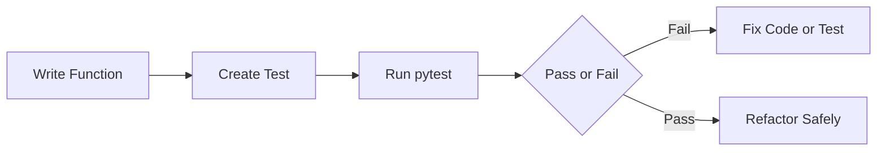

# Day 031 [Beginner]: Testing with pytest Basics

## Index

- [Goal](#goal)
- [Prerequisites](#prerequisites)
- [Explanation](#explanation)
- [Topic by Topic](#topic-by-topic)
- [Key Concepts](#key-concepts)
- [Visual Concept Map](#visual-concept-map)
- [End-to-End Practical](#end-to-end-practical)
- [Hands-on Coding](#hands-on-coding)
- [Mini Exercise](#mini-exercise)
- [Assessment Quiz](#assessment-quiz)
- [Task](#task)
- [Self Check](#self-check)
- [Interview Questions and Answers](#interview-questions-and-answers)
- [Day 031 Outcome](#day-031-outcome)

## Goal

Learn the fundamentals of pytest so you can write reliable tests and validate your Python code confidently.

## Prerequisites

- Day 030 completed
- Comfortable with functions and return values

## Explanation

Testing checks whether your code behaves as expected. pytest is a popular Python testing framework because it is simple to start and scales well for larger projects.

## Topic by Topic

### Topic 1: Why Automated Tests Matter

Theory:
Manual checks are slow and easy to miss. Automated tests run quickly and repeatedly.

Practical:
Tests catch regressions when code changes.

Code Example:

```python
def add(a, b):
  return a + b
```

**Explanation:**
This topic explains Why Automated Tests Matter in a practical Python context so you can write clear, reliable, and maintainable programs for real-world tasks.

**Key Points:**
- Understand the core idea behind Why Automated Tests Matter.
- Apply the practical pattern with good readability and validation habits.
- Keep the solution maintainable, testable, and safe for production use where relevant.

### Topic 2: Writing Your First pytest Test

Theory:
A test is usually a function that starts with test\_.

Practical:
Use plain assert statements to check outcomes.

Code Example:

```python
def add(a, b):
  return a + b

def test_add_positive_numbers():
  assert add(2, 3) == 5
```

**Explanation:**
This topic explains Writing Your First pytest Test in a practical Python context so you can write clear, reliable, and maintainable programs for real-world tasks.

**Key Points:**
- Understand the core idea behind Writing Your First pytest Test.
- Apply the practical pattern with good readability and validation habits.
- Keep the solution maintainable, testable, and safe for production use where relevant.

### Topic 3: Test Discovery and Naming

Theory:
pytest discovers files and functions by naming conventions.

Practical:
Use file names like test_math.py and function names like test_add.

Code Example:

```python
# File name: test_math.py
def test_subtract():
  assert 10 - 4 == 6
```

**Explanation:**
This topic explains Test Discovery and Naming in a practical Python context so you can write clear, reliable, and maintainable programs for real-world tasks.

**Key Points:**
- Understand the core idea behind Test Discovery and Naming.
- Apply the practical pattern with good readability and validation habits.
- Keep the solution maintainable, testable, and safe for production use where relevant.

### Topic 4: Running Tests and Reading Output

Theory:
pytest provides clear pass/fail summaries.

Practical:
Run tests from project root and inspect failure messages.

Code Example:

```bash
pytest -q
```

**Explanation:**
This topic explains Running Tests and Reading Output in a practical Python context so you can write clear, reliable, and maintainable programs for real-world tasks.

**Key Points:**
- Understand the core idea behind Running Tests and Reading Output.
- Apply the practical pattern with good readability and validation habits.
- Keep the solution maintainable, testable, and safe for production use where relevant.

### Topic 5: Arrange-Act-Assert Pattern

Theory:
Good tests have clear structure: setup data, execute behavior, check result.

Practical:
This keeps tests readable and easy to debug.

Code Example:

```python
def multiply(a, b):
  return a * b

def test_multiply():
  # Arrange
  a, b = 4, 5
  # Act
  result = multiply(a, b)
  # Assert
  assert result == 20
```

**Explanation:**
This topic explains Arrange-Act-Assert Pattern in a practical Python context so you can write clear, reliable, and maintainable programs for real-world tasks.

**Key Points:**
- Understand the core idea behind Arrange-Act-Assert Pattern.
- Apply the practical pattern with good readability and validation habits.
- Keep the solution maintainable, testable, and safe for production use where relevant.

### Topic 6: Keep Tests Small and Independent

Theory:
Tests should not depend on order or shared hidden state.

Practical:
Independent tests are more stable and easier to maintain.

Code Example:

```python
# Each test should prepare its own input and expected result.
```

**Explanation:**
This topic explains Keep Tests Small and Independent in a practical Python context so you can write clear, reliable, and maintainable programs for real-world tasks.

**Key Points:**
- Understand the core idea behind Keep Tests Small and Independent.
- Apply the practical pattern with good readability and validation habits.
- Keep the solution maintainable, testable, and safe for production use where relevant.

## Key Concepts

- pytest uses simple assert-based tests
- Naming conventions help automatic test discovery
- Tests should be readable and focused
- Arrange-Act-Assert improves structure
- Failure output helps quick debugging
- Independent tests reduce flakiness

## Visual Concept Map



## End-to-End Practical

1. Create a small utility function.
2. Add two tests for normal inputs.
3. Add one edge case test.
4. Run pytest and inspect output.
5. Fix one intentional bug and re-run.

## Hands-on Coding

### Example 1: Case - Discount Calculation

Scenario:
Validate a simple discount helper.

```python
def discounted_price(price, percent):
  return price - (price * percent / 100)

def test_discounted_price():
  assert discounted_price(1000, 10) == 900
```

### Example 2: Case - Edge Case Zero

Scenario:
Ensure 0 percent discount keeps original value.

```python
def test_zero_discount():
  assert discounted_price(500, 0) == 500
```

### Example 3: Case - Invalid Inputs Strategy

Scenario:
Decide expected behavior for invalid inputs.

```python
def safe_divide(a, b):
  if b == 0:
    return None
  return a / b

def test_safe_divide_zero():
  assert safe_divide(10, 0) is None
```

## Mini Exercise

Scenario:
Write tests for a function that checks if a number is even.

Expected output:

- One function under test
- At least three test cases
- One edge case

## Assessment Quiz

### Quiz Questions

1. Why is pytest popular for beginners?
2. What naming pattern helps pytest find tests?
3. True or False: Tests should depend on execution order.
4. What does assert do in a test?
5. Why is AAA pattern useful?

### Quiz Answers

1. Simple syntax and good output
2. test\_ prefix in files and functions
3. False
4. Verifies expected behavior
5. It keeps tests clear and maintainable

## Task

- Create a test file with at least five tests
- Include one edge case and one invalid case
- Run pytest and fix one failing test intentionally introduced

## Self Check

- You can write and run basic pytest tests
- You can read failure output and debug
- You can design independent test cases

## Interview Questions and Answers

### Beginner

**Question:** What is pytest?

**Answer:** It is a Python testing framework used to write and run automated tests.

**Question:** How do you write a basic test in pytest?

**Answer:** Create a function starting with test\_ and use assert for checks.

### Middle

**Question:** Why should tests be independent?

**Answer:** Independent tests avoid random failures caused by shared state or order.

**Question:** What does pytest discovery depend on?

**Answer:** Naming conventions for test files and test functions.

### Advanced

**Question:** What makes a test suite maintainable over time?

**Answer:** Clear naming, focused test scope, deterministic behavior, and good edge case coverage.

**Question:** What anti-pattern is common in beginner test suites?

**Answer:** Writing one large test that checks too many unrelated behaviors.

## Day 031 Outcome

- You can create and run tests using pytest
- You can structure tests with clear assertions
- You are ready for parametrized tests and fixtures on Day 032
