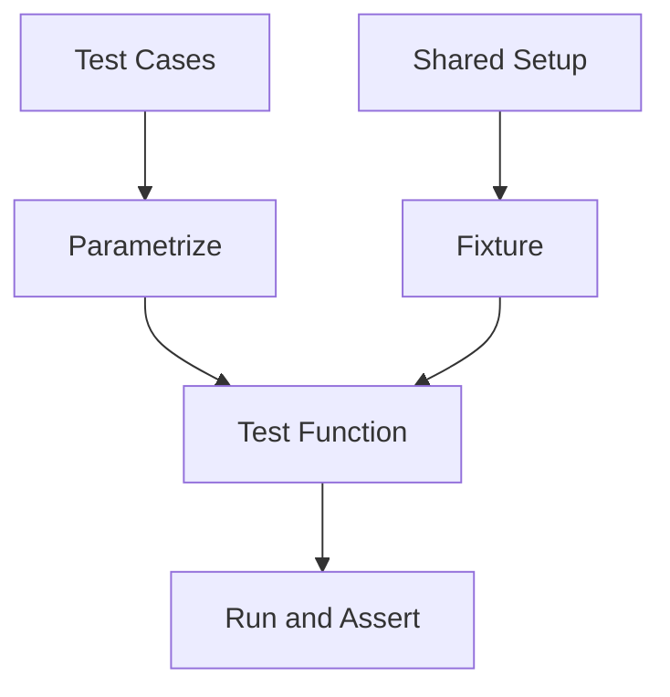

# Day 032 [Beginner]: Parametrized Testing and Fixtures

## Index

- [Goal](#goal)
- [Prerequisites](#prerequisites)
- [Explanation](#explanation)
- [Topic by Topic](#topic-by-topic)
- [Key Concepts](#key-concepts)
- [Visual Concept Map](#visual-concept-map)
- [End-to-End Practical](#end-to-end-practical)
- [Hands-on Coding](#hands-on-coding)
- [Mini Exercise](#mini-exercise)
- [Assessment Quiz](#assessment-quiz)
- [Task](#task)
- [Self Check](#self-check)
- [Interview Questions and Answers](#interview-questions-and-answers)
- [Day 032 Outcome](#day-032-outcome)

## Goal

Learn how to use pytest parametrization and fixtures to write cleaner, reusable, and scalable test suites.

## Prerequisites

- Day 031 completed
- Comfortable with basic pytest tests

## Explanation

As test count grows, repeated setup and repeated assertions become hard to maintain. Parametrization and fixtures solve this by removing duplication and improving test readability.

## Topic by Topic

### Topic 1: Why Parametrized Tests

Theory:
Many tests run the same logic with different inputs.

Practical:
pytest.mark.parametrize lets one test function cover many cases.

Code Example:

```python
import pytest

@pytest.mark.parametrize("a,b,expected", [
  (2, 3, 5),
  (0, 0, 0),
  (-1, 1, 0),
])
def test_add(a, b, expected):
  assert a + b == expected
```

**Explanation:**
This topic explains Why Parametrized Tests in a practical Python context so you can write clear, reliable, and maintainable programs for real-world tasks.

**Key Points:**
- Understand the core idea behind Why Parametrized Tests.
- Apply the practical pattern with good readability and validation habits.
- Keep the solution maintainable, testable, and safe for production use where relevant.

### Topic 2: Writing Clear Parameter Sets

Theory:
Parameter data should be readable and meaningful.

Practical:
Use realistic test cases, including edge values.

Code Example:

```python
import pytest

@pytest.mark.parametrize("email", [
  "user@example.com",
  "admin@site.org",
])
def test_email_contains_at(email):
  assert "@" in email
```

**Explanation:**
This topic explains Writing Clear Parameter Sets in a practical Python context so you can write clear, reliable, and maintainable programs for real-world tasks.

**Key Points:**
- Understand the core idea behind Writing Clear Parameter Sets.
- Apply the practical pattern with good readability and validation habits.
- Keep the solution maintainable, testable, and safe for production use where relevant.

### Topic 3: What Fixtures Solve

Theory:
Fixtures provide reusable setup and teardown logic.

Practical:
Use fixtures for objects shared across multiple tests.

Code Example:

```python
import pytest

@pytest.fixture
def sample_user():
  return {"name": "Riya", "role": "editor"}

def test_user_has_role(sample_user):
  assert "role" in sample_user
```

**Explanation:**
This topic explains What Fixtures Solve in a practical Python context so you can write clear, reliable, and maintainable programs for real-world tasks.

**Key Points:**
- Understand the core idea behind What Fixtures Solve.
- Apply the practical pattern with good readability and validation habits.
- Keep the solution maintainable, testable, and safe for production use where relevant.

### Topic 4: Fixture Scope Basics

Theory:
Scope controls how often fixture setup runs.

Practical:
Choose function scope for isolation, broader scopes for expensive setup.

Code Example:

```python
import pytest

@pytest.fixture(scope="module")
def config_data():
  return {"mode": "test", "timeout": 5}
```

**Explanation:**
This topic explains Fixture Scope Basics in a practical Python context so you can write clear, reliable, and maintainable programs for real-world tasks.

**Key Points:**
- Understand the core idea behind Fixture Scope Basics.
- Apply the practical pattern with good readability and validation habits.
- Keep the solution maintainable, testable, and safe for production use where relevant.

### Topic 5: Combining Fixtures and Parametrization

Theory:
You can use fixture inputs inside parametrized tests.

Practical:
This pattern enables compact yet powerful test coverage.

Code Example:

```python
import pytest

@pytest.fixture
def base_value():
  return 10

@pytest.mark.parametrize("x,expected", [(1, 11), (5, 15)])
def test_sum_with_base(base_value, x, expected):
  assert base_value + x == expected
```

**Explanation:**
This topic explains Combining Fixtures and Parametrization in a practical Python context so you can write clear, reliable, and maintainable programs for real-world tasks.

**Key Points:**
- Understand the core idea behind Combining Fixtures and Parametrization.
- Apply the practical pattern with good readability and validation habits.
- Keep the solution maintainable, testable, and safe for production use where relevant.

### Topic 6: Keep Test Data and Setup Intentional

Theory:
Too many hidden fixtures can make tests hard to understand.

Practical:
Use descriptive fixture names and small, focused parameter sets.

Code Example:

```python
# Prefer readable fixture names over generic names like data1.
```

**Explanation:**
This topic explains Keep Test Data and Setup Intentional in a practical Python context so you can write clear, reliable, and maintainable programs for real-world tasks.

**Key Points:**
- Understand the core idea behind Keep Test Data and Setup Intentional.
- Apply the practical pattern with good readability and validation habits.
- Keep the solution maintainable, testable, and safe for production use where relevant.

## Key Concepts

- Parametrization removes duplicate test functions
- Fixtures centralize setup logic
- Fixture scope controls setup frequency
- Edge cases should be part of parameter sets
- Fixtures and parametrization can be combined
- Clarity is more important than extreme DRYness

## Visual Concept Map



## End-to-End Practical

1. Pick one function with multiple input possibilities.
2. Replace repeated tests with one parametrized test.
3. Extract shared setup into a fixture.
4. Add one edge case parameter.
5. Run pytest and verify readable output.

## Hands-on Coding

### Example 1: Case - Grade Labels

Scenario:
Test grade labeling for multiple score ranges.

```python
import pytest

def grade(score):
  if score >= 90:
    return "A"
  if score >= 75:
    return "B"
  return "C"

@pytest.mark.parametrize("score,expected", [
  (95, "A"),
  (80, "B"),
  (60, "C"),
])
def test_grade(score, expected):
  assert grade(score) == expected
```

### Example 2: Case - Shared Cart Fixture

Scenario:
Reuse cart data across tests.

```python
import pytest

@pytest.fixture
def cart():
  return [100, 200, 300]

def test_cart_count(cart):
  assert len(cart) == 3

def test_cart_total(cart):
  assert sum(cart) == 600
```

### Example 3: Case - Fixture with Config

Scenario:
Use a module-level config fixture.

```python
import pytest

@pytest.fixture(scope="module")
def app_config():
  return {"currency": "INR", "tax": 0.18}

def test_config_has_tax(app_config):
  assert app_config["tax"] > 0
```

## Mini Exercise

Scenario:
Create one fixture for user data and one parametrized test that validates username length for different values.

Expected output:

- One reusable fixture
- One parametrized test with at least four cases
- At least one failing case corrected

## Assessment Quiz

### Quiz Questions

1. What problem does parametrization solve?
2. What is a fixture in pytest?
3. True or False: Fixtures can only be used in one test.
4. Why is fixture scope important?
5. What is one risk of overusing complex fixtures?

### Quiz Answers

1. Repeated test logic for multiple inputs
2. Reusable setup/teardown helper for tests
3. False
4. It affects performance and test isolation
5. Reduced readability and hidden dependencies

## Task

- Refactor three repeated tests into one parametrized test
- Create at least one fixture and reuse it in two tests
- Add one edge case in parameter data

## Self Check

- You can write pytest.mark.parametrize correctly
- You can create and use fixtures
- You can choose fixture scope thoughtfully

## Interview Questions and Answers

### Beginner

**Question:** Why use parametrized tests?

**Answer:** They reduce duplicate test code while increasing input coverage.

**Question:** What is a fixture?

**Answer:** A reusable setup helper that pytest injects into tests.

### Middle

**Question:** How do fixtures improve maintainability?

**Answer:** Shared setup is defined once and reused consistently across tests.

**Question:** When would you use module scope?

**Answer:** For expensive setup that can be shared within a module safely.

### Advanced

**Question:** What tradeoff exists between DRY and readability in tests?

**Answer:** Too much abstraction can hide test intent even if duplication is reduced.

**Question:** How do you keep fixture-heavy suites understandable?

**Answer:** Keep fixtures small, name them clearly, and avoid deep fixture dependency chains.

## Day 032 Outcome

- You can scale your test suite with parametrization and fixtures
- You can reduce duplication without losing clarity
- You are ready for mocking and patching on Day 033
