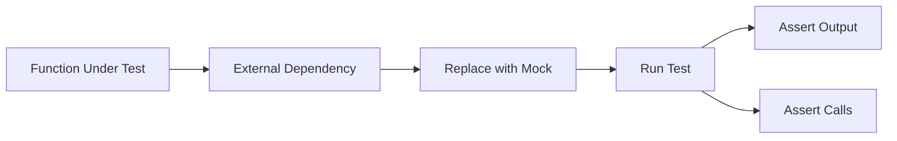

# Day 033 [Beginner]: Mocking and Patching

## Index

- [Goal](#goal)
- [Prerequisites](#prerequisites)
- [Explanation](#explanation)
- [Topic by Topic](#topic-by-topic)
- [Key Concepts](#key-concepts)
- [Visual Concept Map](#visual-concept-map)
- [End-to-End Practical](#end-to-end-practical)
- [Hands-on Coding](#hands-on-coding)
- [Mini Exercise](#mini-exercise)
- [Assessment Quiz](#assessment-quiz)
- [Task](#task)
- [Self Check](#self-check)
- [Interview Questions and Answers](#interview-questions-and-answers)
- [Day 033 Outcome](#day-033-outcome)

## Goal

Understand mocking and patching so you can test code that depends on APIs, databases, time, or other external systems.

## Prerequisites

- Day 032 completed
- Comfortable with pytest basics and fixtures

## Explanation

Mocking replaces real dependencies with controlled test doubles. Patching temporarily replaces functions or objects during a test so behavior can be isolated and verified.

## Topic by Topic

### Topic 1: Why Mocking Is Needed

Theory:
Real external dependencies make tests slow, flaky, or expensive.

Practical:
Mocking isolates business logic from network and file system effects.

Code Example:

```python
def fetch_user_name(api_client, user_id):
  data = api_client.get_user(user_id)
  return data["name"]
```

**Explanation:**
This topic explains Why Mocking Is Needed in a practical Python context so you can write clear, reliable, and maintainable programs for real-world tasks.

**Key Points:**
- Understand the core idea behind Why Mocking Is Needed.
- Apply the practical pattern with good readability and validation habits.
- Keep the solution maintainable, testable, and safe for production use where relevant.

### Topic 2: Mock Objects with unittest.mock

Theory:
Mock objects simulate methods and return values.

Practical:
Set return_value and assert method calls.

Code Example:

```python
from unittest.mock import Mock

api = Mock()
api.get_user.return_value = {"name": "Asha"}
assert api.get_user(101)["name"] == "Asha"
api.get_user.assert_called_once_with(101)
```

**Explanation:**
This topic explains Mock Objects with unittest.mock in a practical Python context so you can write clear, reliable, and maintainable programs for real-world tasks.

**Key Points:**
- Understand the core idea behind Mock Objects with unittest.mock.
- Apply the practical pattern with good readability and validation habits.
- Keep the solution maintainable, testable, and safe for production use where relevant.

### Topic 3: Patching Functions

Theory:
patch temporarily replaces an imported symbol in test scope.

Practical:
Patch where the function is used, not where it was originally defined.

Code Example:

```python
from unittest.mock import patch

with patch("payments.gateway.charge", return_value=True):
  # call function that internally uses payments.gateway.charge
  pass
```

**Explanation:**
This topic explains Patching Functions in a practical Python context so you can write clear, reliable, and maintainable programs for real-world tasks.

**Key Points:**
- Understand the core idea behind Patching Functions.
- Apply the practical pattern with good readability and validation habits.
- Keep the solution maintainable, testable, and safe for production use where relevant.

### Topic 4: pytest monkeypatch Utility

Theory:
monkeypatch from pytest can modify attributes or environment values.

Practical:
Useful for temporary env vars and replacing helpers.

Code Example:

```python
def test_env_mode(monkeypatch):
  monkeypatch.setenv("APP_MODE", "test")
  assert True
```

**Explanation:**
This topic explains pytest monkeypatch Utility in a practical Python context so you can write clear, reliable, and maintainable programs for real-world tasks.

**Key Points:**
- Understand the core idea behind pytest monkeypatch Utility.
- Apply the practical pattern with good readability and validation habits.
- Keep the solution maintainable, testable, and safe for production use where relevant.

### Topic 5: Verifying Interactions

Theory:
Sometimes behavior matters more than return value.

Practical:
Assert that expected calls happened with correct arguments.

Code Example:

```python
from unittest.mock import Mock

notifier = Mock()
notifier.send("order-confirmed")
notifier.send.assert_called_once_with("order-confirmed")
```

**Explanation:**
This topic explains Verifying Interactions in a practical Python context so you can write clear, reliable, and maintainable programs for real-world tasks.

**Key Points:**
- Understand the core idea behind Verifying Interactions.
- Apply the practical pattern with good readability and validation habits.
- Keep the solution maintainable, testable, and safe for production use where relevant.

### Topic 6: Avoid Over-Mocking

Theory:
If everything is mocked, tests may pass but real integration can fail.

Practical:
Balance unit tests with a few integration tests.

Code Example:

```python
# Mock external boundaries, not every internal function.
```

**Explanation:**
This topic explains Avoid Over-Mocking in a practical Python context so you can write clear, reliable, and maintainable programs for real-world tasks.

**Key Points:**
- Understand the core idea behind Avoid Over-Mocking.
- Apply the practical pattern with good readability and validation habits.
- Keep the solution maintainable, testable, and safe for production use where relevant.

## Key Concepts

- Mocks isolate external dependencies
- patch replaces symbols temporarily during tests
- monkeypatch modifies environment and attributes safely
- Call assertions verify interactions
- Patch at usage location for correct behavior
- Over-mocking can hide integration defects

## Visual Concept Map



## End-to-End Practical

1. Identify one function that calls an external service.
2. Replace service with a mock return value.
3. Assert function output.
4. Assert dependency call count and arguments.
5. Add one failure-case mock behavior.

## Hands-on Coding

### Example 1: Case - Mock API Client

Scenario:
Test profile formatting without real API calls.

```python
from unittest.mock import Mock

def full_name(client, user_id):
  u = client.get_user(user_id)
  return f"{u['first']} {u['last']}"

def test_full_name():
  client = Mock()
  client.get_user.return_value = {"first": "Nina", "last": "Shah"}
  assert full_name(client, 7) == "Nina Shah"
```

### Example 2: Case - Patch Time Source

Scenario:
Stabilize tests by controlling current date.

```python
from unittest.mock import patch

with patch("orders.service.today", return_value="2026-07-24"):
  pass
```

### Example 3: Case - Verify Notification Call

Scenario:
Ensure notification is sent after order success.

```python
from unittest.mock import Mock

sender = Mock()
sender.send("order_id=1001")
sender.send.assert_called_once()
```

## Mini Exercise

Scenario:
Write a function that calls a payment gateway object, and test it by mocking success and failure responses.

Expected output:

- One mocked success test
- One mocked failure test
- One interaction assertion

## Assessment Quiz

### Quiz Questions

1. Why use mocking in unit tests?
2. What does patch do?
3. True or False: You should patch where symbol is used.
4. What does assert_called_once_with verify?
5. What risk comes from over-mocking?

### Quiz Answers

1. To isolate logic from external dependencies
2. Temporarily replaces an object or function
3. True
4. Call count and exact arguments
5. Missing real integration issues

## Task

- Add mocks for one API and one notifier dependency
- Add interaction assertions for both
- Add one test that simulates dependency failure

## Self Check

- You can create and configure mocks
- You can patch dependencies at correct location
- You can balance mocks with realistic coverage

## Interview Questions and Answers

### Beginner

**Question:** What is a mock in Python testing?

**Answer:** A test double that simulates a real dependency in controlled ways.

**Question:** Why patch dependencies in tests?

**Answer:** To isolate business logic and avoid real external calls.

### Middle

**Question:** What common mistake happens with patch?

**Answer:** Patching the original symbol instead of the symbol location used by the code under test.

**Question:** How do call assertions help?

**Answer:** They verify interaction behavior, not just final output.

### Advanced

**Question:** What is the tradeoff of heavy mocking?

**Answer:** Fast isolated tests but weaker confidence about real integrations.

**Question:** How do mature teams use mocking strategically?

**Answer:** Mock external boundaries for unit tests and keep integration tests for real wiring.

## Day 033 Outcome

- You can isolate dependencies using mocks and patching
- You can assert both output and interactions
- You are ready for step-debugging with pdb on Day 034
