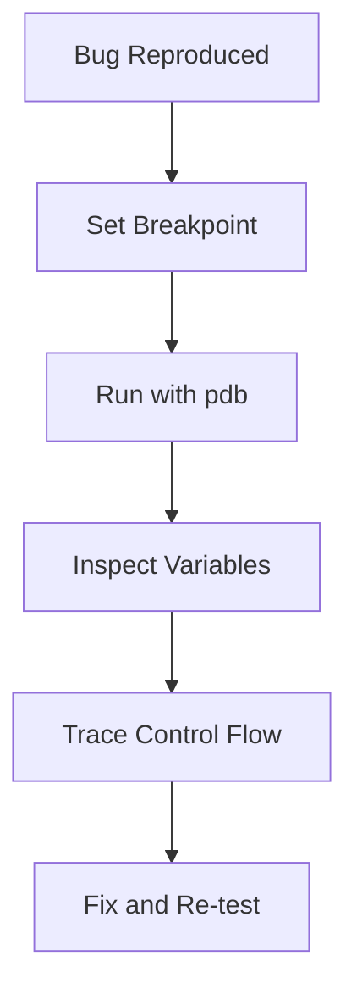

# Day 034 [Beginner]: Debugging with pdb

## Index

- [Goal](#goal)
- [Prerequisites](#prerequisites)
- [Explanation](#explanation)
- [Topic by Topic](#topic-by-topic)
- [Key Concepts](#key-concepts)
- [Visual Concept Map](#visual-concept-map)
- [End-to-End Practical](#end-to-end-practical)
- [Hands-on Coding](#hands-on-coding)
- [Mini Exercise](#mini-exercise)
- [Assessment Quiz](#assessment-quiz)
- [Task](#task)
- [Self Check](#self-check)
- [Interview Questions and Answers](#interview-questions-and-answers)
- [Day 034 Outcome](#day-034-outcome)

## Goal

Learn how to debug Python code with pdb so you can inspect variables, trace flow, and fix bugs faster.

## Prerequisites

- Day 033 completed
- Comfortable with functions and loops

## Explanation

pdb is Python's built-in debugger. It lets you pause execution, inspect program state, step line by line, and understand why code behaves unexpectedly.

## Topic by Topic

### Topic 1: Why Use a Debugger

Theory:
Print-based debugging helps for simple issues, but breaks down in larger logic paths.

Practical:
Debugger tools reveal exact values and control flow at runtime.

Code Example:

```python
def total(items):
  return sum(items)
```

**Explanation:**
This topic explains Why Use a Debugger in a practical Python context so you can write clear, reliable, and maintainable programs for real-world tasks.

**Key Points:**
- Understand the core idea behind Why Use a Debugger.
- Apply the practical pattern with good readability and validation habits.
- Keep the solution maintainable, testable, and safe for production use where relevant.

### Topic 2: Starting pdb Sessions

Theory:
You can run a script with pdb or drop into debugger at a specific line.

Practical:
Use python -m pdb script.py or breakpoint() in code.

Code Example:

```python
def divide(a, b):
  breakpoint()
  return a / b
```

**Explanation:**
This topic explains Starting pdb Sessions in a practical Python context so you can write clear, reliable, and maintainable programs for real-world tasks.

**Key Points:**
- Understand the core idea behind Starting pdb Sessions.
- Apply the practical pattern with good readability and validation habits.
- Keep the solution maintainable, testable, and safe for production use where relevant.

### Topic 3: Core pdb Commands

Theory:
Useful commands include n (next), s (step), c (continue), p (print).

Practical:
Use p variable_name to inspect values as execution moves.

Code Example:

```text
(Pdb) n
(Pdb) p a
(Pdb) p b
(Pdb) c
```

**Explanation:**
This topic explains Core pdb Commands in a practical Python context so you can write clear, reliable, and maintainable programs for real-world tasks.

**Key Points:**
- Understand the core idea behind Core pdb Commands.
- Apply the practical pattern with good readability and validation habits.
- Keep the solution maintainable, testable, and safe for production use where relevant.

### Topic 4: Understanding Call Stack

Theory:
Where (or w) command shows stack frames and execution context.

Practical:
Stack view helps when bug origin is different from failure point.

Code Example:

```text
(Pdb) where
```

**Explanation:**
This topic explains Understanding Call Stack in a practical Python context so you can write clear, reliable, and maintainable programs for real-world tasks.

**Key Points:**
- Understand the core idea behind Understanding Call Stack.
- Apply the practical pattern with good readability and validation habits.
- Keep the solution maintainable, testable, and safe for production use where relevant.

### Topic 5: Conditional Breakpoints

Theory:
Break only when specific conditions are met.

Practical:
This avoids stopping on every loop iteration.

Code Example:

```text
(Pdb) break script.py:12, price < 0
```

**Explanation:**
This topic explains Conditional Breakpoints in a practical Python context so you can write clear, reliable, and maintainable programs for real-world tasks.

**Key Points:**
- Understand the core idea behind Conditional Breakpoints.
- Apply the practical pattern with good readability and validation habits.
- Keep the solution maintainable, testable, and safe for production use where relevant.

### Topic 6: Debugging Strategy for Real Projects

Theory:
Random stepping wastes time; use a hypothesis-driven approach.

Practical:
Reproduce, set breakpoint near suspected area, inspect key variables, confirm fix.

Code Example:

```python
# Debug with a clear hypothesis, not by stepping blindly through all lines.
```

**Explanation:**
This topic explains Debugging Strategy for Real Projects in a practical Python context so you can write clear, reliable, and maintainable programs for real-world tasks.

**Key Points:**
- Understand the core idea behind Debugging Strategy for Real Projects.
- Apply the practical pattern with good readability and validation habits.
- Keep the solution maintainable, testable, and safe for production use where relevant.

## Key Concepts

- pdb is built into Python
- breakpoint() inserts debugger stop points
- next, step, continue, and print are core commands
- Stack inspection helps trace bug source
- Conditional breakpoints reduce noise
- Structured debugging speeds root cause analysis

## Visual Concept Map



## End-to-End Practical

1. Reproduce a failing case consistently.
2. Place breakpoint near suspicious logic.
3. Step through execution and inspect values.
4. Confirm wrong branch or bad data.
5. Patch code and verify with test rerun.

## Hands-on Coding

### Example 1: Case - Wrong Discount Output

Scenario:
A discount function returns unexpected totals.

```python
def apply_discount(price, pct):
  breakpoint()
  return price - pct
```

### Example 2: Case - Loop Condition Bug

Scenario:
A loop behaves unexpectedly for one value.

```python
def find_first_negative(values):
  for value in values:
    breakpoint()
    if value < 0:
      return value
  return None
```

### Example 3: Case - Exception Investigation

Scenario:
Investigate a division by zero path.

```python
def ratio(a, b):
  breakpoint()
  return a / b
```

## Mini Exercise

Scenario:
Write a function with an intentional bug, debug it using pdb commands, and fix it.

Expected output:

- One bug reproduction case
- At least three pdb commands used
- Corrected function behavior

## Assessment Quiz

### Quiz Questions

1. What is pdb used for?
2. Which command prints a variable value?
3. True or False: breakpoint() can be placed directly in code.
4. Why use conditional breakpoints?
5. What does where show?

### Quiz Answers

1. Interactive debugging of Python programs
2. p
3. True
4. To stop only when needed and avoid noise
5. Current call stack and frame context

## Task

- Debug one failing script using breakpoint()
- Use at least four pdb commands during investigation
- Document root cause and final fix

## Self Check

- You can start and control pdb sessions
- You can inspect values and flow effectively
- You can debug with a repeatable strategy

## Interview Questions and Answers

### Beginner

**Question:** What is pdb in Python?

**Answer:** It is Python's built-in interactive debugger.

**Question:** How do you pause execution in code?

**Answer:** Add breakpoint() at the target line.

### Middle

**Question:** What is the difference between step and next?

**Answer:** step enters called functions, next moves to the next line in current frame.

**Question:** Why inspect stack frames while debugging?

**Answer:** To understand how execution reached the current failing state.

### Advanced

**Question:** What makes debugging efficient in production-like bugs?

**Answer:** Reproducible failing case, targeted breakpoints, and hypothesis-driven inspection.

**Question:** What is a common debugging anti-pattern?

**Answer:** Stepping blindly without a clear hypothesis or expected state.

## Day 034 Outcome

- You can debug code interactively with pdb
- You can inspect flow and state to find root causes
- You are ready for performance profiling on Day 035
