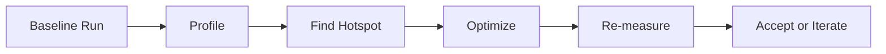

# Day 035 [Beginner]: Performance Profiling Basics

## Index

- [Goal](#goal)
- [Prerequisites](#prerequisites)
- [Explanation](#explanation)
- [Topic by Topic](#topic-by-topic)
- [Key Concepts](#key-concepts)
- [Visual Concept Map](#visual-concept-map)
- [End-to-End Practical](#end-to-end-practical)
- [Hands-on Coding](#hands-on-coding)
- [Mini Exercise](#mini-exercise)
- [Assessment Quiz](#assessment-quiz)
- [Task](#task)
- [Self Check](#self-check)
- [Interview Questions and Answers](#interview-questions-and-answers)
- [Day 035 Outcome](#day-035-outcome)

## Goal

Learn profiling basics so you can find slow parts of Python programs and optimize the right code first.

## Prerequisites

- Day 034 completed
- Comfortable with loops, functions, and timing basics

## Explanation

Performance problems should be measured, not guessed. Profiling tools show where time is spent so you can optimize high-impact code paths.

## Topic by Topic

### Topic 1: Measure Before Optimizing

Theory:
Assumptions about slow code are often wrong.

Practical:
Start with baseline timing for key operations.

Code Example:

```python
import time

start = time.perf_counter()
sum(range(1_000_000))
end = time.perf_counter()
print(end - start)
```

**Explanation:**
This topic explains Measure Before Optimizing in a practical Python context so you can write clear, reliable, and maintainable programs for real-world tasks.

**Key Points:**
- Understand the core idea behind Measure Before Optimizing.
- Apply the practical pattern with good readability and validation habits.
- Keep the solution maintainable, testable, and safe for production use where relevant.

### Topic 2: Quick Timing with timeit

Theory:
timeit runs code multiple times for stable measurement.

Practical:
Use it to compare two small code alternatives fairly.

Code Example:

```python
import timeit

duration = timeit.timeit("sum(range(1000))", number=10000)
print(duration)
```

**Explanation:**
This topic explains Quick Timing with timeit in a practical Python context so you can write clear, reliable, and maintainable programs for real-world tasks.

**Key Points:**
- Understand the core idea behind Quick Timing with timeit.
- Apply the practical pattern with good readability and validation habits.
- Keep the solution maintainable, testable, and safe for production use where relevant.

### Topic 3: Function Profiling with cProfile

Theory:
cProfile gives per-function call stats and cumulative time.

Practical:
Use it for larger scripts where bottleneck is unclear.

Code Example:

```python
import cProfile

def run_workload():
  data = [i * i for i in range(100000)]
  return sum(data)

cProfile.run("run_workload()")
```

**Explanation:**
This topic explains Function Profiling with cProfile in a practical Python context so you can write clear, reliable, and maintainable programs for real-world tasks.

**Key Points:**
- Understand the core idea behind Function Profiling with cProfile.
- Apply the practical pattern with good readability and validation habits.
- Keep the solution maintainable, testable, and safe for production use where relevant.

### Topic 4: Reading Profiling Output

Theory:
Focus on total time and cumulative time columns.

Practical:
Prioritize frequently called expensive functions first.

Code Example:

```text
ncalls  tottime  percall  cumtime  percall filename:lineno(function)
```

**Explanation:**
This topic explains Reading Profiling Output in a practical Python context so you can write clear, reliable, and maintainable programs for real-world tasks.

**Key Points:**
- Understand the core idea behind Reading Profiling Output.
- Apply the practical pattern with good readability and validation habits.
- Keep the solution maintainable, testable, and safe for production use where relevant.

### Topic 5: Common Optimization Moves

Theory:
Performance gains often come from algorithmic changes.

Practical:
Reduce nested loops, avoid repeated heavy computation, use better data structures.

Code Example:

```python
# Precompute repeated values instead of recalculating in each loop iteration.
```

**Explanation:**
This topic explains Common Optimization Moves in a practical Python context so you can write clear, reliable, and maintainable programs for real-world tasks.

**Key Points:**
- Understand the core idea behind Common Optimization Moves.
- Apply the practical pattern with good readability and validation habits.
- Keep the solution maintainable, testable, and safe for production use where relevant.

### Topic 6: Avoid Premature Optimization

Theory:
Fast but unreadable code can hurt maintainability.

Practical:
Optimize hotspots only after profiling evidence.

Code Example:

```python
# Keep baseline readable version, then optimize measured hotspots.
```

**Explanation:**
This topic explains Avoid Premature Optimization in a practical Python context so you can write clear, reliable, and maintainable programs for real-world tasks.

**Key Points:**
- Understand the core idea behind Avoid Premature Optimization.
- Apply the practical pattern with good readability and validation habits.
- Keep the solution maintainable, testable, and safe for production use where relevant.

## Key Concepts

- Measure performance before changing code
- timeit helps micro-benchmarks
- cProfile identifies function-level bottlenecks
- Read cumulative time for hotspot prioritization
- Algorithm improvements usually beat minor syntax tweaks
- Optimize only where measurement shows impact

## Visual Concept Map



## End-to-End Practical

1. Select one slow script or function.
2. Capture baseline time.
3. Run cProfile and identify top hotspot.
4. Apply one focused optimization.
5. Re-measure and compare improvement.

## Hands-on Coding

### Example 1: Case - List Lookup Optimization

Scenario:
Speed up repeated membership checks.

```python
def count_hits_list(items, targets):
  hits = 0
  for item in items:
    if item in targets:
      hits += 1
  return hits
```

### Example 2: Case - Use Set for Faster Membership

Scenario:
Replace list targets with set targets.

```python
def count_hits_set(items, targets):
  target_set = set(targets)
  hits = 0
  for item in items:
    if item in target_set:
      hits += 1
  return hits
```

### Example 3: Case - Profile Before and After

Scenario:
Verify optimization impact with measurements.

```python
import timeit

print(timeit.timeit("sum(range(10000))", number=5000))
```

## Mini Exercise

Scenario:
Create two versions of a function, profile both, and report which one is faster with measured numbers.

Expected output:

- Baseline and optimized timings
- One profiling summary
- Clear conclusion based on data

## Assessment Quiz

### Quiz Questions

1. Why should optimization start with profiling?
2. Which module is used for quick repeated timing?
3. True or False: Premature optimization is always good engineering.
4. What is a hotspot in profiling?
5. Why are algorithmic changes often stronger than micro-changes?

### Quiz Answers

1. To optimize based on evidence, not guesswork
2. timeit
3. False
4. Code section consuming significant runtime
5. They reduce fundamental computational cost

## Task

- Profile one script using cProfile
- Optimize one measured hotspot only
- Record before and after timing values

## Self Check

- You can measure runtime properly
- You can read profiling output meaningfully
- You can apply evidence-based optimizations

## Interview Questions and Answers

### Beginner

**Question:** What is performance profiling?

**Answer:** Measuring where a program spends time so bottlenecks can be identified.

**Question:** Which tool can quickly benchmark snippets?

**Answer:** The timeit module.

### Middle

**Question:** What does cProfile help you discover?

**Answer:** Which functions consume the most time and are called most frequently.

**Question:** Why is baseline timing important?

**Answer:** It provides a comparison point to verify optimization impact.

### Advanced

**Question:** How do you prevent wasted optimization effort?

**Answer:** Profile first, optimize targeted hotspots, and re-measure objectively.

**Question:** What is a common optimization anti-pattern?

**Answer:** Refactoring for speed without measurements, resulting in complexity without gains.

## Day 035 Outcome

- You can profile Python code and locate bottlenecks
- You can apply targeted optimizations with evidence
- You are ready for mid-level application design patterns on Day 036
