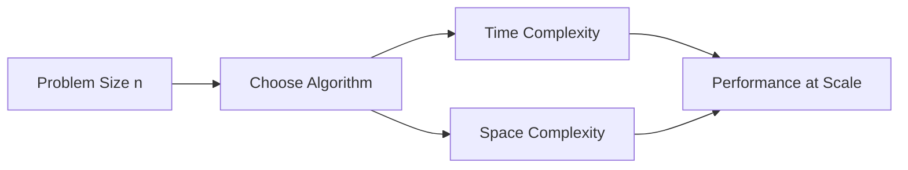

# Day 036 [Intermediate]: Algorithmic Complexity in Python

## Index

- [Goal](#goal)
- [Prerequisites](#prerequisites)
- [Explanation](#explanation)
- [Topic by Topic](#topic-by-topic)
- [Key Concepts](#key-concepts)
- [Visual Concept Map](#visual-concept-map)
- [End-to-End Practical](#end-to-end-practical)
- [Hands-on Coding](#hands-on-coding)
- [Mini Exercise](#mini-exercise)
- [Assessment Quiz](#assessment-quiz)
- [Task](#task)
- [Self Check](#self-check)
- [Interview Questions and Answers](#interview-questions-and-answers)
- [Day 036 Outcome](#day-036-outcome)

## Goal

Understand time and space complexity deeply enough to choose better algorithms and write scalable Python code.

## Prerequisites

- Day 035 completed
- Comfortable with loops, functions, and core data structures

## Explanation

Algorithmic complexity helps estimate how code grows as input size grows. This is crucial for writing software that performs well not just on small examples, but also on real production data.

## Topic by Topic

### Topic 1: Big-O Intuition

Theory:
Big-O notation describes growth trend, not exact runtime.

Practical:
Use it to compare approaches before implementing.

Code Example:

```python
def contains_linear(values, target):
  for value in values:
    if value == target:
      return True
  return False
```

**Explanation:**
This topic explains Big-O Intuition in a practical Python context so you can write clear, reliable, and maintainable programs for real-world tasks.

**Key Points:**
- Understand the core idea behind Big-O Intuition.
- Apply the practical pattern with good readability and validation habits.
- Keep the solution maintainable, testable, and safe for production use where relevant.

### Topic 2: Common Complexity Classes

Theory:
Typical classes include O(1), O(log n), O(n), O(n log n), and O(n^2).

Practical:
Recognizing these patterns helps identify bottlenecks quickly.

Code Example:

```python
def pair_sum(values):
  total = 0
  for i in values:
    for j in values:
      total += i + j
  return total
```

**Explanation:**
This topic explains Common Complexity Classes in a practical Python context so you can write clear, reliable, and maintainable programs for real-world tasks.

**Key Points:**
- Understand the core idea behind Common Complexity Classes.
- Apply the practical pattern with good readability and validation habits.
- Keep the solution maintainable, testable, and safe for production use where relevant.

### Topic 3: Time vs Space Tradeoff

Theory:
Faster algorithms may use extra memory.

Practical:
Choose based on constraints like RAM limits or latency targets.

Code Example:

```python
def has_duplicates(values):
  seen = set()
  for value in values:
    if value in seen:
      return True
    seen.add(value)
  return False
```

**Explanation:**
This topic explains Time vs Space Tradeoff in a practical Python context so you can write clear, reliable, and maintainable programs for real-world tasks.

**Key Points:**
- Understand the core idea behind Time vs Space Tradeoff.
- Apply the practical pattern with good readability and validation habits.
- Keep the solution maintainable, testable, and safe for production use where relevant.

### Topic 4: Hidden Costs in Python

Theory:
Operations that look simple can have non-trivial complexity.

Practical:
Know costs of list insert, membership checks, and string concatenation.

Code Example:

```python
def build_text(parts):
  return "".join(parts)  # better than repeated + in loops
```

**Explanation:**
This topic explains Hidden Costs in Python in a practical Python context so you can write clear, reliable, and maintainable programs for real-world tasks.

**Key Points:**
- Understand the core idea behind Hidden Costs in Python.
- Apply the practical pattern with good readability and validation habits.
- Keep the solution maintainable, testable, and safe for production use where relevant.

### Topic 5: Complexity-Driven Refactoring

Theory:
Refactoring based on complexity often gives larger gains than syntax tweaks.

Practical:
Replace nested loops with hash-based lookups when possible.

Code Example:

```python
def intersection_size(a, b):
  set_b = set(b)
  count = 0
  for item in a:
    if item in set_b:
      count += 1
  return count
```

**Explanation:**
This topic explains Complexity-Driven Refactoring in a practical Python context so you can write clear, reliable, and maintainable programs for real-world tasks.

**Key Points:**
- Understand the core idea behind Complexity-Driven Refactoring.
- Apply the practical pattern with good readability and validation habits.
- Keep the solution maintainable, testable, and safe for production use where relevant.

### Topic 6: Complexity in Interviews and Design Reviews

Theory:
You should communicate tradeoffs, not just final complexity value.

Practical:
State baseline approach, optimized approach, and why optimization is justified.

Code Example:

```python
# Explain both readability and complexity impact when proposing changes.
```

**Explanation:**
This topic explains Complexity in Interviews and Design Reviews in a practical Python context so you can write clear, reliable, and maintainable programs for real-world tasks.

**Key Points:**
- Understand the core idea behind Complexity in Interviews and Design Reviews.
- Apply the practical pattern with good readability and validation habits.
- Keep the solution maintainable, testable, and safe for production use where relevant.

## Key Concepts

- Big-O captures asymptotic growth
- Complexity classes predict scalability
- Time and memory trade off with each other
- Python built-ins have important complexity characteristics
- Refactor by reducing expensive nested operations
- Communicate optimization reasoning clearly

## Visual Concept Map



## End-to-End Practical

1. Implement a baseline nested-loop solution.
2. Measure runtime on increasing input sizes.
3. Replace with set or dictionary-based logic.
4. Measure again and compare growth pattern.
5. Document complexity and memory tradeoff.

## Hands-on Coding

### Example 1: Case - Duplicate Detection

Scenario:
Compare naive and optimized duplicate check.

```python
def has_duplicates_naive(values):
  for i in range(len(values)):
    for j in range(i + 1, len(values)):
      if values[i] == values[j]:
        return True
  return False
```

### Example 2: Case - Optimized Lookup

Scenario:
Use hashing to reduce complexity.

```python
def has_duplicates_fast(values):
  seen = set()
  for value in values:
    if value in seen:
      return True
    seen.add(value)
  return False
```

### Example 3: Case - Membership Cost Difference

Scenario:
Understand list vs set membership performance.

```python
def count_hits(values, targets):
  target_set = set(targets)
  return sum(1 for v in values if v in target_set)
```

## Mini Exercise

Scenario:
Given two lists, find common elements using both nested loops and set-based approach, then compare complexity.

Expected output:

- Two implementations
- Complexity explanation for both
- One reason to prefer one approach in production

## Assessment Quiz

### Quiz Questions

1. What does O(n^2) usually indicate in code shape?
2. Why can a set improve lookup performance?
3. True or False: Lower time complexity always means better overall solution.
4. What is a common Python string performance mistake?
5. Why discuss complexity in code reviews?

### Quiz Answers

1. Nested iteration over input data
2. Average constant-time membership checks
3. False
4. Repeated concatenation using + in loops
5. To justify scalability and design decisions

## Task

- Refactor one O(n^2) routine to near O(n)
- Measure before and after runtime on large input
- Document memory tradeoff in comments or notes

## Self Check

- You can estimate complexity for common patterns
- You can spot hidden expensive operations
- You can choose scalable alternatives with reasoning

## Interview Questions and Answers

### Beginner

**Question:** What is time complexity?

**Answer:** It describes how runtime grows with input size.

**Question:** Why is Big-O useful?

**Answer:** It helps compare algorithm scalability independent of machine speed.

### Middle

**Question:** When would you accept higher memory usage?

**Answer:** When lower latency is required and memory budget allows it.

**Question:** Why is list membership often slower than set membership?

**Answer:** Lists scan sequentially, while sets use hash-based lookup.

### Advanced

**Question:** How do you defend an optimization in review?

**Answer:** Show measured baseline, complexity improvement, and acceptable tradeoffs.

**Question:** What optimization mistake is common in interviews?

**Answer:** Over-optimizing early without proving bottleneck relevance.

## Day 036 Outcome

- You can analyze and compare algorithmic complexity in Python
- You can refactor with clear time-space tradeoff decisions
- You are ready for recursion and backtracking on Day 037
