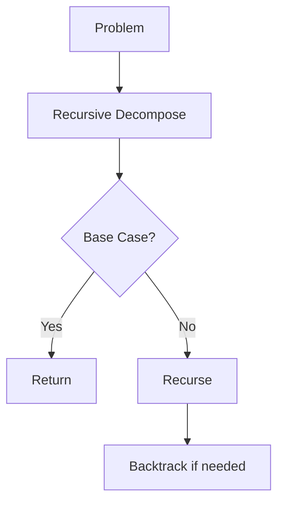

# Day 037 [Intermediate]: Recursion and Backtracking

## Index

- [Goal](#goal)
- [Prerequisites](#prerequisites)
- [Explanation](#explanation)
- [Topic by Topic](#topic-by-topic)
- [Key Concepts](#key-concepts)
- [Visual Concept Map](#visual-concept-map)
- [End-to-End Practical](#end-to-end-practical)
- [Hands-on Coding](#hands-on-coding)
- [Mini Exercise](#mini-exercise)
- [Assessment Quiz](#assessment-quiz)
- [Task](#task)
- [Self Check](#self-check)
- [Interview Questions and Answers](#interview-questions-and-answers)
- [Day 037 Outcome](#day-037-outcome)

## Goal

Master recursion fundamentals and backtracking patterns for solving tree-like and search-space problems in Python.

## Prerequisites

- Day 036 completed
- Comfortable with functions, lists, and loops

## Explanation

Recursion solves problems by reducing them into smaller versions of the same problem. Backtracking is a recursive strategy that tries choices, checks validity, and undoes choices when needed.

## Topic by Topic

### Topic 1: Recursion Basics and Base Case

Theory:
Every recursive function needs a base case and a recursive step.

Practical:
Missing base case causes infinite recursion and stack overflow.

Code Example:

```python
def factorial(n):
  if n <= 1:
    return 1
  return n * factorial(n - 1)
```

**Explanation:**
This topic explains Recursion Basics and Base Case in a practical Python context so you can write clear, reliable, and maintainable programs for real-world tasks.

**Key Points:**
- Understand the core idea behind Recursion Basics and Base Case.
- Apply the practical pattern with good readability and validation habits.
- Keep the solution maintainable, testable, and safe for production use where relevant.

### Topic 2: Call Stack Mental Model

Theory:
Recursive calls are stored on call stack until base case returns.

Practical:
Understanding stack flow helps debug wrong return values.

Code Example:

```python
def sum_to_n(n):
  if n == 0:
    return 0
  return n + sum_to_n(n - 1)
```

**Explanation:**
This topic explains Call Stack Mental Model in a practical Python context so you can write clear, reliable, and maintainable programs for real-world tasks.

**Key Points:**
- Understand the core idea behind Call Stack Mental Model.
- Apply the practical pattern with good readability and validation habits.
- Keep the solution maintainable, testable, and safe for production use where relevant.

### Topic 3: Recursive Problem Decomposition

Theory:
Good recursion comes from clean subproblem definitions.

Practical:
Ask: what is one smaller version of current problem?

Code Example:

```python
def reverse_text(text):
  if len(text) <= 1:
    return text
  return reverse_text(text[1:]) + text[0]
```

**Explanation:**
This topic explains Recursive Problem Decomposition in a practical Python context so you can write clear, reliable, and maintainable programs for real-world tasks.

**Key Points:**
- Understand the core idea behind Recursive Problem Decomposition.
- Apply the practical pattern with good readability and validation habits.
- Keep the solution maintainable, testable, and safe for production use where relevant.

### Topic 4: Backtracking Pattern

Theory:
Backtracking explores choices depth-first and rolls back invalid paths.

Practical:
Used in subset, permutation, and path-finding problems.

Code Example:

```python
def subsets(values):
  result = []

  def dfs(index, path):
    if index == len(values):
      result.append(path[:])
      return
    path.append(values[index])
    dfs(index + 1, path)
    path.pop()
    dfs(index + 1, path)

  dfs(0, [])
  return result
```

**Explanation:**
This topic explains Backtracking Pattern in a practical Python context so you can write clear, reliable, and maintainable programs for real-world tasks.

**Key Points:**
- Understand the core idea behind Backtracking Pattern.
- Apply the practical pattern with good readability and validation habits.
- Keep the solution maintainable, testable, and safe for production use where relevant.

### Topic 5: Pruning and Efficiency

Theory:
Backtracking can explode combinatorially without pruning.

Practical:
Add early-stop conditions to avoid useless branches.

Code Example:

```python
def combinations_sum_limit(values, limit):
  result = []

  def dfs(i, path, total):
    if total > limit:
      return
    if i == len(values):
      result.append(path[:])
      return
    path.append(values[i])
    dfs(i + 1, path, total + values[i])
    path.pop()
    dfs(i + 1, path, total)

  dfs(0, [], 0)
  return result
```

**Explanation:**
This topic explains Pruning and Efficiency in a practical Python context so you can write clear, reliable, and maintainable programs for real-world tasks.

**Key Points:**
- Understand the core idea behind Pruning and Efficiency.
- Apply the practical pattern with good readability and validation habits.
- Keep the solution maintainable, testable, and safe for production use where relevant.

### Topic 6: Recursion vs Iteration Decision

Theory:
Recursion can be elegant but sometimes less memory-efficient.

Practical:
Use recursion when problem structure is naturally recursive.

Code Example:

```python
# Choose recursion for clarity; choose iteration when stack depth is risky.
```

**Explanation:**
This topic explains Recursion vs Iteration Decision in a practical Python context so you can write clear, reliable, and maintainable programs for real-world tasks.

**Key Points:**
- Understand the core idea behind Recursion vs Iteration Decision.
- Apply the practical pattern with good readability and validation habits.
- Keep the solution maintainable, testable, and safe for production use where relevant.

## Key Concepts

- Base case is mandatory in recursion
- Recursive calls use call stack frames
- Decompose into smaller same-shape problems
- Backtracking uses choose-explore-unchoose flow
- Pruning improves backtracking feasibility
- Pick recursion or iteration based on clarity and limits

## Visual Concept Map



## End-to-End Practical

1. Solve factorial and sum-to-n recursively.
2. Draw call flow for one example.
3. Implement subset generation using backtracking.
4. Add pruning condition to reduce branch count.
5. Compare readability with iterative approach.

## Hands-on Coding

### Example 1: Case - Recursive Binary Search

Scenario:
Search sorted array recursively.

```python
def binary_search(values, target, left, right):
  if left > right:
    return -1
  mid = (left + right) // 2
  if values[mid] == target:
    return mid
  if values[mid] < target:
    return binary_search(values, target, mid + 1, right)
  return binary_search(values, target, left, mid - 1)
```

### Example 2: Case - Generate Permutations

Scenario:
Create all orderings using backtracking.

```python
def permutations(values):
  result = []

  def dfs(path, used):
    if len(path) == len(values):
      result.append(path[:])
      return
    for i, value in enumerate(values):
      if used[i]:
        continue
      used[i] = True
      path.append(value)
      dfs(path, used)
      path.pop()
      used[i] = False

  dfs([], [False] * len(values))
  return result
```

### Example 3: Case - Backtracking with Validation

Scenario:
Build combinations and keep only valid ones.

```python
def valid_even_sum_subsets(values):
  result = []

  def dfs(i, path):
    if i == len(values):
      if sum(path) % 2 == 0:
        result.append(path[:])
      return
    path.append(values[i])
    dfs(i + 1, path)
    path.pop()
    dfs(i + 1, path)

  dfs(0, [])
  return result
```

## Mini Exercise

Scenario:
Write a recursive function to generate all subsets of a list, then add a condition to return only subsets of size 2.

Expected output:

- One recursive/backtracking implementation
- One pruning or filtering rule
- Correct subset list for sample input

## Assessment Quiz

### Quiz Questions

1. What is the role of a base case?
2. Why does backtracking call pop after recursion?
3. True or False: Backtracking always has linear time complexity.
4. What is pruning?
5. When might iteration be preferred over recursion?

### Quiz Answers

1. It stops recursion and returns concrete result
2. To undo choice and explore other branches
3. False
4. Early elimination of unpromising branches
5. When recursion depth risk is high or iterative version is clearer

## Task

- Implement one recursive and one backtracking problem
- Add one optimization through pruning
- Explain complexity for both solutions

## Self Check

- You can design proper base and recursive steps
- You can implement choose-explore-unchoose pattern
- You can reason about recursion depth and complexity

## Interview Questions and Answers

### Beginner

**Question:** What is recursion?

**Answer:** A function calling itself on smaller inputs until a base condition is met.

**Question:** What is backtracking?

**Answer:** A recursive search method that tries choices and undoes them when needed.

### Middle

**Question:** Why is pop important in backtracking?

**Answer:** It restores state so the next branch starts from clean context.

**Question:** What common bug appears in recursion problems?

**Answer:** Missing or incorrect base case leading to infinite recursion.

### Advanced

**Question:** How do you optimize backtracking solutions?

**Answer:** Add pruning, sort inputs if helpful, and avoid repeated work.

**Question:** When does recursion become impractical in Python?

**Answer:** Very deep call chains can hit recursion depth and memory limits.

## Day 037 Outcome

- You can solve recursive and backtracking problems confidently
- You can optimize recursive search with pruning
- You are ready for sorting and searching patterns on Day 038
