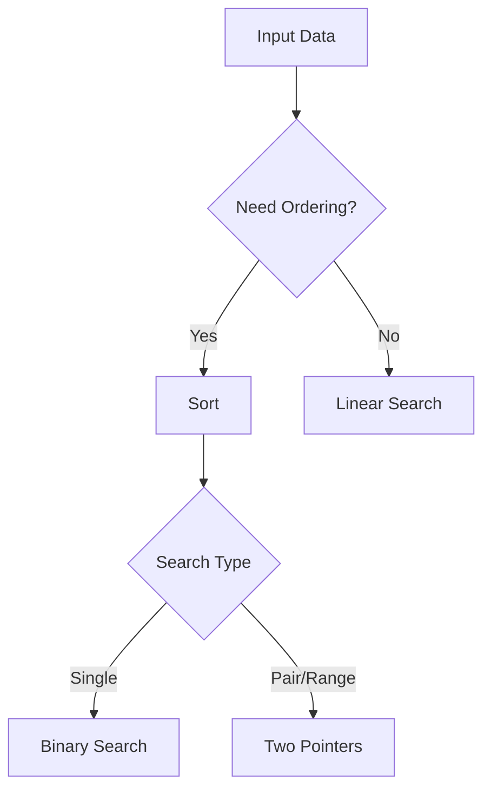

# Day 038 [Intermediate]: Sorting Searching Patterns

## Index

- [Goal](#goal)
- [Prerequisites](#prerequisites)
- [Explanation](#explanation)
- [Topic by Topic](#topic-by-topic)
- [Key Concepts](#key-concepts)
- [Visual Concept Map](#visual-concept-map)
- [End-to-End Practical](#end-to-end-practical)
- [Hands-on Coding](#hands-on-coding)
- [Mini Exercise](#mini-exercise)
- [Assessment Quiz](#assessment-quiz)
- [Task](#task)
- [Self Check](#self-check)
- [Interview Questions and Answers](#interview-questions-and-answers)
- [Day 038 Outcome](#day-038-outcome)

## Goal

Learn practical sorting and searching patterns so you can solve data-processing and interview-style problems efficiently.

## Prerequisites

- Day 037 completed
- Comfortable with loops, functions, and lists

## Explanation

Sorting and searching are core problem-solving tools. Python provides efficient built-ins, and pattern knowledge helps you choose between brute-force and optimized approaches.

## Topic by Topic

### Topic 1: Python Sorting Fundamentals

Theory:
sorted returns a new list, while list.sort modifies in place.

Practical:
Choose based on whether you need original order preserved.

Code Example:

```python
scores = [88, 62, 95, 74]
sorted_scores = sorted(scores)
print(scores)
print(sorted_scores)
```

**Explanation:**
This topic explains Python Sorting Fundamentals in a practical Python context so you can write clear, reliable, and maintainable programs for real-world tasks.

**Key Points:**
- Understand the core idea behind Python Sorting Fundamentals.
- Apply the practical pattern with good readability and validation habits.
- Keep the solution maintainable, testable, and safe for production use where relevant.

### Topic 2: Custom Sorting with key

Theory:
key function controls sort criteria.

Practical:
Use key for dictionaries, tuples, and objects.

Code Example:

```python
students = [
  {"name": "Riya", "marks": 84},
  {"name": "Aman", "marks": 92},
  {"name": "Nina", "marks": 76},
]
by_marks = sorted(students, key=lambda s: s["marks"], reverse=True)
print(by_marks)
```

**Explanation:**
This topic explains Custom Sorting with key in a practical Python context so you can write clear, reliable, and maintainable programs for real-world tasks.

**Key Points:**
- Understand the core idea behind Custom Sorting with key.
- Apply the practical pattern with good readability and validation habits.
- Keep the solution maintainable, testable, and safe for production use where relevant.

### Topic 3: Linear Search vs Binary Search

Theory:
Linear search is O(n), binary search is O(log n) on sorted data.

Practical:
Binary search is powerful when repeated lookups happen on sorted collections.

Code Example:

```python
def binary_search(values, target):
  left, right = 0, len(values) - 1
  while left <= right:
    mid = (left + right) // 2
    if values[mid] == target:
      return mid
    if values[mid] < target:
      left = mid + 1
    else:
      right = mid - 1
  return -1
```

**Explanation:**
This topic explains Linear Search vs Binary Search in a practical Python context so you can write clear, reliable, and maintainable programs for real-world tasks.

**Key Points:**
- Understand the core idea behind Linear Search vs Binary Search.
- Apply the practical pattern with good readability and validation habits.
- Keep the solution maintainable, testable, and safe for production use where relevant.

### Topic 4: Two-Pointer Pattern on Sorted Arrays

Theory:
Two pointers reduce nested-loop work in many pair-based problems.

Practical:
Useful for pair sum, deduplication, and window boundaries.

Code Example:

```python
def has_pair_sum(values, target):
  values = sorted(values)
  i, j = 0, len(values) - 1
  while i < j:
    current = values[i] + values[j]
    if current == target:
      return True
    if current < target:
      i += 1
    else:
      j -= 1
  return False
```

**Explanation:**
This topic explains Two-Pointer Pattern on Sorted Arrays in a practical Python context so you can write clear, reliable, and maintainable programs for real-world tasks.

**Key Points:**
- Understand the core idea behind Two-Pointer Pattern on Sorted Arrays.
- Apply the practical pattern with good readability and validation habits.
- Keep the solution maintainable, testable, and safe for production use where relevant.

### Topic 5: Top-K and Partial Sorting

Theory:
Sometimes you only need top few results, not full ordering.

Practical:
Use heapq.nlargest or nsmallest for efficiency in such cases.

Code Example:

```python
import heapq

values = [50, 10, 80, 30, 95, 40]
top_3 = heapq.nlargest(3, values)
print(top_3)
```

**Explanation:**
This topic explains Top-K and Partial Sorting in a practical Python context so you can write clear, reliable, and maintainable programs for real-world tasks.

**Key Points:**
- Understand the core idea behind Top-K and Partial Sorting.
- Apply the practical pattern with good readability and validation habits.
- Keep the solution maintainable, testable, and safe for production use where relevant.

### Topic 6: Pattern Selection Strategy

Theory:
Correct pattern choice depends on data state and query frequency.

Practical:
If data is unsorted and queried once, linear can be enough; for repeated queries, pre-sort may win.

Code Example:

```python
# Evaluate cost of sorting once versus many linear scans.
```

**Explanation:**
This topic explains Pattern Selection Strategy in a practical Python context so you can write clear, reliable, and maintainable programs for real-world tasks.

**Key Points:**
- Understand the core idea behind Pattern Selection Strategy.
- Apply the practical pattern with good readability and validation habits.
- Keep the solution maintainable, testable, and safe for production use where relevant.

## Key Concepts

- sorted and sort behave differently
- key enables custom sort criteria
- Binary search needs sorted input
- Two-pointer pattern optimizes pair problems
- Partial sorting tools handle top-k tasks
- Choose pattern based on usage pattern and constraints

## Visual Concept Map



## End-to-End Practical

1. Load a list of records.
2. Sort by one primary key.
3. Search for one element using binary search.
4. Solve one pair-sum query using two pointers.
5. Extract top-3 values using heapq.

## Hands-on Coding

### Example 1: Case - Sort Product Catalog

Scenario:
Sort products by price and then rating.

```python
products = [
  {"name": "A", "price": 999, "rating": 4.3},
  {"name": "B", "price": 799, "rating": 4.8},
  {"name": "C", "price": 999, "rating": 4.7},
]
ordered = sorted(products, key=lambda p: (p["price"], -p["rating"]))
print(ordered)
```

### Example 2: Case - Fast ID Lookup

Scenario:
Find an ID quickly in sorted user IDs.

```python
ids = [101, 105, 112, 130, 152, 200]
print(binary_search(ids, 130))
```

### Example 3: Case - Pair Budget Match

Scenario:
Check if two item prices can match a budget.

```python
prices = [120, 80, 40, 60, 200]
print(has_pair_sum(prices, 140))
```

## Mini Exercise

Scenario:
Given a list of employee dictionaries, sort by salary descending, then find whether any two salaries sum to a target value.

Expected output:

- Sorted employee list
- Pair-sum function using two pointers
- Correct true or false result

## Assessment Quiz

### Quiz Questions

1. Why might sorted be safer than sort in some cases?
2. What precondition is required for binary search?
3. True or False: Two pointers usually need sorted input.
4. When should you use heapq.nlargest?
5. Why can pre-sorting be worth it?

### Quiz Answers

1. It preserves original list
2. Data must be sorted
3. True
4. When only top-k values are needed
5. It can reduce repeated search cost

## Task

- Implement one binary search function and test it
- Solve one two-pointer problem
- Compare full sort vs top-k approach for a sample dataset

## Self Check

- You can choose correct sorting API
- You can apply searching patterns based on constraints
- You can justify algorithm choices with complexity

## Interview Questions and Answers

### Beginner

**Question:** What is difference between sort and sorted?

**Answer:** sort changes original list, sorted returns a new list.

**Question:** Why is binary search faster than linear search?

**Answer:** It halves the search space each step on sorted data.

### Middle

**Question:** When is two-pointer better than nested loops?

**Answer:** In sorted pair or range problems where pointer movement prunes work.

**Question:** What is a common bug in binary search implementations?

**Answer:** Incorrect boundary updates causing infinite loops or missed targets.

### Advanced

**Question:** How do you choose between pre-sorting and hash lookups?

**Answer:** Compare one-time sorting cost against number of queries and memory constraints.

**Question:** Why is pattern selection more important than micro-optimization here?

**Answer:** Right algorithmic pattern gives order-of-magnitude gains over minor syntax-level tweaks.

## Day 038 Outcome

- You can use sorting and searching patterns effectively
- You can combine complexity reasoning with practical Python tools
- You are ready to model data with core structures on Day 039
