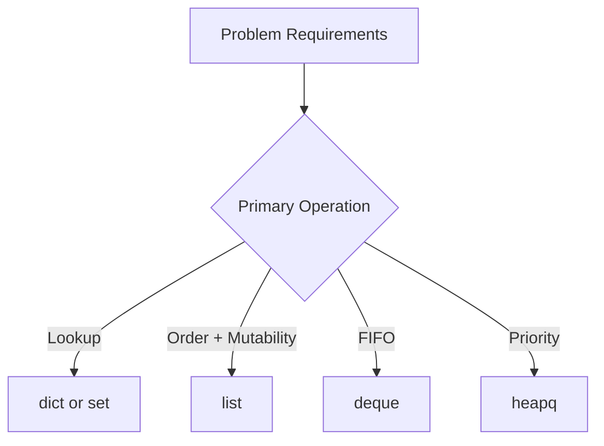

# Day 039 [Intermediate]: Data Structures in Python

## Index

- [Goal](#goal)
- [Prerequisites](#prerequisites)
- [Explanation](#explanation)
- [Topic by Topic](#topic-by-topic)
- [Key Concepts](#key-concepts)
- [Visual Concept Map](#visual-concept-map)
- [End-to-End Practical](#end-to-end-practical)
- [Hands-on Coding](#hands-on-coding)
- [Mini Exercise](#mini-exercise)
- [Assessment Quiz](#assessment-quiz)
- [Task](#task)
- [Self Check](#self-check)
- [Interview Questions and Answers](#interview-questions-and-answers)
- [Day 039 Outcome](#day-039-outcome)

## Goal

Build practical intuition for selecting Python data structures based on operation cost, readability, and problem constraints.

## Prerequisites

- Day 038 completed
- Comfortable with lists, loops, and functions

## Explanation

Data structures shape performance and code clarity. Picking the right structure often matters more than low-level optimization because it directly affects algorithm complexity.

## Topic by Topic

### Topic 1: Lists, Tuples, and Sets

Theory:
Each built-in structure has different strengths.

Practical:
List for ordered mutable data, tuple for fixed records, set for unique fast lookups.

Code Example:

```python
items = ["pen", "book", "pen"]
unique_items = set(items)
record = (101, "Riya")
print(items, unique_items, record)
```

**Explanation:**
This topic explains Lists, Tuples, and Sets in a practical Python context so you can write clear, reliable, and maintainable programs for real-world tasks.

**Key Points:**
- Understand the core idea behind Lists, Tuples, and Sets.
- Apply the practical pattern with good readability and validation habits.
- Keep the solution maintainable, testable, and safe for production use where relevant.

### Topic 2: Dictionaries for Mapping

Theory:
Dictionaries map keys to values with fast average lookup.

Practical:
Useful for indexing, counters, and configuration data.

Code Example:

```python
marks = {"Riya": 88, "Aman": 92}
print(marks.get("Riya"))
marks["Nina"] = 79
```

**Explanation:**
This topic explains Dictionaries for Mapping in a practical Python context so you can write clear, reliable, and maintainable programs for real-world tasks.

**Key Points:**
- Understand the core idea behind Dictionaries for Mapping.
- Apply the practical pattern with good readability and validation habits.
- Keep the solution maintainable, testable, and safe for production use where relevant.

### Topic 3: Stack and Queue Patterns

Theory:
Stack is LIFO, queue is FIFO.

Practical:
Use list for stack, collections.deque for efficient queue operations.

Code Example:

```python
from collections import deque

stack = []
stack.append("A")
stack.append("B")
print(stack.pop())

queue = deque(["task1", "task2"])
queue.append("task3")
print(queue.popleft())
```

**Explanation:**
This topic explains Stack and Queue Patterns in a practical Python context so you can write clear, reliable, and maintainable programs for real-world tasks.

**Key Points:**
- Understand the core idea behind Stack and Queue Patterns.
- Apply the practical pattern with good readability and validation habits.
- Keep the solution maintainable, testable, and safe for production use where relevant.

### Topic 4: Counter and Defaultdict

Theory:
collections provides optimized helpers for common patterns.

Practical:
Counter for frequency maps, defaultdict for safe grouped accumulation.

Code Example:

```python
from collections import Counter, defaultdict

letters = Counter("banana")
groups = defaultdict(list)
groups["A"].append("item1")
print(letters, dict(groups))
```

**Explanation:**
This topic explains Counter and Defaultdict in a practical Python context so you can write clear, reliable, and maintainable programs for real-world tasks.

**Key Points:**
- Understand the core idea behind Counter and Defaultdict.
- Apply the practical pattern with good readability and validation habits.
- Keep the solution maintainable, testable, and safe for production use where relevant.

### Topic 5: Heap for Priority Workloads

Theory:
Heap supports efficient smallest-element access.

Practical:
Great for top-k, scheduling, and priority-based processing.

Code Example:

```python
import heapq

tasks = [5, 1, 3]
heapq.heapify(tasks)
print(heapq.heappop(tasks))
```

**Explanation:**
This topic explains Heap for Priority Workloads in a practical Python context so you can write clear, reliable, and maintainable programs for real-world tasks.

**Key Points:**
- Understand the core idea behind Heap for Priority Workloads.
- Apply the practical pattern with good readability and validation habits.
- Keep the solution maintainable, testable, and safe for production use where relevant.

### Topic 6: Selecting Structures by Operation Profile

Theory:
Choose structure based on dominant operations: search, insert, delete, order, uniqueness.

Practical:
Write operation-first notes before coding to avoid later refactors.

Code Example:

```python
# If frequent membership checks are required, prefer set or dict over list.
```

**Explanation:**
This topic explains Selecting Structures by Operation Profile in a practical Python context so you can write clear, reliable, and maintainable programs for real-world tasks.

**Key Points:**
- Understand the core idea behind Selecting Structures by Operation Profile.
- Apply the practical pattern with good readability and validation habits.
- Keep the solution maintainable, testable, and safe for production use where relevant.

## Key Concepts

- Data structure choice affects complexity significantly
- set and dict provide fast average membership lookup
- deque is efficient for queue operations
- Counter and defaultdict reduce boilerplate
- heap supports priority-based extraction
- Design around operation patterns, not habit

## Visual Concept Map



## End-to-End Practical

1. List required operations for a sample feature.
2. Pick data structures based on operation costs.
3. Implement baseline solution.
4. Replace one poor structure choice and re-measure.
5. Document final rationale.

## Hands-on Coding

### Example 1: Case - Frequency Analyzer

Scenario:
Count word frequency in user reviews.

```python
from collections import Counter

words = "good service good quality".split()
freq = Counter(words)
print(freq)
```

### Example 2: Case - Group Records by Category

Scenario:
Group products by category key.

```python
from collections import defaultdict

products = [("books", "Python 101"), ("tech", "Mouse"), ("books", "Algorithms")]
catalog = defaultdict(list)
for category, name in products:
  catalog[category].append(name)
print(dict(catalog))
```

### Example 3: Case - Task Scheduler Priority

Scenario:
Process smallest priority number first.

```python
import heapq

priorities = [3, 1, 5, 2]
heapq.heapify(priorities)
while priorities:
  print(heapq.heappop(priorities))
```

## Mini Exercise

Scenario:
Design a mini inventory tracker using dict for product details, set for unique tags, and deque for processing orders.

Expected output:

- At least three structures used intentionally
- Basic add, lookup, and process operations
- One short note explaining each structure choice

## Assessment Quiz

### Quiz Questions

1. Why use deque instead of list for queue behavior?
2. What is Counter best used for?
3. True or False: A set preserves insertion order as a strict contract for algorithm design.
4. Which structure is ideal for key-value lookup?
5. Why should operation profile come before implementation?

### Quiz Answers

1. Efficient pops from left side
2. Frequency counting
3. False
4. Dictionary
5. It drives correct structure selection and performance

## Task

- Build one feature that uses at least three data structures
- Include one performance-focused replacement (for example list to set)
- Explain complexity impact of your choices

## Self Check

- You can justify data-structure selection clearly
- You can apply collections tools effectively
- You can trade memory and speed based on constraints

## Interview Questions and Answers

### Beginner

**Question:** Why are data structures important?

**Answer:** They determine how efficiently data is stored and accessed.

**Question:** When should you use a set?

**Answer:** For unique values and fast membership checks.

### Middle

**Question:** Why is deque preferred for queue operations?

**Answer:** It supports efficient append and pop from both ends.

**Question:** What does defaultdict solve?

**Answer:** It avoids manual key existence checks when building grouped structures.

### Advanced

**Question:** How do you evaluate structure choice in review?

**Answer:** Match operation patterns to complexity guarantees and memory tradeoffs.

**Question:** What is a common architecture smell in data-heavy code?

**Answer:** Using list for everything, causing avoidable O(n) lookups and slower workflows.

## Day 039 Outcome

- You can select appropriate Python data structures with confidence
- You can reason about complexity and maintainability together
- You are ready for the mini project on Day 040
