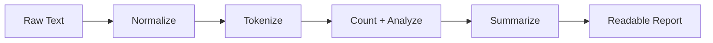

# Day 040 [Intermediate]: Mini Project Text Analyzer

## Index

- [Goal](#goal)
- [Prerequisites](#prerequisites)
- [Explanation](#explanation)
- [Topic by Topic](#topic-by-topic)
- [Key Concepts](#key-concepts)
- [Visual Concept Map](#visual-concept-map)
- [End-to-End Practical](#end-to-end-practical)
- [Hands-on Coding](#hands-on-coding)
- [Mini Exercise](#mini-exercise)
- [Assessment Quiz](#assessment-quiz)
- [Task](#task)
- [Self Check](#self-check)
- [Interview Questions and Answers](#interview-questions-and-answers)
- [Day 040 Outcome](#day-040-outcome)

## Goal

Build an end-to-end text analyzer mini project that processes raw text and produces useful statistics and insights.

## Prerequisites

- Day 039 completed
- Comfortable with strings, dictionaries, sets, and functions

## Explanation

This mini project combines multiple topics: string processing, frequency analysis, sorting, and clean function design. It is a practical milestone that simulates real utility-tool development.

## Topic by Topic

### Topic 1: Define Scope and Output

Theory:
Projects are easier when output requirements are explicit.

Practical:
Decide required metrics: word count, unique words, sentence count, top words.

Code Example:

```python
TARGET_METRICS = ["words", "unique_words", "sentences", "top_words"]
```

**Explanation:**
This topic explains Define Scope and Output in a practical Python context so you can write clear, reliable, and maintainable programs for real-world tasks.

**Key Points:**
- Understand the core idea behind Define Scope and Output.
- Apply the practical pattern with good readability and validation habits.
- Keep the solution maintainable, testable, and safe for production use where relevant.

### Topic 2: Text Normalization Pipeline

Theory:
Raw text contains mixed case and punctuation noise.

Practical:
Normalize text before analysis for consistent results.

Code Example:

```python
import re

def normalize(text):
  text = text.lower()
  text = re.sub(r"[^a-z0-9\s.!?]", "", text)
  return text
```

**Explanation:**
This topic explains Text Normalization Pipeline in a practical Python context so you can write clear, reliable, and maintainable programs for real-world tasks.

**Key Points:**
- Understand the core idea behind Text Normalization Pipeline.
- Apply the practical pattern with good readability and validation habits.
- Keep the solution maintainable, testable, and safe for production use where relevant.

### Topic 3: Tokenization and Counting

Theory:
Tokenization splits text into analyzable units.

Practical:
Use split for basic tokens and Counter for frequencies.

Code Example:

```python
from collections import Counter

def word_stats(text):
  words = text.split()
  counter = Counter(words)
  return len(words), len(counter), counter
```

**Explanation:**
This topic explains Tokenization and Counting in a practical Python context so you can write clear, reliable, and maintainable programs for real-world tasks.

**Key Points:**
- Understand the core idea behind Tokenization and Counting.
- Apply the practical pattern with good readability and validation habits.
- Keep the solution maintainable, testable, and safe for production use where relevant.

### Topic 4: Sentence and Character Insights

Theory:
Different metrics answer different user questions.

Practical:
Track sentence count and average word length for richer analysis.

Code Example:

```python
import re

def sentence_count(text):
  parts = [p.strip() for p in re.split(r"[.!?]+", text) if p.strip()]
  return len(parts)
```

**Explanation:**
This topic explains Sentence and Character Insights in a practical Python context so you can write clear, reliable, and maintainable programs for real-world tasks.

**Key Points:**
- Understand the core idea behind Sentence and Character Insights.
- Apply the practical pattern with good readability and validation habits.
- Keep the solution maintainable, testable, and safe for production use where relevant.

### Topic 5: Presenting Results Cleanly

Theory:
Readable output design is part of software quality.

Practical:
Return structured dictionary and print report in clear sections.

Code Example:

```python
def summarize(text):
  normalized = normalize(text)
  total, unique, counter = word_stats(normalized)
  return {
    "total_words": total,
    "unique_words": unique,
    "top_5": counter.most_common(5),
    "sentences": sentence_count(normalized),
  }
```

**Explanation:**
This topic explains Presenting Results Cleanly in a practical Python context so you can write clear, reliable, and maintainable programs for real-world tasks.

**Key Points:**
- Understand the core idea behind Presenting Results Cleanly.
- Apply the practical pattern with good readability and validation habits.
- Keep the solution maintainable, testable, and safe for production use where relevant.

### Topic 6: Project Hardening and Edge Cases

Theory:
Real text includes empty input, extra spaces, and unusual symbols.

Practical:
Add guard clauses and tests for empty/short/noisy text inputs.

Code Example:

```python
def safe_analyze(text):
  if not text or not text.strip():
    return {"total_words": 0, "unique_words": 0, "top_5": [], "sentences": 0}
  return summarize(text)
```

**Explanation:**
This topic explains Project Hardening and Edge Cases in a practical Python context so you can write clear, reliable, and maintainable programs for real-world tasks.

**Key Points:**
- Understand the core idea behind Project Hardening and Edge Cases.
- Apply the practical pattern with good readability and validation habits.
- Keep the solution maintainable, testable, and safe for production use where relevant.

## Key Concepts

- Mini projects need explicit scope definition
- Normalize text before counting
- Counter simplifies frequency analysis
- Separate metrics into small focused functions
- Return structured results for easier reuse
- Handle empty and noisy input robustly

## Visual Concept Map



## End-to-End Practical

1. Build normalize, tokenize, and counting functions.
2. Add sentence and character-level metrics.
3. Create a final summarize function.
4. Test with normal, empty, and noisy input text.
5. Print final report in readable format.

## Hands-on Coding

### Example 1: Case - Basic Analyzer Flow

Scenario:
Run analyzer on a short paragraph.

```python
sample = "Python is great. Python is readable!"
print(safe_analyze(sample))
```

### Example 2: Case - Top Keywords Report

Scenario:
Display top repeated words.

```python
analysis = safe_analyze("data data python code code code test")
print("Top words:", analysis["top_5"])
```

### Example 3: Case - Empty Input Handling

Scenario:
Verify no crash on empty string.

```python
print(safe_analyze("   "))
```

## Mini Exercise

Scenario:
Add one extra metric to the text analyzer: either average word length or longest word. Include it in the final summary output.

Expected output:

- New metric added in summary dictionary
- At least two sample input runs
- Correct handling of empty input

## Assessment Quiz

### Quiz Questions

1. Why normalize text before analysis?
2. What does Counter.most_common provide?
3. True or False: Mini projects can skip edge cases during first version.
4. Why keep analyzer logic in small functions?
5. What kind of output format is reusable for APIs?

### Quiz Answers

1. To avoid inconsistent counting from case and punctuation noise
2. Most frequent tokens with counts
3. False
4. Better maintainability and easier testing
5. Structured dictionary or JSON-like object

## Task

- Build complete text analyzer with at least four metrics
- Add tests for normal and edge cases
- Print a final user-friendly summary report

## Self Check

- You can design and build a utility mini project end to end
- You can structure code into reusable functions
- You can handle real-world noisy input safely

## Interview Questions and Answers

### Beginner

**Question:** What is the purpose of this text analyzer project?

**Answer:** To process raw text and generate meaningful statistics like word counts and frequent terms.

**Question:** Why use Counter here?

**Answer:** It quickly computes frequency distribution of words.

### Middle

**Question:** How do you make analyzer code maintainable?

**Answer:** Split logic into normalization, tokenization, counting, and summary functions.

**Question:** What common edge case should always be handled?

**Answer:** Empty or whitespace-only input text.

### Advanced

**Question:** How would you scale this mini project for large files?

**Answer:** Stream input in chunks, avoid loading full content in memory, and aggregate counts incrementally.

**Question:** How would you expose this as a service API?

**Answer:** Wrap summary function behind a request handler and return structured JSON response with validation.

## Day 040 Outcome

- You built a meaningful intermediate mini project
- You combined data structures, string processing, and reporting
- You are ready to move into advanced Python architecture from Day 041
